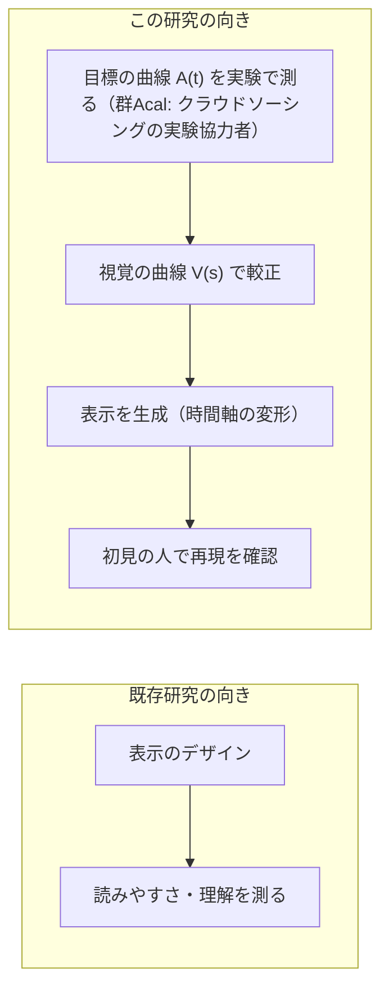
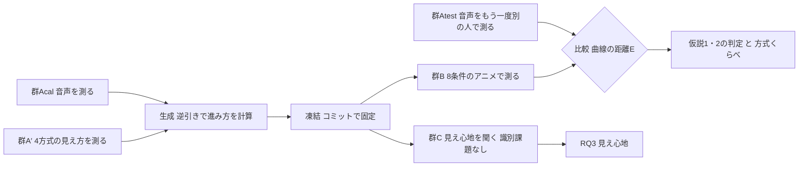
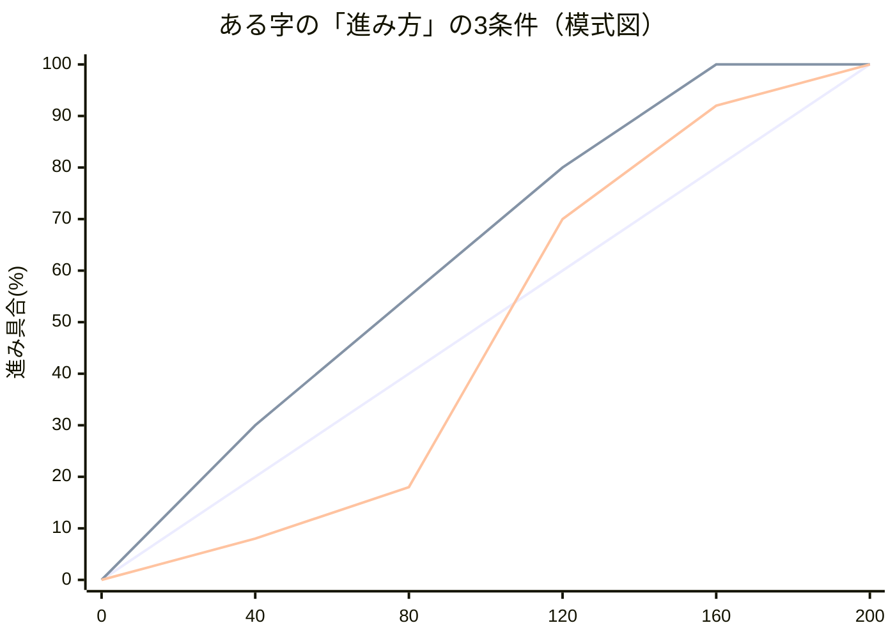
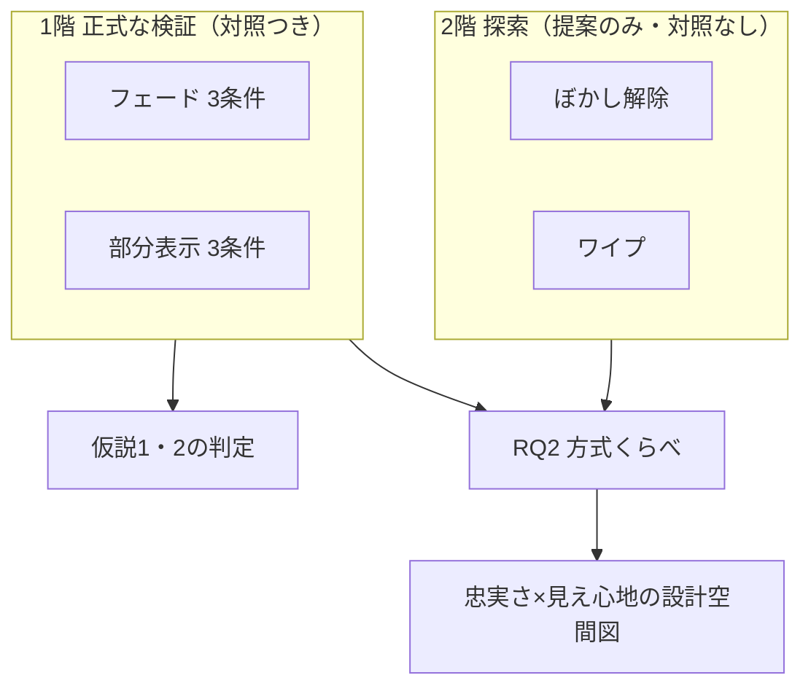

# 実験計画書：音声の「分かっていく過程」を文字アニメーションで作り直す手法の検証（iFont 転写検証実験）

- 作成: 2026-08-19 丸山。AI補助により起草した。**第2稿**で、栗原先生のレビューを待っている。
- 第2稿は、4系統の模擬査読を受けて第1稿を大きく直したものである。
  査読は 研究レビュー12点・EC24型・VR学会25型・ICEC23型 の4系統で、
  **どれも実験を始めてからでは直せない指摘**だった。変更の一覧は**巻末の付録B**にまとめた。
- 位置づけ: 実験1（68かな・目標220人）の計画書は温存し、その**前に行う小さな検証実験**。
  経緯: project/提案_方針転換_小さく確かめてから広げる.md／設計: project/設計案_生成アルゴリズム.md
- 実験ページは experiment/audio1char.html（v3.41）を土台に改修する（変更点は10章)。
  データ収集直前のコミットで実装を固定し、そのコミット番号を論文に書く。
- 呼称は「実験協力者」。修正時は「>」「-」表記。設計判断の理由は付録のQ&Aにまとめた。
- **締切: WISS 2026 投稿 8/31（月）23:59。登壇論文6ページ。**

## 1. 背景

### 1.1 経緯

iFontの狙いは、音声を聞くのと「同じ時点に同じだけ分かる」文字表示を作ることにある。
出発点は、かるたの決まり字を味わう体験を、聴覚に頼れない人にも字幕で届けたいという動機である。
音や表示を途中で打ち切って「どこまで届けば分かるか」を測る方法をゲーティング法と呼ぶ。
これは1961年以来の標準的な測り方で、聴覚と視覚の曲線を測って比べた研究もすでにある。
先行研究の整理は2章にまとめた。
本研究が新しく踏み込むのは、**測った音声の曲線をもとに文字アニメーションを作り、
それが狙いどおりに働くかを初見の参加者で確かめる**ところである。まず8文字でこれを検証する。

### 1.2 この研究の向き

主となる問いは「集団で測った音声の分かっていく曲線を、文字アニメーションの進み方を
変形することで、初見の集団に再現できるか」である。
**問いと仮説の定義はすべて3章に置いた。** この節は背景と設計の枠組みだけを述べる。

図の補足: A(t) と V(s) は、どちらもこの実験の中で測る。測る相手はクラウドソーシングで
募集した実験協力者である。A(t) は今回録音する発話に固有の曲線なので、この実験で測って
はじめて手に入る。既存研究から借りるのは、測り方であるゲーティング法と、表示方式を
分類する根拠の2つである。

**この研究の向き（最重要）**: 本研究が目指すのは、分かりやすさの**制御**である。
音声側で測った曲線を目標として与え、それと同じ分かり方をする表示を較正で作る。
目標が「この時点では55%の人にしか分からない」なら、わざと55%しか分からない表示が正しい。
既存のアニメーション文字研究は「表示を変えると読みやすさや理解がどう変わるか」を調べる
向きであり、本研究はその逆に「目標の曲線→較正→表示を作る」の向きへ進む。
だから各表示方式は、**分かり方を時間軸の上で操るための「乗り物」**として扱う。
この向きの違いは2.2で先行研究と対比した。

**言葉のルール**: この実験で作り直す対象は「識別率の軌跡」、すなわち正答率の時間曲線である。
正答率が同じでも、間違え方の分布は違いうる。たとえば60%が「た」で30%が「だ」に集まる場合と、
60%が「た」で残りがばらばらに散る場合とでは、参加者が持っている情報は違う。
そこで論文では、測ったものを直接表す「識別率軌跡の転写」という言い方に統一する。
間違え方の分布が一致するかは、追加の分析として調べる。
言葉づかいの取り決めは12章の「使わない言葉」に一覧にした。→ Q13

**表示方式は4種類・2階建て**: 方式は、既存のdynamic text研究が示す「文字の見えやすさを
時間的に操作する代表的なやり方」から4種類を選んだ。根拠は2.2に書いた。

| 方式 | 何が徐々に変わるか | 性質 |
|---|---|---|
| フェード | 透明→不透明 | 文字全体は最初からあり、信号の強さが上がる |
| 部分表示 | 文字の画素が固定乱数順で増える | 散らばった部分情報が増える（既存資産を流用） |
| ぼかし解除 | 強いぼかし→鮮明 | 形は最初からあり、細部が後から入る |
| ワイプ | 端から順に領域を見せる | つながった部分情報が増える |

- **1階（正式な検証）**: フェードと部分表示の2方式。それぞれに対照条件を揃える。
- **2階（探索）**: ぼかし解除とワイプは、提案手法の表示だけを作る。
  「同じ較正のやり方が他の方式でも通るか」「4方式のうちどれが目標の曲線に近づけやすいか」を
  傾向として見る。

どの方式で何を判定するか、探索の2方式についてどこまで言えるかは、3章に定義した。
最後に横軸=忠実さ・縦軸=見え心地の図に4方式を置き、設計の全体像として示す。

### 1.3 iFontの構想との対応

| 構想の言葉 | この実験での姿 |
|---|---|
| Perceptual Score（分かっていく過程の中間表現） | まぐれ当たりと押し間違いの分を除いて0〜1に直した識別の進み具合 q(t)。→ 7.1 |
| 変換g（聴覚と視覚を同じ認識率で対応づける較正） | 時間軸の変形 s_i(t) = q̂V_i⁻¹(q̂A_i(t))。gを時間に沿って使ったもの |
| frac課題（gの実測） | 較正グループの打ち切り課題 |
| 文字合成 | 生成アルゴリズム（3.1） |
| iFont | 生成されたアニメーション（提案手法の条件） |

（「対象＝かなそのもの」の意味 → Q2）

## 2. 関連研究

本研究が寄りかかっている先行研究を4つのまとまりに分けて示す。
ほかの章では文献名を並べず、必要なところからこの章を参照する。

### 2.1 時間で打ち切って測る方法

音や文字を途中で打ち切り、「どこまで届けば分かるか」を提示量の関数として測る方法は、
竹内(1961)以来の標準的な測り方である。Grosjean(1980)は語の認識にこの方法を広げた。
Furui(1986)は日本語の音節について、識別率が切る位置に対して急に変わり、スペクトルが
大きく動く付近の短い区間が識別に強く効くと報告している。この知見は、時点を等間隔に置く
かわりに、変化の速い早い時間帯を細かく取るという本研究の配置の根拠になっている。→ Q6

同じ刺激に何度も触れることの影響については、Cotton & Grosjean が提示形式による差の
小ささを報告しており、本研究で当て推量の扱いを考えるときの材料になる。→ Q7

### 2.2 動的な文字表示

文字を時間とともに変えて見せる研究には、大きく3つの系列がある。
第1に、文字を段階的に提示して読みや学習への効果を調べる研究がある。
Petersen & Andersen らの仕事があり、dynamic text と総称される領域である。
第2に、Livefonts のように字形そのものを時間とともに変化させる書体の研究がある。
第3に、kinetic typography のように文字の動きで情報や感情を伝える表現の研究がある。

いずれの系列も「表示を変えると読みやすさや理解がどう変わるか」を問う向きである。
本研究はその逆向きに、これらの機構を制御の乗り物として使い、外から与えた識別率の軌跡を
再現できるかを問う。→ 1.2
本研究が4方式を選んだ根拠も、この領域が示す「文字の見えやすさを時間的に操作する
代表的なやり方」の分類である。

### 2.3 感覚間の対応づけ

聴覚と視覚で測った認識の曲線を突き合わせる試みには先例がある。
Sánchez-García ら(2018)はゲーティング法を聴覚と視覚の両方に使い、両者の曲線を測って比べた。
その土台には、異なる感覚の量を対応づける古典的な感覚間マッチングの研究群がある。

音声に同期して文字を出す実装としては、カラオケが広く使われている。カラオケは表示の時刻を
音に合わせるところまでを行う。本研究はそこにさらに、較正の工程と、初見の参加者による
検証の工程を加え、一続きの手続きにする。→ Q11

### 2.4 刺激を少数に絞るときの先例

少数の刺激で音韻的な範囲を代表させる方法には、音声学的カテゴリーによる層化という先例がある。
Arai らの日本語音節知覚実験はカテゴリーを横断するように音節を選び、Takeuchi の検査は
100単音節から子音カテゴリーが均等になるよう20音節へ縮約している。
一方、iCI2004 や藤原の方式に代表される頻度ベースの選定は、日常会話の平均明瞭度を推定する
目的に向く。本研究の目的は時間構造の異なる音で転写が成立するかを見ることなので、
層化のほうが目的に合う。8字の具体的な選定は4.3に書いた。

## 3. 問いと仮説

**本研究の問いと仮説はこの章に一本化する。** ほかの章からはここを参照する。

**RQ1（主となる問い）**: 集団で測った音声の「分かっていく曲線」、すなわち提示時間から
正答率への対応を、文字アニメーションの進み方を変形することで、初見の集団に再現できるか。

判定は「初見の人が音声を聞いたときの曲線（群Atest）」と「初見の人がアニメーションを
見たときの曲線（群B）」の比較で行う。近さは曲線どうしの距離Eで測る。定義は7.2にある。
**仮説1・2はフェードと部分表示のそれぞれで別々に判定する。**
方式どうしの比較は探索のRQ2で扱い、仮説1・2の判定は方式の中だけで行う。

- **仮説1（転写は効く）**: 提案手法で作ったアニメーションは、そのままの等速で進む表示よりも、
  音声の曲線に近い。
- **仮説2（速さ合わせでは足りない）**: 提案手法は、「開始時刻と速さだけを最適に合わせた表示」
  よりも音声の曲線に近い。この対照は1次の時間変換にあたり、数式では s=at+b と書ける。
  - 前提: この仮説が意味を持つのは「1次の変換で合わせきれない字」がある場合である。
    その合わせきれなさを D_i と呼ぶ。**8字は音の種類と品質チェックだけで先に固定する。**
    D_i は「D_iが大きい字ほど提案手法の優位が大きいはず」という事前に宣言した予測として、
    本番データで確かめる用途に使う。この順序を守ることで、「効きそうな字だけ選んだ」という
    批判の余地を消す。
  - 仮説2が支持されなかった場合は「1次の時間変換で足りる」が結論になる。
    それも表示設計の知見として報告する。
- 補助指標: 中点の差。中点の意味には注意が要るので、7.1に注記を置いた。
- **RQ2（方式くらべ・探索）**: 同じ較正のやり方を4方式に使ったとき、
  **外から与えた目標の曲線にどれだけ近づけられるか**は方式によってどう違うか。
  評価の軸は忠実さである。探索の2方式は対照を持たないので、順位と傾向の報告にとどめる。
- **RQ3（見え心地・記述）**: 各方式の生成表示は、続けて見ていられるか。
  「継続して閲覧する際の主観的な見やすさ・負担」と定義し、4方式について聞く。
  忠実さと見え心地は別の量として扱う。
  **これは独立した実験（群C）として、識別課題を通らない別の集団に行う**（8/21の決定）。
  1字だけの提示に加えて、**5文字続けて出す形を2通り**（横に並べて残す／同じ場所で入れ替える）
  比べる。字幕は本来1文字ずつ続けて流れるものだからである。
  掲載は検証フェーズと並行するので、日程は延びない。→ 4.5
- **RQ4（速さの影響・記述）**: **表示の識別率は、いま画面がどこまで進んでいるか
  （進み具合 s）だけで決まるのか。それとも、そこへ至る速さにも左右されるのか。**

  この問いは本研究の土台に直接あたる。生成のやり方は時間軸を伸び縮みさせて曲線を写すもので、
  「s が同じなら正答率も同じ」＝**進み具合が状態を決める**という見方の上に成り立っている。
  そこで、視覚較正（群A′）のフェード方式にかぎり、基準アニメの長さを**2水準**にして、
  同じ s の水準を両方の速さで測る。暫定値は600ミリ秒＝いつもの速さと、
  1000ミリ秒＝約1.7倍ゆっくり、の2つである。**どちらの結果でも報告する**——

  - **差が出なかった場合**: 進み具合がその時点の見えやすさを決めている、という
    予備的な証拠になる。時間軸の伸び縮みで曲線を写すという生成のやり方の土台を支える。
  - **差が出た場合**: 同じ濃さでも至る速さで見え方が変わる＝**履歴に依存する**という発見。
    これは「時間の伸び縮みだけでは移せない」という手法の**限界条件**を示すもので、
    次の設計へつながる。速さも入力に持つ生成へ広げるか、扱う速さの範囲を限定して報告する。

  **三段構えで答える**。(1) **下見** = 少人数の予備。当たりを見るための段階である。
  (2) **本番の視覚較正（群A′）** = RQ4 の**本回答**。効果量と信頼区間を付けて報告する。
  (3) **検証（群B と群Atest の曲線の一致）** = 進み具合が状態を決めるという見方そのものの
  **総合テスト**。この見方が崩れていれば、そこで一致しないという形で必ず現れる。
  なお**生成に使う視覚の曲線は600ミリ秒の水準だけ**と事前に決めてある。→ 7.1
  1000ミリ秒の水準のデータは、RQ4 に答えるために使う。

**評価の2つの軸**: 忠実さは目標の曲線にどれだけ近いか、見え心地はその表示を続けて
見ていられるかを表す。この2つは別々に測る。最後に横軸=忠実さ・縦軸=見え心地の図に
4方式を置き、設計の全体像として示す。

やっていることが壊れていないかの確認（操作チェック）:
確認A＝全部見せ・全部聞かせの問題の正答率が十分高い。確認B＝提示が長いほど正答率が上がる。
確認C＝ほとんど情報のない問題の正答率が、実験の後半になっても上がっていない
（出てくる字を覚えてしまう「学習」の兆候検出。→ Q7）。

## 4. 実験の構成

### 4.1 全体の流れ（5つの独立な参加者集団＋生成工程、「測る→作る→別の人で確かめる」）

参加者がいるのは較正2つ・検証2つ・見え心地1つの**5集団**である。較正は群Acalと群A′、
検証は群Atestと群B、見え心地は群Cを指す。
生成は参加者を伴わない計算工程である。視覚較正A′の割付方式しだいでは、A′が方式別の複数集団に
分かれる場合がある。

群Cは2026-08-21に、群Bの識別課題の末尾から切り離して独立させたものである（→ 4.5）。
掲載は検証フェーズと**並行**して行うので、日程は延びない。

| 段階 | 集団 | 課題 | 得るもの |
|---|---|---|---|
| 較正（聴覚） | 群Acal | 音声を先頭からt msで打ち切り→かな表から回答 | 生成に使う音声の曲線 Â_i(t) |
| 較正（視覚） | 群A′ | 基準アニメを進み具合s%で打ち切り→回答（4方式ぶん） | 方式ごとの視覚の曲線 V̂_m,i(s) |
| 生成 | — | 曲線の逆引きでアニメの進み方を一発生成し**凍結** | 各字の進み方 s_i(t)（人手調整なし） |
| 検証（聴覚） | 群Atest | 群Acalと同じ音声課題 | 検証の基準になる目標曲線 |
| 検証（視覚） | 群B | 1階6条件＋2階2条件のアニメを打ち切り→回答 | 各方式・各条件の曲線 |
| 見え心地 | 群C | 4方式 × 3通りの出し方（1字／横に並べる／その場で入れ替える）のアニメを打ち切らず繰り返し見る→7件法で評価（識別課題は無し） | 方式ごと・出し方ごとの見え心地（RQ3） |

- **検証の比較は「群B vs 群Atest」**、つまり初見の人の視覚と初見の人の聴覚を突き合わせる。
  こうすると「較正に使った人たちに合わせ込んだだけ」という疑いを、判定の基準から切り離せる。→ Q1
- どの集団も互いに独立で、同じ人が出るのは1回だけである。較正の聴覚と視覚まで分けるのは、
  同じ人が両方をやると、先の課題で出てくる字や刺激の癖を覚え、後の課題の曲線が汚れるためである。→ Q1
- **凍結**: 生成のコード・設定・全8字の進み方を、検証データを取る**前に**コミットで固定し、
  番号を記録する。そのあとは、固定した版のまま検証データを取る。→ Q3
  凍結には「**生成に使う視覚の曲線は基準アニメ600ミリ秒の水準だけ**」という取り決めも含める。
  視覚較正では RQ4 のため2つの速さで測り、逆引きの材料には600ミリ秒の側を使う。→ 7.1
- **この手法が置いている仮定**: 基準アニメで測った「進み具合→正答率」の関係が、進み方を
  変形した後でもだいたい保たれること。同じ濃さに達していれば、そこへ来るまでの見え方の履歴が
  違っても正答率は近い、という見立てである。この仮定は**この実験の検証対象に含める**。
  崩れた場合は「単純な時間変形では移植できない」という結果として報告する。→ Q12
- 基準アニメの長さと進み方のカーブは、較正の前に少人数の下見で決める設計項目である。→ Q4
- **視覚較正のまとめ方（検討中の案）**: 1つの集団の中で「どの字をどの方式で見るか」を
  偏りなく割り振る。同じ人には、1つの字につき1方式だけを見せ、人によって組合せを入れ替える。
  集団全体では全方式×全字の曲線が得られる。これは**集団の数を減らす工夫**であり、
  必要な回答数は方式の数に比例したままである。成立するかと必要人数はA2で確定する。→ 11章

### 4.2 群Bの条件

**1階（正式な検証）**: フェードと部分表示のそれぞれに、同じ3条件を用意する（計6条件）:

| 条件 | 内容 | 何に答えるか |
|---|---|---|
| 対照1 | その方式の等速の進み方 | 手を加えないときの基準 |
| 対照2 | **開始時刻と速さだけ最適に合わせた進み方**（s=at+b。a,bは較正データだけから、曲線の距離が最小になるように決める） | 「速さを合わせるだけで十分では？」への直接の答え（→ Q5） |
| 提案 | 曲線の形まで写す非線形な時間変形（＝iFont） | 「分かっていく形」まで写す必要があるか |

> 比較はすべて**方式の中だけ**で行う。つまり提案と、その方式の対照とを突き合わせる。
> 方式どうしの比較は探索のRQ2で扱う。→ 3章
> 論文には代表の字について、3条件の進み方の違いを1枚の図に重ねて示す。

3条件の違いの模式図（数値は説明用の作り物。横軸=時間ms、縦軸=表示の進み具合%）:

（提案だけが「ゆっくり→急に→ゆっくり」のような**非直線の進み方**になり得る。
3本がほぼ重なる字＝1次で足りる字、離れる字＝形まで写す意味がある字）

**2階（探索・対照つきなし）**: ぼかし解除とワイプは提案手法の表示だけ作って群Bに混ぜ、
合計8条件にする。この2方式が答えるのはRQ2とRQ3で、較正と凍結の対象には含める。
**言い方のルール**: 1階は「対照に勝つか検証した」、2階は「同じ較正のやり方で作れるか、
どのくらい近いかを傾向として調べた」と書き分ける。用語の取り決めは12章に一覧がある。

### 4.3 課題の詳細

- **文字**: ターゲット8字を、**音声学的カテゴリーによる層化**で選ぶ。
  少数で音韻的な範囲を代表させるこの方式には先例があり、根拠は2.4に整理した。

  > 決定（8/20・丸山）: **あ（母音）・か（無声破裂）・が（有声破裂・かとの清濁対）・
  > ぱ（両唇無声破裂・調音位置差）・し（摩擦）・つ（破擦）・ま（鼻音）・ら（はじき音）**。
  > 日本語モーラの主要な子音様式を1つずつ含む層化構成。
  > **選定規則**: 原則を先に固定 → 8字固定 → 録音 → 品質チェック → 実験、の順を守る。
  > 録音や曲線を見たあとも、この8字をそのまま使いつづける。これで選択の偏りを防ぐ。
  > 録音に不備があった字は**録り直して**同じ字を使う。
  > か・がのonset検出には±20ms程度の不確かさが残るが、onsetの誤差は較正と検証で共通なので、
  > 実験の中では相殺される。絶対時刻として読むときにだけ注意を付す。
  > 視覚面は二次チェックにとどめ、8字が極端に似た字や簡単な字へ偏っていないことを確かめた。
  > ストローク画素は4458〜10045の幅に散り、字形の重複もなかった。
  8字はねらって選ぶので、結論は「この8字について、参加者の母集団へ広げられる」までとする。
  かな全体への一般化は68字実験の役割である。
- **まぎれ字（フィラー）**: ターゲット以外のかなも問題に混ぜ、出題の範囲を8字より広く見せる。
  このため録音は全68かなで行う。混ぜる量と繰り返し回数はA2で確定する。
- **提示の刻み**: 聴覚は音の実体の開始点（acoustic onset）からの実時間ms、視覚は
  進み具合%で打ち切る。1字あたり7時点に、打ち切らない「全長」を1点足して8点とする。
  時間帯の根拠は2.1にある。

  > 決定（8/21・丸山）: **全字で同じ時点を使うのをやめ、字の音の種類ごとに時点帯を割り当てる。**
  >
  > **なぜそうするか。** Furui (1986) の日本語CV音節の打ち切り実験では、識別に必要な区間の
  > 長さが子音の種類でかなり違うと報告されている——破裂音と鼻音は50〜70ミリ秒（破裂の
  > 約10ミリ秒前から）、無声摩擦音は平均120ミリ秒（声の始まりの100ミリ秒前から）。
  > 下見（`project/パイロット分析_20260821.md`）の結果もこれと同じ向きで、
  > 「あ」「が」は20ミリ秒、破裂の仲間は40ミリ秒、「つ」は60ミリ秒、「ら」は110ミリ秒で、
  > すでに正答率が天井に張り付いていた。全字に同じ並びを当てると、早く天井に着く字では
  > 後半の時点が、遅い字では前半の時点が、どちらも情報を持たない点になってしまう。
  >
  > **暫定の配置**（数値はいずれも onset を0ミリ秒とした絶対時間。A2で再確定する）:
  >
  > | 音の種類 | 字 | 時点（ミリ秒） |
  > |---|---|---|
  > | 母音・破裂音・鼻音 | あ・か・が・ぱ・ま | 10, 20, 30, 40, 55, 70, 100, 全長 |
  > | 破擦音（破裂＋摩擦） | つ | 20, 40, 60, 80, 110, 150, 200, 全長 |
  > | 無声摩擦音 | し | 30, 60, 90, 120, 150, 190, 240, 全長 |
  > | はじき音 | ら | 20, 40, 60, 80, 110, 150, 200, 全長 |
  >
  > **絶対時間である点は変えない。** 「その字の全長の何%」という相対の置き方は採らない。
  > 字をまたいだ比較（曲線どうしの距離E）も、生成の逆引き（音の時刻→アニメの進み具合）も、
  > どちらも絶対時間の軸の上で行うので、字ごとに軸の目盛りが変わると両方が成り立たなくなる。
  >
  > **確定の手順**: ①文献で当たりをつける（済） → ②下見で全域を粗く測る →
  > ③**A2で各字の配置を確定する**。
  >
  > **論文での書き方**: 「提示時点は、先行研究の知見と下見の結果に基づいて字ごとに配置した」。
  > 研究者の勘ではなく、根拠を示せる設計として記述する。
  >
  > 設定は `experiment/transfer_config.js` の `audio.gates_ms`（字をキーにした表）にある。
  > 表に名前の無い字（まぎれ字60字）は `_default` の並び 20, 40, 60, 80, 110, 150, 220 を使う。
  > 「全長」を各字の1点として足したのは、**その字の曲線の天井**（最後まで聞けば何%当たるか）を
  > 字ごとに押さえるためである。時点を字ごとに置くと、天井が取れているかどうかも
  > 字ごとに確かめる必要が出てくる。
  >
  > **視覚（群B）の時点 `visual.gates_ms` は、まだ全字共通のままである。** 聴覚と同じ時点で
  > 曲線を比べる決まりなので、検証フェーズを掲載する前に聴覚と同じ字ごとの配置へそろえる。→ 11章
- **1回だけ提示**: 刺激に触れる回数を聴覚・視覚とも1回にそろえる。回答時間は無制限のままにする。
- **回答**: 五十音表と同じ並びの全かな表から選ぶ。1問1答で、選び直しの確認を挟む。
  **回答に使う表は聴覚・視覚で同じにする**。当て推量の率は、値を変えても結論が変わらないかを
  確かめる形で扱う。同じ字が繰り返し出ると、参加者の頭の中の候補は68個より狭まりうるためである。→ Q7
- **割り振りの原則**: 群Bでは「字×時点×条件」の各組合せの回答数がほぼ等しくなるように
  実験協力者の間で分担し、1人は3条件すべてを経験、順番はランダムにする。具体はA2で確定。
- **募集**: Yahoo!クラウドソーシングで行う。条件は日本語母語・18歳以上・各集団1人1回で、
  集団のあいだで同じ人が重ならないようにする。再生機器は自由とし、
  合図音 → 0.6秒 → 刺激 の順で鳴らして無線イヤホンの頭欠けを防ぐ。
- **重複参加の防ぎ方**: **同時期に走る集団を1つの掲載・1つのURLに統合し、サイト側で
  自動的に振り分ける**。較正フェーズはAcalとA′で1掲載、検証フェーズはAtestとBで1掲載になる。
  この形にするのは、別々の掲載どうしで排他参加を強制する手段が無いためである。
  フェーズをまたぐ重複は、参加者IDをサーバ記録と照合して受付時にお断りする。
  **群C（見え心地）は3本目の掲載**で、検証フェーズと同時期に走る。群Cは課題の中身が違うので
  1本の掲載にまとめられない。同時期に走る2本のあいだの重複は、受付時の照合を
  **どちら向きにも**掛けて防ぐ（群Cに来た人が検証フェーズにいないか、
  検証フェーズに来た人が群Cにいないか）。
- **人数**: A2の通しシミュレーションで確定する。→ 11章
  以前の目安25人/集団は下限とみなす。まぎれ字を入れると1つの組合せあたりの回答が薄まるので、
  必要人数は増える見込みである。

### 4.4 刺激（音源）

> 決定（8/19・丸山）: **自然音声**。録音は全68かな（ターゲット候補12字を優先して丁寧に）。

1. **録音**: 日本語を母語とする話者1名（研究室の学生・知人などでよい）が、かなを1字ずつ
   単独で自然に発話。各3〜5回・WAV（手順書: project/録音手順_自然音声12字.md 第3版）
2. **テイクの選び方（録音前に固定）**: 読み間違い・雑音・音割れのある回を除き、
   残りから**長さが真ん中に最も近い回**を機械的に採用（→ Q8）
3. **音量合わせと下処理**: 1音まるごとに一定の倍率を掛け、音の中身の強弱の配分はそのまま残す。→ Q8
   加えて**電源ハム除去の100Hzハイパスフィルタ**を全字共通で掛ける
   > 決定（8/20・丸山）: 録音に50Hzの電源ノイズが乗っていたため追加した。話者の声の基本周波数は
   > 216Hzなので、フィルタが掛かるのは声より下の帯域だけである。音声刺激づくりでは
   > カットオフ40〜100Hzが常用される標準的な下処理にあたる。
   > 下処理はこのハイパスだけにとどめ、Methodsに明記する。
4. **時間の基準**: 音の実体が始まる点、すなわち acoustic onset を測って記録し、**実験の0msとする**。
   検出は自動で行い、短い窓のエネルギーが背景雑音を十分超えた最初の点を取ったうえで、全数を目視確認する。
   音の種類ごとの基準も文書化する。破裂音は破裂の開始、こすれる音は摩擦音の開始、母音と鼻音は
   周期的な波形の開始を onset とする。スクリプトと全字の値は公開する。→ Q9
5. **打ち切りの処理**: **打ち切り時刻tで終わる5msのなめらかなフェードアウト**で切る。
   フェード区間はtの直前5msで、刺激に入るのはtまでの音である。
   全字・全時点で共通にし、論文に明記する
6. **配信**: WAVのまま配信し、音の頭の立ち上がりをそのまま残す。再生時も録音のまま鳴らす
7. **品質チェック（QC）**: 耳での全長試聴に加え、開始点・VOT・全長・音量・音割れの
   機械測定一覧を作る。さらに少人数の下見で、全長ならほぼ正答できることを確認

- 各字1テイクなので、得られる曲線は**この話者のこの発話**のものである。論文でもそう限定する。
  複数話者・複数テイクへの拡張は今後の課題とする。
- この実験では自然音声を使う。従来の刺激作りにあたる合成音声への加工は、「ぽ」が濁って
  聞こえる問題を起こしたため凍結した。診断は project/清濁診断_音響測定.md にある。
  標準データベースは将来の追試用に温存する。→ project/音源調査_標準DB.md

### 4.5 見え心地の実験（群C・独立した実験）

RQ3 に答えるための実験である。**識別課題を通らない別の集団**に行う。

> 決定（8/21・丸山）: **群Bの末尾から切り出して独立させる。**
> 8/19の版では、群Bの識別課題が全部終わったあとに続けて聞く形にしていた。
> 切り出した理由は3つある。
>
> 1. **疲れが印象に混ざるのを避ける**。群Bは1人あたり90問以上の識別課題をこなす。
>    その直後に「この表示は続けて見ていられるか」を聞くと、答えているのが表示の性質なのか、
>    課題をやり終えた疲れなのかを分けられない。
> 2. **打ち切りなしの繰り返し提示にできる**。群Bの末尾に付けるかぎり、
>    識別課題と同じ「1回だけ見せる」の建て付けを大きく崩せなかった。独立させれば、
>    同じアニメを何度でも流しつづけられる。**字幕は本来くりかえし流れるもの**なので、
>    そのほうが実態に近い。
> 3. **群Bの負担が減る**。群Bは識別課題だけで終われる。
>
> 掲載は検証フェーズ（群Atest・群B）と**並行**して行う。別の集団・別の掲載なので、
> 日程は延びない。

- **流れ**: 同意 → 見え方の確認 → 説明 → 評価本体 → 完了コード。**識別課題は通らない。**

- **提示（4方式 × 3通りの出し方 = 12本）**: 決定（8/21・丸山）。
  1字だけ見せる形に加えて、**5文字続けて出す形を2通り**足した。字幕は本来1文字ずつ
  続けて流れるものなので、1字だけの印象では字幕としての見え心地を答えたことにならない。

  | 出し方 | 何をするか |
  |---|---|
  | 1字だけ | 代表字1字が現れて、しばらく残って、消える |
  | 5字・横に並べる | 5字を左から1字ずつ出し、**出た字はそのまま残す**（字幕的な見せ方） |
  | 5字・その場で入れ替える | 5字を**同じ位置で1字ずつ差し替える** |

  進み方は生成した表（提案手法のもの）を使うので、群Bが見るのと同じ絵になる。
  どれも**打ち切らず**、評価しているあいだ**くりかえし流れつづける**。
  「▶ もう一度みる」を押せばその場で流し直せる。流れた周の数と、押して流し直した回数は
  別々に記録する。

- **字は増やさない**: 1字条件は あ、5字条件は **あ・か・し・ま・ら**（事前固定）。
  比べたいのは現れ方と出し方であって字の難しさではないので、字の種類は増やさない。
  5字の並びは**意味のある語にしない**——言葉として読めてしまうと、表示の見え心地ではなく
  語の読みやすさを答えられてしまうためである。

- **字と字の間隔（重要）**: **前の字が現れきってから300ミリ秒空けて、次の字が現れはじめる。**
  アニメ本体が600ミリ秒なので、字と字の**開始どうしの間隔は約900ミリ秒**になる。

  > **なぜこの値か。** ここで測りたいのは「字幕として続けて見ていられるか」だけであり、
  > **前後の字が互いの見え方を邪魔する現象（視覚的マスキング）は測らない**。それは連続提示
  > そのものを扱う次の段階の実験の領域である。先行研究では、視覚的マスキングが起きるのは
  > 2つの刺激の開始どうしの間隔（SOA）が0〜200ミリ秒の範囲とされ、文字の識別に対する抑制は
  > 約60〜120ミリ秒で最も強く、120ミリ秒あたりで消えると報告されている
  > （Enns & Di Lollo のレビュー、経頭蓋磁気刺激による文字識別の抑制の研究など）。
  > 900ミリ秒はその**4倍以上**離れており、**先行研究が示す視覚マスキングの時間帯を
  > 大きく超える間隔を取り、前後の字が干渉しない条件で見え心地だけを問う**設計になっている。
  >
  > 読み上げの速さとの関係も見ておく。録音した自然音声の実測では、かな1字の長さは
  > ターゲット8字で303〜419ミリ秒（平均347）、全68かなでも250〜451ミリ秒だった。
  > 900ミリ秒はその**2.6倍ほどゆっくり**にあたる。5文字続けて読む速さを土台にしつつ、
  > 干渉しないところまで十分に間を空けた、という位置づけである。
  >
  > **横に並べる形では、残った字と新しい字が空間的に隣り合う。** これは時間の干渉ではなく、
  > 隣の字が邪魔をする現象（crowding・側方抑制）の領域にあたる。対処として
  > **字と字のすき間を1文字分あける**。

- **大きさをそろえる**: 3つの出し方すべてで、1字あたりの表示の大きさを同じにする。
  1字だけの条件を大きく出すと、「出し方の違い」ではなく「字の大きさの違い」を
  答えられてしまうためである。実際の表示幅は記録に残す（`char_px`）。

- **質問**: 各本について7件法で3項目。「この表示は継続して見やすい」「変化が自然に感じる」
  「目障り・わずらわしい」の3つで、1がまったくそう思わない、7がとてもそう思うにあたる。
  3つ目だけ向きが逆なので、集計のときは反転する。

- **最後の質問は2問に分ける**: 聞きたいことが「どの**現れ方**（方式）がよいか」と
  「5文字続けるとき、どの**出し方**がよいか」の2つあるためである。1問にまとめると、
  参加者がどちらについて答えたのか分からなくなる。
  1. **現れ方**（4択）: 4方式の見本を1字の形で横に並べ、同時に流して見くらべてもらう。
  2. **出し方**（3択: 横に並べる／その場で入れ替える／どちらでもよい）:
     見本は**1問目で選ばれた方式**で出す。自分がよいと思った現れ方で2つを見くらべられる。
     この2つの見本は同じ方式なので、**1周ずつかわりばんこに**流し、
     いま流しているほうを枠の色で示す（同じ方式のアニメを2つ同時に動かすと、
     部分表示・ぼかし解除の内部の作業領域を取り合って壊れるため）。

- **順序**: 方式も出し方も混ぜて出す。何番目に出したかを記録し、順序の効き目を後から
  見られるようにする。最後の2問で見本を並べる順も混ぜる（左端・上端が有利にならないため）。

- **所要**: 4方式×3通り＝12本で、同意から完了コードまで**およそ7分**。
  1周の長さは1字条件が2.1秒、5字条件が6.5秒である。

- **独立性**: 群Cは較正フェーズ（群Acal・群A′）とも検証フェーズ（群Atest・群B）とも
  重ならない集団にする。参加者IDをサーバの名簿と照合して、どちらかに出ている人はお断りする。
  群Cは検証フェーズと**同時期に走る**ので、照合はどちら向きにも要る
  （群C→検証フェーズ、検証フェーズ→群C）。

実装は `experiment/transfer_comfort.html` ＋ `experiment/transfer_comfort.js`、
設定は `experiment/transfer_comfort_config.js` にある。人数と報酬はまだ決まっていない。→ 11章

## 5. 何を測定して分析するか

- 主要指標: 1問ごとの正誤。採点の仕組みは実験1と同じである。
- 補助指標: 反応時間・実際の提示時間・基準アニメの長さ・所要時間・途中再開の回数・
  何問目か・端末環境。
  実際の提示時間は、視覚では描画の実時刻を記録して、狙った時間とのずれを見るために使う。
  基準アニメの長さは `base_anim_ms` 列に入り、RQ4 のための速さ2水準はここで分かれる。
  何問目かは、学習の兆候を調べるために使う。
- 仮説1・2の判定はすべて正誤から行う。主観の質問は見え心地だけにとどめる。→ 4.5
  かるたの実戦のような使い勝手の評価は、次の段階の実験で扱う。

## 6. 実験協力者への事前説明

実験1（v3.41）の画面をそのまま使う。順に、同意画面・音量の確認・見え方の確認・
図解つき説明と練習である。教示の要点は「聞こえなくても、もっとも近いと思う文字を
選んでください」で、視覚の集団には「見えなくても」に読み替えた文を出す。
この実験の画面では、1問につき1回だけ提示する形に合わせて聞き直しのボタンを外してある。

## 7. データの分析方法

### 7.1 曲線の推定（生成用と分析用を分ける）

**生成用**: まぐれ当たりによる床と、押し間違いによる天井の欠けを除いて0〜1に直した
「識別の進み具合」q を、**単調であることだけを条件にした回帰**で推定する。
アニメの進み方は s_i(t) = q̂V_i⁻¹(q̂A_i(t))。範囲の外に出る部分は端に丸め、丸めが起きた範囲を
記録・報告する。
> 第2稿の理由: 聴覚・視覚の両方をS字関数に当てはめてから逆引きすると、数学的にほぼ
> 「開始時刻をずらして速さを変えるだけ」の変換へ退化し、提案手法と対照2がほぼ同じものになる。
> そこでS字への当てはめは、分析の要約にだけ使うことにした。

**内挿の確認**: 凍結の前に行う手続きで、追加のデータは要らない。
生成では、実際に測った提示水準と水準のあいだの値を曲線から読み取って使う。これを内挿と呼ぶ。
その読み取りが信用できるかを、
**測った水準を1つ伏せて確かめる**。手順は、較正で測った提示水準のうち1つを取り除き、
残りだけで曲線を当てはめ、伏せた水準の正答率を予測させて実測と比べる。これを水準ごとに
繰り返す。これを1つ抜き交差確認と呼ぶ。すでに取ったデータだけで済む手続きである。
予測が大きく外れる水準があれば、そこは曲線がなだらかにつながっていない＝**水準の間隔が
粗すぎる**ということなので、A2 で水準を足すか配置を変えることを検討する。
外れの大きさ（予測と実測の差。単位は正答率ポイント）は論文にも載せ、生成に使った曲線が
どのくらい信用できるかの目安として示す。

**生成に使う視覚の曲線は「600ミリ秒の水準」だけ（事前固定・凍結の対象）**: 視覚較正では
RQ4 のために基準アニメの長さを2水準（600 / 1000ミリ秒）で測るが、**逆引きの材料にするのは
600ミリ秒の水準の曲線だけ**と、データを見る前に決めてある
実装は `experiment/transfer_config.js` の `visual.calib_speed_probe.generation_level_ms` にあり、
記録の `base_anim_ms` 列で2群に分かれる。1000ミリ秒の水準のデータは **RQ4 に答えるために**使う。
理由は2つある。第1に、速さの効果と進み具合の効果を別々に見るためである。2水準を混ぜて1本の
曲線にすると、この2つが重なってしまう。第2に、「結果を見てから生成に都合のよい速さを選んだ」
という批判の余地を消すためである。→ Q3・Q8 と同じ考え方
この取り決めも凍結の対象に含める。

**下見だけ足す時点の扱い**: 下見では、聴覚の打ち切り時点に 10 ミリ秒を、視覚の進み具合に
3% を、それぞれ1水準ずつ足す。ねらいはどちらも**床がどこにあるかを見る**ことである。
下見では作者本人が最も薄い・最も短い水準でも正答してしまい、いちばん端の水準が
床として働かなかった。**この2つの水準は、生成（warp）の材料には使わない。**
逆引きに使うのは `gates_ms` と `progress_pct_levels` 本体の時点だけである。
とくに10ミリ秒の刺激は注意が要る。打ち切りの終端には5ミリ秒の余弦フェードが掛かる決まり
なので、10ミリ秒の刺激では後半5ミリ秒が減衰していく区間になり、**そのままの大きさで
鳴るのは頭の約5ミリ秒だけ**になる。他の時点と同じ土俵の値として扱わず、
「ここまで短くすると当たらなくなる」という床の目印として読む。
本番の掲載前には両方とも切り、A2で確定した並びを本体の表に書く。

**RQ4（速さの影響）の分析**: 群A′のフェード方式について、同じ進み具合 s の水準での正答率を
速さ2水準のあいだで比べる。判定は効果量と信頼区間で行う。効果量の単位は正答率ポイントである。
区間が広いときは「この人数では判定できなかった」と書く。三段構えの位置づけは3章のRQ4に書いた。
同じ人が同じ字を2つの速さで見るので、**人と字を効果として含めた混合モデル**で扱う。
速さの比較は人の中で取れるため、人によるばらつきの影響を受けにくい。

**分析用（要約）**: S字関数 P(t) = γ + (1−γ−λ)·logistic((t−μ)/s) を当てはめ、
中点μ・急峻さ・押し間違い率λを要約として報告する。まぐれ当たり率γは選択肢数の逆数を
初期値に置き、値を変えても結論が変わらないかを確かめる。→ Q7
**μが表すのは「下限と上限のちょうど中間の時刻」である。**
正答率50%の時刻が要るときは、そこから別に逆算する。

**統計モデル**: 正誤を、実験協力者・文字・条件・時間・文字×時間を含む混合モデルで扱う。
実験協力者を入れるのは、同じ人の回答どうしが似ることを考慮するためである。
文字はねらって選んでいるので、結論はこの8字の範囲で述べる。

### 7.2 成功の判定（「近さ」の定義）

- **主判定: 曲線の距離E**＝2つの曲線の、評価時点での差の平均（正答率ポイント）。
  仮説1は E(提案) vs E(対照1)、仮説2は E(提案) vs E(対照2)。同じ字どうしのペアで比べ、
  字ごとの難しさの差を打ち消す。
- 補助: 中点の差・急峻さ・混同行列・字ごとの誤差・丸めの発生範囲。
- 報告: 差とその信頼区間。「±何msなら実質同じか」という基準は次の段階で決める。
- 参考の目安（シミュレーションより）: 測定の揺らぎだけでも距離Eは約4.7ポイント残る。
  形が合っていない場合は8〜10ポイントに現れる。

### 7.3 除外基準

実験1の7.3を踏襲（確認問題の誤答数・無応答・所要時間の異常・重複参加）。
数値の線引きはA2と同時に固定。加えて確認C（学習の兆候）を集団レベルで報告する。

## 8. モデルケース（群Bのある実験協力者）

1. Yahoo!クラウドソーシングで「文字の見え方の実験（約10分）」を開く。
2. 同意画面→見え方の確認→図解つき説明→練習1問以上。
3. 本番: いろいろなかなが、さまざまな速さと見え方で現れては消える。見え方はフェード・
   部分表示・ぼかし解除・ワイプの4通りで、条件の区別を伝えずに出題する。各問1回だけ提示され、
   全かな表から選んで確定する。分からないときも、もっとも近い字を選ぶ。
4. 識別課題が全部終わったら、代表の字のアニメーションを普通に眺めて、
   見え心地の質問（3項目×数本＋どれを使いたいか）に答える。
5. 完了コードをコピーして投稿し、報酬を受け取る。

（聴覚の集団は音声版、較正の視覚集団は各方式の基準アニメ版で同じ流れ。）

## 9. 予想される結果・結論（希望的展望）

- 仮説1が支持: 「音声の識別率軌跡は、較正した時間変形で文字アニメーションとして作り直せる」
  ——WISSの中核の主張。
- 仮説2も支持: 「速さ合わせでは足りず、曲線の形まで写す意味がある」。
- 仮説2が不支持: 「1次の時間変換で近似できる」という設計知見として報告する。
  どの字も1次で合わせきれるかどうかは、下見の段階で見当がつく。
- 進み具合と正答率の関係が変形後に崩れた場合: 「同じ濃さでも見え方の履歴で正答率が変わる」
  という発見として報告（→ Q12）。
- 方式くらべ（RQ2・RQ3）: 例えば「部分表示は忠実だが目障り、フェードは快適だが忠実さは中くらい」
  のような結果になれば、**忠実さと見え心地は別物でトレードオフがあり得る**という
  HCIらしい知見になる。
- どの場合も、主張は「較正済みの8字・この話者の発話・調べた表示方式・集団レベル」の範囲で述べる。
  言葉づかいの一覧は設計案§6と本書12章にある。

## 10. 実験のための実装（差分）

1. 聴覚: 割合指定（frac%）→ 開始点からの実時間ms・字ごと7時点の設定化＋5msの終端フェード。
   **8/21に字ごとの配置へ変更（実装済み）**: `audio.gates_ms` を字をキーにした表として書き、
   表に無い字は `_default` を使う。各字の並びの最後に「全長」を1点足す
   （`audio.include_full_gate`）。確認問題C（ほとんど情報のない問題）は、全字共通の最小値ではなく
   **その字の最小の時点**を使う。→ 4.3
2. 視覚較正: フェードは既存の打ち切り課題（刻みの設定のみ）。部分表示は既存のマスク方式
   （字ごと固定乱数順の画素表示。必要な刻みは生成スクリプトで再生成）の再生器を追加。
   探索の2方式: ぼかし解除＝ぼかし半径を単調に減らす、ワイプ＝見せる領域を単調に広げる
3. 群B: 進み方 s_i(t)（60Hzの数値列）で再生する変形モード（フェード=濃さ、部分表示=画素率、
   ぼかし=半径、ワイプ=領域率）＋8条件とまぎれ字の割り振り・記録（方式列・条件列）。
   **見え心地の画面は8/21に群Bから外した**（独立した群Cへ。→ 4.5）
4. 1問につき1回だけ提示する形にする。聞き直し・見直しのボタンは画面から外す
5. 刺激: 自然音声WAV＋各ファイルの開始点（ms）の一覧。まぎれ字の音声・表示も同じ手順で用意
6. 記録: 集団・方式・条件・時点・実提示時間・何問目かを1問1行で保存
7. **群C（見え心地・8/21追加）**: `experiment/transfer_comfort.html` を入口とする独立ページ。
   同意 → 見え方の確認 → 説明 → **4方式 × 3通りの出し方 = 12本**のアニメを打ち切らず
   繰り返し流して7件法3項目 → 最後の2問（現れ方の4択・出し方の3択） → 完了コード。
   3通りの出し方（1字／5字を横に並べて残す／5字を同じ場所で入れ替える）は1つの再生器で
   まかない、字と字の間隔は「現れきってから300ミリ秒」で決める。1字あたりの表示の
   大きさは3条件で同じにそろえる。提示順・繰り返した周の数・押して流し直した回数・
   1本あたりの所要・実際の表示幅も記録する。保存先は群Bと同じ `transfer_wellbeing` シートで、
   `phase` 列に `comfort`、`group` 列に `c` が入る（サーバ側の変更は要らない）。
   **残る結線**: サーバの名簿（`gas_transfer/code.gs` の `transferStatus`）が
   `comfort` フェーズをまだ知らないので、掲載前に足す。→ 掲載前チェックリスト H-1

## 11. 未確定事項と決定の記録

シミュレーションは二段階に分かれる。A1とA1.5は実施済みで、仮の曲線を使った設計感度の確認だった。
**これから行うA2**は、実際の刺激の下見データを使う。
録音標本→曲線推定→生成→検証標本→距離Eの判定、までの**全工程を通した誤判定率**で
次を確定する: ①各字の「1次で合わせきれない度合い」D_iの分布。事前予測の検証に使う
②**各字の時点の配置**——8/21に「字の音の種類ごとの時点帯」へ切り替えたので（→ 4.3）、
A2で確かめるのは「その配置でよいか」である。具体的には次の3つを字ごとに見る。
(a) いちばん早い時点の正答率が十分低いか（床が取れているか）
(b) 全長の正答率が十分高いか（天井が取れているか）
(c) 中間の時点が正答率の動く帯に入っているか（内挿の確認。→ 7.1）。
外れている字は、その字の並びだけをずらす（全字を一律に動かさない）。
あわせて、**視覚（群B）の時点 `visual.gates_ms` を聴覚と同じ字ごとの配置へそろえる**
（曲線を同じ時点で比べる決まりのため。検証フェーズの掲載前に必要）
③まぎれ字の量 ④ターゲットの繰り返し回数 ⑤必要人数
⑥4方式ぶんの割り振りで精度が確保できるか
⑦**RQ4（速さの影響）に本番の群A′で答えられるかの検出力の確認**——下見で得た2速度の
データから、速さによる正答率の差の大きさとばらつきを見積もり、**本番の群A′の人数だと
その差にどのくらいの幅の信頼区間が付くか**を計算する。→ 3章 RQ4・7.1。
ここで見るのは、答えを出せる精度になるかどうかである。
区間が広くて判定に届きそうにないときは、対策を先に決める。選択肢は3つある——
群A′の人数を増やす／速さの2水準を離して1000ミリ秒をもっと長くする／
RQ4 を測る進み具合の水準を中央付近に絞って1水準あたりの回答数を厚くする。
**この測定は較正フェーズのあいだ入れたままにする。** 下見は予備で、本番の群A′が本回答に
あたるからである。検証フェーズを掲載するときもそのままでよい。
群A′はもう走らないので、実際の出題への影響はない。
**撤退の順序（8/22のA2完了時点で判定）**: 間に合わなければ
①まず探索の2方式（ぼかし解除・ワイプ）を落とす → ②次に部分表示を落としてフェード単独へ。
どの段階でも仮説1・2は成立する。

| 事項 | 状態 | 決め方 |
|---|---|---|
| 音源 | **確定**（8/19・丸山）: 自然音声・全68かな録音 | 4.4 |
| 検証用の聴覚集団（Atest）追加・5集団構成 | **確定**（8/19・丸山） | 4.1 |
| 対照2=最適な1次変換・生成=形を決めつけない単調推定・主判定=距離E | **確定**（8/19・レビュー反映） | 4.2・7章 |
| 表示方式の2階建て（1階2方式×3条件＋2階2方式は提案のみ）・見え心地評価・撤退順序 | **確定**（8/19・丸山） | 1.2・4.2・4.5・11章 |
| RQ4（速さの影響）を正式なRQに格上げ・視覚較正で速さ2水準を継続測定・生成は600ミリ秒の水準だけ | **確定**（8/20・丸山） | 3章・7.1・Q12 |
| まぎれ字方式（量・繰り返しは未定） | **確定**（8/19・丸山） | A2③④ |
| 見え心地（RQ3）を群Bから切り出し、独立した群Cにする（参加者集団は5つに） | **確定**（8/21・丸山） | 3章・4.1・4.5 |
| 群Cに「5文字続けて出す」提示を2通り足す（横に並べて残す／その場で入れ替える）・字と字の間隔は現れきってから300ミリ秒 | **確定**（8/21・丸山） | 4.5 |
| 提示時点を**字の音の種類ごと**に配置する（絶対時間のまま・相対割合は採らない） | **確定**（8/21・丸山） | 4.3・A2② |
| 録音話者 | 未確定 | 母語話者1名を研究室周辺から依頼 |
| 8字の選定 | 未確定 | **音の種類＋QCのみ**で選定する。D_iは事前予測の検証に使う。方針は先生に確認 |
| 基準アニメの長さ・進み方 | 未確定 | 下見で曲線の広がりを確認して固定（Q4） |
| 人数・時点・割り振り・除外の線引き | 未確定 | A2⑤⑥ |
| **群Cの人数** | 未確定 | 方式ごとの見え心地の平均を比べるのに要る人数をA2で見積もる。1人が4方式すべてを見るので、群Bより少人数で足りる見込み |
| **群Cの報酬** | 未確定 | 所要およそ7分。時給1,000円の目安なら**120円**（時給約1,030円）。**要ユーザー判断** |
| 報酬・予算 | 未確定 | 下見の実所要時間から時給1,000円目安で設定 |
| この順序とWISS 8/31目標の承認 | 先生の復帰待ち | 提案メモ第4版とともにレビュー依頼 |

## 12. WISS執筆方針（模擬査読への対応の要点）

- **Contribution（序論の最後に明示する3点・案)**:
  1. 音声と文字アニメーションの識別率軌跡を同じ手続き（ゲーティング）で較正する方法
  2. 較正に基づく非線形な時間変形による文字アニメーション生成（一発生成・凍結つき）
  3. 初見の参加者による、「速さ合わせ」対照との比較検証と、4方式にわたる適用の探索
- **使わない言葉の一覧**。書き分けの基準として使うので、この表だけは禁止の形で書く。

  | 使わない言葉 | 代わりに書くこと |
  |---|---|
  | Perceptual Score | 正規化した識別率。構想名は展望の節でだけ触れる |
  | equivalent experience・同じ知覚体験 | 識別率の軌跡が一致した、と書く |
  | 識別過程を再構成 | 識別率軌跡を転写した、と書く |
  | 4方式で成立した＝一般に適用可能 | 調べた4方式の範囲で成立した、と書く |
  | 探索の2方式について「転写できた」 | 同じ較正のやり方で作れるか、どのくらい近いかを傾向として調べた、と書く |

- **この研究が扱わない問い**: 「どのアニメーションが最も理解しやすい・読みやすいか」。
  これは既存のanimated typography研究の土俵である。本研究の位置づけは、既存研究が
  表示→理解の向きで進むのに対し、代表的な表示機構を制御可能な乗り物として使い、
  外から与えた識別率の軌跡を再現できるかを問うところにある。
  英文: Prior work has investigated how animated typography affects
  legibility and reading. We instead use representative animation mechanisms as controllable
  visual carriers and ask whether each can be calibrated to reproduce an externally specified
  recognition trajectory.
- 初めに proof-of-concept、すなわち原理確認だと明言する。範囲は1話者・8字・4方式・集団レベルで、
  かるた実戦やゲームプレイの評価は次の段階に置く
- **必須図**: 代表1字の「聴覚の目標曲線・視覚の較正曲線・3条件の進み方・時刻→進み具合の
  対応表」を1枚にまとめる。結果は全体平均に加えて、音の種類別・字別にも示す。
  「母音は1次で足り、破裂は非線形が要る」型の発見を狙うためである
- **報告する実装情報**: フォント名・文字サイズ・想定視距離・画面のリフレッシュレート・
  実測フレーム時刻・音の開始点の定義とスクリプト・打ち切りフェード仕様・かな表UIの詳細
- 次の研究（温存）: 探索で有望だった方式の正式検証・線の太さ変化などの追加方式・
  本格的な見え心地評価・かるた文脈での評価
- **回答のしかたを変える案**（2026-08-21・丸山がパイロットを通しながら発案）:
  1字を選ばせる代わりに、**「あり得る字をすべて選ぶ」**方式にする。こうすると、
  提示が進むにつれて候補集合がどう狭まっていくかを直接測れ、間違え方の分布も
  1試行から取れる。ゲーティング研究には、候補を並べさせて確信度を付ける先例がある。
  → 2.1
  今回は単一選択という標準的なやり方の上に設計全体が乗っているので、次の研究で扱う。

## 付録: 設計の理由（Q&A）

**Q1. 「別の人で確かめる」というのは、追試のことですか。なぜ集団を全部分けるのですか。**
追試とは別の話である。検証集団を分ける目的は、「結果を見ながら調整した」可能性を消すことにある。
さらに聴覚の再測定として群Atestを置く理由は次のとおり。生成の目標に使った群Acalの曲線を
検証の採点基準にも使うと、「較正標本に合わせただけ」と区別がつかなくなる。
そこで比較を「初見の視覚 vs 初見の聴覚」の形にした。
較正の聴覚と視覚を分けるのは、同じ人が両方をやると、先の課題で出題の字や刺激の癖を覚えて
後の課題の曲線が汚れるためである。曲線は集団単位で扱うので、同じ人で対にする利点は小さい。

**Q2. 「対象＝かなそのもの」とは？**
構想では、スコアは「対象（かるたなら歌）がいつ分かるか」を書き、それを「どの文字をいつ
見せるか」へ翻訳する橋渡し（決まり字の組合せ論）を挟む。この実験は分かる対象がかな1文字
そのものなので、翻訳の工程が不要（何もしない翻訳＝恒等写像）。構想の特別な場合にあたる。

**Q3. なぜ凍結するのか？**
時間変形は自由度が高いので「結果を見て調整を繰り返せばいつかは合う」という批判が成り立つ。
検証データを取る前にコミットで固定し、一発生成であることを履歴で証明する。

**Q4. 基準アニメの200msをなぜ見直す？**
200msは旧製品（かるたの0.2秒/モーラ）の名残で、測定のために選んだ値ではない。大事なのは
「進み具合→正答率」の曲線が全域でなだらかに立ち上がること。進みが速すぎると「薄くても
すぐ読める」ため曲線が狭い範囲で跳び、逆引きが不安定になる。下見で決めてから較正する。

**Q5. 対照2はなぜ「最適な1次変換」なのか。仮説2を直感で説明してほしい。**
音声の分かり方は「階段」の形をしていることがある。例えば「た」は破裂が聞こえるまで
ほぼ手がかりがゼロで、聞こえた瞬間に一気に分かる。数字で書けば 40ms:10% → 60ms:70% → 80ms:80% のような形である。
対照2にあたる速さ合わせのフェードにできるのは、なだらかな坂を伸び縮みさせることだけである。
だから真ん中の60ms付近は合わせられても、前半は見えすぎ、後半は足りない、と形がずれる。
提案手法は表示の進み方自体を階段にできるので、理屈のうえでは全時刻でそろう。
仮説2が問うのは、「その階段まで真似た表示が、実際の人間で測っても本当に近いか」である。
急な変化に目がついてこなければ、提案手法が負けることもあり得る。→ Q12
勝てば「形まで写す較正が要る」、負ければ「速さ調整で足りる」。どちらでも字幕の作り方を決める知見になる。
なお対照を「中点だけ合わせた表示」にすると「傾きも合わせれば十分では」という反論が残る。
そこで、較正データだけから作れる最良の1次変換、つまり開始時刻と速さの両方を合わせたものを対照にする。

**Q6. 打ち切りが40msとか、急すぎない？**
先行研究では、日本語の音節の識別率は切る位置に対して急に変わると報告されている。→ 2.1
清濁の主な手がかりの一つに VOT があり、破裂から声帯振動までの時間を指す。
日本語ではおおむね数十msで、音と話者によって動く。
そこで時点は、変化が予想される早い時間帯を細かく取る配置にする。具体は下見の結果から決める。
「もっと遅く分かるはず」という体感には反応時間が数百ms乗っている。この方法は回答時間を
無制限にして、「情報がいつ届いたか」と「反応の速さ」を切り分けて測る。

**Q7. 当て推量の率は1/68でいいの？**
第2稿では、1つの値に決め打ちする扱いをやめた。回答の表に68字あっても、同じ8字が繰り返し
出れば参加者は出題の範囲を学習し、実質の選択肢は狭まりうるからである。対策は4つ。
(1) 全68かなを録音してまぎれ字を混ぜる (2) ターゲットの繰り返しを抑える。量はA2で決める
(3) 当て推量率は値を変えても結論が変わらないかを確かめる (4) 学習の兆候を確認Cとして調べる。
繰り返し聞くこと自体の影響は小さいという報告があり、より注意すべきは出題範囲の学習である。→ 2.1

**Q8. テイク選びと音量合わせは、なぜ機械的に？**
「都合の良い録音を選んだ」「音を整えて結果を作った」という批判の余地を消すため、選ぶ基準
（除外→長さが真ん中）を録音前に固定する。音量も、音の頭のノイズの強さ自体が清濁の
手がかりになり得るので、中身の配分を変えない一定倍率だけにする。

**Q9. 音の開始点は誰がどう決める？**
自動検出を初期値に、波形とスペクトログラムで全数を目視確認。音の種類ごとの基準を文書化し、
スクリプトと全字の値を公開して、第三者が同じ値を出せるようにする。時間の位置そのものが
この実験の独立変数なので、5msのずれでも無視できない。

**Q10. 曲線の急峻さ、つまり傾きはどう扱う？**
傾きは要約と図示に使い、判定には曲線の距離Eを使う。二段階の推定、すなわち曲線を推定してから
逆引きに使う手順では、傾きが系統的に浅く出る偏りがあることをシミュレーションで確認したためである。

**Q11. 「まだ誰もやっていない」って本当？**
部品はすべて既存である。ゲーティング測定、聴覚と視覚の曲線の測定と比較、文字の段階提示、
感覚間の対応づけ、音声に同期した文字表示。文献は2章に整理した。
本研究が新しく足すのは、これらを「測った識別率軌跡から較正済みの逆引きで表示を作り、
初見の参加者で確かめる」という一続きの組み合わせにするところである。8/19時点の調査による。
論文では「私たちの知る限り」と限定し、近い研究を自分から挙げて区別する。
価値は新しさよりも検証結果のほうに置く。

**Q15. 目標の曲線が「たまたまの標本」の測定値なら、再現しても意味があるのですか。**
検証の対象は「測った曲線を目標として与えれば別の集団に実現できる」という**手続き**である。
曲線はその入力であり材料にあたる。
偶然の偏りは群Atestが受け止める。採点基準に使うのは較正集団Acalの曲線ではなく、別の初見集団
Atestの曲線である。もしAcalがたまたま偏っていたら、それに忠実な表示はAtestとずれて
失敗と判定される。つまり偶然に罰を与える向きの設計になっている。
第三者による再現性は、「公開した手順一式を自分の話者・参加者で回して、同じ仮説の判定が
再現されるか」で担保する。これは心理物理の通常の形である。
そのために、onset・打ち切り・テイク選択・コードを固定して公開する。

**Q12. 「進み具合が同じなら正答率も同じ」と言える？（見え方の履歴の問題）**
保証はない。同じ濃さ50%でも、ゆっくり到達した場合と直前に急に到達した場合で正答率は
違い得る。本手法はこの関係が変形後も保たれることを仮定しており、**仮定ごと検証対象に
含める**。崩れれば「単純な時間変形では移植できない（履歴まで考えたモデルが必要）」という
結果として報告する。
第2稿からは、これを**RQ4として正面から測る**ことにした。→ 3章 RQ4
確かめ方は三段構えである。(1) **下見** = 群A′のフェードだけ基準アニメの長さを2通りにして、
同じ進み具合の水準を両方の速さで測る少人数の予備。ここで得るのは当たりである。
(2) **本番の群A′** = RQ4 の本回答。効果量と信頼区間を付けて報告する。
(3) **検証、すなわち群B と群Atest の曲線の一致** = この仮定そのものの総合テスト。
仮定が崩れていれば、一致しないという形で必ず現れる。
生成に使う視覚の曲線は600ミリ秒の水準だけと事前に固定してあるので、
RQ4 のための2水準測定は生成の中身と切り離してある。→ 7.1

**Q13. 正答率が同じなら「分かっていく過程を作り直した」と言える？**
言えない。正答率60%でも間違え方の中身が違えば、持っている情報は違う。この実験で保存を
確かめるのは「識別率の軌跡」であり、論文の言葉もそれに合わせる。間違え方の分布（混同行列）の
一致は追加の分析として調べ、一致すればより強い主張の材料、しなければ「正答率軌跡のみの転写」
と限定する。

**Q14. なぜフェードイン？そもそも徐々に表示する必要ある？**
手法が求めるのは「進み具合という1つの量で書ける、単調に情報が増える表示」であり、
フェードはその一例にすぎない。第2稿からは部分表示も正式検証に含め、ぼかし解除とワイプも
探索層で調べる。これで「フェード固有の現象ではないか」という疑いに直接答えられる。
「徐々に」が要る根拠は、分かる時刻だけでなく、途中の「半分だけ分かる」状態まで
そろえることを目的にしている点にある。時刻だけをそろえるなら一気に全表示するステップ表示でも
足りる可能性があり、それは仮説2の延長として考察で扱う。

## 付録B: 第2稿の主な変更（第1稿からの差分・すべて実験前に直さないと後から直せない指摘）

1. 生成をS字関数（logistic）の逆写像から**形を決めつけない単調推定**へ（S字同士の逆写像は
   ほぼ「開始時刻と速さの調整」に退化し、提案が対照2と区別できなくなるため）
2. 対照2を「中点合わせ」から**最適な1次の時間変換**（s=at+b）へ強化
3. 仮説2の主判定を中点の差から**曲線の距離E**へ（中点を合わせた対照を中点で測る矛盾の解消）
4. **検証用の聴覚集団（Atest）を追加**。検証は「初見の視覚 vs 初見の聴覚」の比較に
5. 「当て推量率=1/68」の固定を撤回（出題範囲の学習で実質の選択肢が変わり得る）。
   **全68かな録音＋まぎれ字混入**方式へ
6. 聞き直し・見直しの廃止（**1回だけ提示**）、音の開始点の決め方の明文化、
   打ち切り終端の5msフェード仕様、較正集団を分ける理由、主張の「集団レベル」明確化
7. 言葉を「識別率軌跡の転写」に統一（「識別過程の再構成」は言い過ぎ）。混同行列の一致を
   追加分析に。8字の選定は音の種類＋QCのみ（「合わせきれなさD_i」は事前予測として使う）
8. **表示方式を2階建てで4種類に拡張**: 1階=フェード・部分表示（各3条件で正式検証）、
   2階=ぼかし解除・ワイプ（提案のみで探索）。方式どうしの比較は探索のRQ2で扱う
9. **見え心地の評価（RQ3）**を群Bの最後に追加（識別課題の後に限定・3項目＋choice・数分）
10. 研究の向きを「読みやすさの最大化」でなく**「分かりやすさの制御」**と明確化。
    方式は「制御の乗り物」であり、既存のanimated typography研究とはこの向きで区別する
11. **撤退の順序**を事前に固定: 8/22のA2時点で間に合わなければ 探索2方式→部分表示→
    フェード単独 の順に縮める
