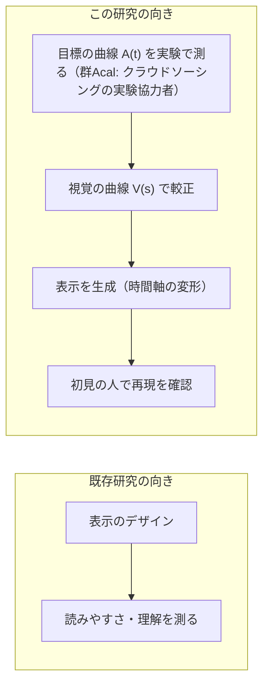
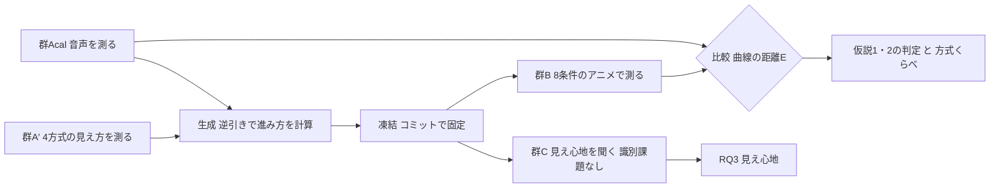
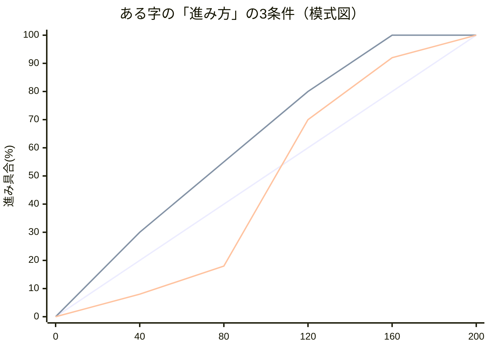
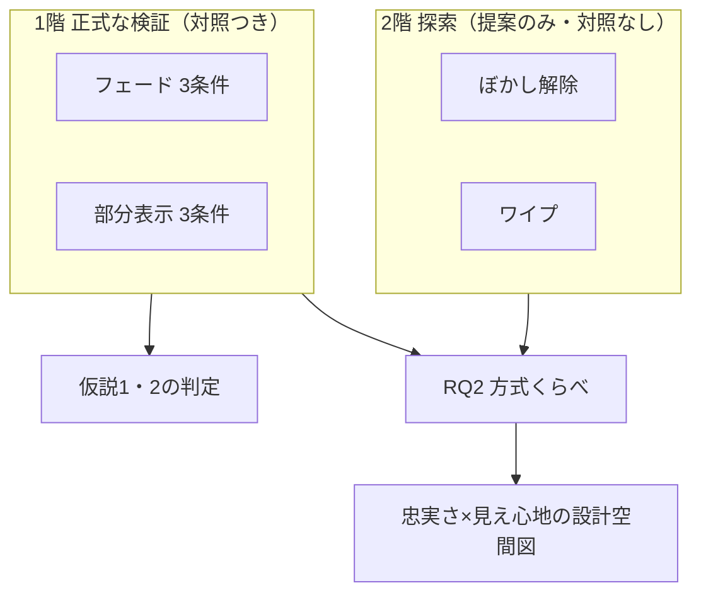

# 実験計画書：音声の「分かっていく過程」を文字アニメーションで作り直す手法の検証（iFont 転写検証実験）

- 作成: 2026-08-19 丸山。AI補助により起草した。**第2稿**で、栗原先生のレビューを待っている。
- 第2稿は、4系統の模擬査読を受けて第1稿を大きく直したものである。
  査読は 研究レビュー12点・EC24型・VR学会25型・ICEC23型 の4系統で、
  **どれも実験を始めてからでは直せない指摘**だった。変更の一覧は**巻末の付録B**にまとめた。
- 位置づけ: 実験1（68かな・目標220人）の計画書は温存し、その**前に行う小さな検証実験**。
  経緯: project/提案_方針転換_小さく確かめてから広げる.md／設計: project/設計案_生成アルゴリズム.md
- 実験ページは experiment/audio1char.html（v3.41）を土台に改修する（変更点は10章)。
  データ収集直前のコミットで実装を固定し、そのコミット番号を論文に書く。
- 呼称は「実験協力者」。修正時は「>」「-」表記。設計判断の理由は付録のQ&Aにまとめた。
- **締切: WISS 2026 投稿 8/31（月）23:59。登壇論文6ページ。**

## 1. 背景

### 1.1 経緯

iFontの狙いは、音声を聞くのと「同じ時点に同じだけ分かる」文字表示を作ることにある。
出発点は、かるたの決まり字を味わう体験を、聴覚に頼れない人にも字幕で届けたいという動機である。
音や表示を途中で打ち切って「どこまで届けば分かるか」を測る方法をゲーティング法と呼ぶ。
これは1961年以来の標準的な測り方で、聴覚と視覚の曲線を測って比べた研究もすでにある。
先行研究の整理は2章にまとめた。
本研究が新しく踏み込むのは、**測った音声の曲線をもとに文字アニメーションを作り、
それが狙いどおりに働くかを初見の参加者で確かめる**ところである。まず8文字でこれを検証する。

### 1.2 この研究の向き

主となる問いは「集団で測った音声の分かっていく曲線を、文字アニメーションの進み方を
変形することで、初見の集団に再現できるか」である。
**問いと仮説の定義はすべて3章に置いた。** この節は背景と設計の枠組みだけを述べる。



図の補足: A(t) と V(s) は、どちらもこの実験の中で測る。測る相手はクラウドソーシングで
募集した実験協力者である。A(t) は今回録音する発話に固有の曲線なので、この実験で測って
はじめて手に入る。既存研究から借りるのは、測り方であるゲーティング法と、表示方式を
分類する根拠の2つである。

**この研究の向き（最重要）**: 本研究が目指すのは、分かりやすさの**制御**である。
音声側で測った曲線を目標として与え、それと同じ分かり方をする表示を較正で作る。
目標が「この時点では55%の人にしか分からない」なら、わざと55%しか分からない表示が正しい。
既存のアニメーション文字研究は「表示を変えると読みやすさや理解がどう変わるか」を調べる
向きであり、本研究はその逆に「目標の曲線→較正→表示を作る」の向きへ進む。
だから各表示方式は、**分かり方を時間軸の上で操るための「乗り物」**として扱う。
この向きの違いは2.2で先行研究と対比した。

**言葉のルール**: この実験で作り直す対象は「識別率の軌跡」、すなわち正答率の時間曲線である。
正答率が同じでも、間違え方の分布は違いうる。たとえば60%が「た」で30%が「だ」に集まる場合と、
60%が「た」で残りがばらばらに散る場合とでは、参加者が持っている情報は違う。
そこで論文では、測ったものを直接表す「識別率軌跡の転写」という言い方に統一する。
間違え方の分布が一致するかは、追加の分析として調べる。
言葉づかいの取り決めは12章の「使わない言葉」に一覧にした。→ Q13

**表示方式は4種類・2階建て**: 方式は、既存のdynamic text研究が示す「文字の見えやすさを
時間的に操作する代表的なやり方」から4種類を選んだ。根拠は2.2に書いた。

| 方式 | 何が徐々に変わるか | 性質 |
|---|---|---|
| フェード | 透明→不透明 | 文字全体は最初からあり、信号の強さが上がる |
| 部分表示 | 文字の画素が固定乱数順で増える | 散らばった部分情報が増える（既存資産を流用） |
| ぼかし解除 | 強いぼかし→鮮明 | 形は最初からあり、細部が後から入る |
| ワイプ | 端から順に領域を見せる | つながった部分情報が増える |

- **1階（正式な検証）**: フェードと部分表示の2方式。それぞれに対照条件を揃える。
- **2階（探索）**: ぼかし解除とワイプは、提案手法の表示だけを作る。
  「同じ較正のやり方が他の方式でも通るか」「4方式のうちどれが目標の曲線に近づけやすいか」を
  傾向として見る。

どの方式で何を判定するか、探索の2方式についてどこまで言えるかは、3章に定義した。
最後に横軸=忠実さ・縦軸=見え心地の図に4方式を置き、設計の全体像として示す。

### 1.3 iFontの構想との対応

| 構想の言葉 | この実験での姿 |
|---|---|
| Perceptual Score（分かっていく過程の中間表現） | まぐれ当たりと押し間違いの分を除いて0〜1に直した識別の進み具合 q(t)。→ 7.1 |
| 変換g（聴覚と視覚を同じ認識率で対応づける較正） | 時間軸の変形 s_i(t) = q̂V_i⁻¹(q̂A_i(t))。gを時間に沿って使ったもの |
| frac課題（gの実測） | 較正グループの打ち切り課題 |
| 文字合成 | 生成アルゴリズム（3.1） |
| iFont | 生成されたアニメーション（提案手法の条件） |

（「対象＝かなそのもの」の意味 → Q2）

## 2. 関連研究

本研究が寄りかかっている先行研究を4つのまとまりに分けて示す。
ほかの章では文献名を並べず、必要なところからこの章を参照する。

### 2.1 時間で打ち切って測る方法

音や文字を途中で打ち切り、「どこまで届けば分かるか」を提示量の関数として測る方法は、
竹内(1961)以来の標準的な測り方である。Grosjean(1980)は語の認識にこの方法を広げた。
Furui(1986)は日本語の音節について、識別率が切る位置に対して急に変わり、スペクトルが
大きく動く付近の短い区間が識別に強く効くと報告している。この知見は、時点を等間隔に置く
かわりに、変化の速い早い時間帯を細かく取るという本研究の配置の根拠になっている。→ Q6

同じ刺激に何度も触れることの影響については、Cotton & Grosjean が提示形式による差の
小ささを報告しており、本研究で当て推量の扱いを考えるときの材料になる。→ Q7

### 2.2 動的な文字表示

文字を時間とともに変えて見せる研究には、大きく3つの系列がある。
第1に、文字を段階的に提示して読みや学習への効果を調べる研究がある。
Petersen & Andersen らの仕事があり、dynamic text と総称される領域である。
第2に、Livefonts のように字形そのものを時間とともに変化させる書体の研究がある。
第3に、kinetic typography のように文字の動きで情報や感情を伝える表現の研究がある。

いずれの系列も「表示を変えると読みやすさや理解がどう変わるか」を問う向きである。
本研究はその逆向きに、これらの機構を制御の乗り物として使い、外から与えた識別率の軌跡を
再現できるかを問う。→ 1.2
本研究が4方式を選んだ根拠も、この領域が示す「文字の見えやすさを時間的に操作する
代表的なやり方」の分類である。

### 2.3 感覚間の対応づけ

聴覚と視覚で測った認識の曲線を突き合わせる試みには先例がある。
Sánchez-García ら(2018)はゲーティング法を聴覚と視覚の両方に使い、両者の曲線を測って比べた。
その土台には、異なる感覚の量を対応づける古典的な感覚間マッチングの研究群がある。

音声に同期して文字を出す実装としては、カラオケが広く使われている。カラオケは表示の時刻を
音に合わせるところまでを行う。本研究はそこにさらに、較正の工程と、初見の参加者による
検証の工程を加え、一続きの手続きにする。→ Q11

### 2.4 刺激を少数に絞るときの先例

少数の刺激で音韻的な範囲を代表させる方法には、音声学的カテゴリーによる層化という先例がある。
Arai らの日本語音節知覚実験はカテゴリーを横断するように音節を選び、Takeuchi の検査は
100単音節から子音カテゴリーが均等になるよう20音節へ縮約している。
一方、iCI2004 や藤原の方式に代表される頻度ベースの選定は、日常会話の平均明瞭度を推定する
目的に向く。本研究の目的は時間構造の異なる音で転写が成立するかを見ることなので、
層化のほうが目的に合う。8字の具体的な選定は4.3に書いた。

## 3. 問いと仮説

**本研究の問いと仮説はこの章に一本化する。** ほかの章からはここを参照する。

**RQ1（主となる問い）**: 集団で測った音声の「分かっていく曲線」、すなわち提示時間から
正答率への対応を、文字アニメーションの進み方を変形することで、初見の集団に再現できるか。

判定は「**生成に与えた目標の曲線**（較正の聴覚集団・群Acalで測った音声の曲線）」と
「初見の人がアニメーションを見たときの曲線（群B）」の比較で行う。
近さは曲線どうしの距離Eで測る。定義は7.2にある。

> **なぜ群Acalの曲線を基準にするのか（2026-08-24に変更）**。8/19版では、検証専用の
> 音声集団（群Atest）をもう1つ募集して、その曲線を採点基準にする設計だった。
> **これを廃止し、群Acalの曲線に一本化した。** 群Bの参加者は生成の工程に一切
> 関わっていないので、この比較でも「生成に関与していない集団で確かめる」という
> 検証の形（ホールドアウト検証）は成立する。判断の根拠は4.1と付録Q1・Q15にある。

**「一致した」を有意差なしで判定しない。** 「差が有意でなかった」は「差が無い」ことの
証拠にはならないので、**事前に許容誤差δ（距離Eが何ポイント以内なら再現できたとみなすか）を
決めてから**、Eの信頼区間がδの内側に収まるかで判定する。δの値はA2で確定する
（→ 11章⑧、判定の手続きは7.2）。

**仮説1・2はフェードと部分表示のそれぞれで別々に判定する。**
方式どうしの比較は探索のRQ2で扱い、仮説1・2の判定は方式の中だけで行う。

- **仮説1（転写は効く）**: 提案手法で作ったアニメーションは、そのままの等速で進む表示よりも、
  音声の曲線に近い。
- **仮説2（速さ合わせでは足りない）**: 提案手法は、「開始時刻と速さだけを最適に合わせた表示」
  よりも音声の曲線に近い。この対照は1次の時間変換にあたり、数式では s=at+b と書ける。
  - 前提: この仮説が意味を持つのは「1次の変換で合わせきれない字」がある場合である。
    その合わせきれなさを D_i と呼ぶ。**8字は音の種類と品質チェックだけで先に固定する。**
    D_i は「D_iが大きい字ほど提案手法の優位が大きいはず」という事前に宣言した予測として、
    本番データで確かめる用途に使う。この順序を守ることで、「効きそうな字だけ選んだ」という
    批判の余地を消す。
  - 仮説2が支持されなかった場合は「1次の時間変換で足りる」が結論になる。
    それも表示設計の知見として報告する。
- 補助指標: 中点の差。中点の意味には注意が要るので、7.1に注記を置いた。
- **RQ2（方式くらべ・探索）**: 同じ較正のやり方を4方式に使ったとき、
  **外から与えた目標の曲線にどれだけ近づけられるか**は方式によってどう違うか。
  評価の軸は忠実さである。探索の2方式は対照を持たないので、順位と傾向の報告にとどめる。
- **RQ3（見え心地・記述）**: 各方式の生成表示は、続けて見ていられるか。
  「継続して閲覧する際の主観的な見やすさ・負担」と定義し、4方式について聞く。
  忠実さと見え心地は別の量として扱う。
  **これは独立した実験（群C）として、識別課題を通らない別の集団に行う**（8/21の決定）。
  1字だけの提示に加えて、**5文字続けて出す形を2通り**（横に並べて残す／同じ場所で入れ替える）
  比べる。字幕は本来1文字ずつ続けて流れるものだからである。
  **2026-08-24 から、4方式に加えて「ステップ表示」**——ある時刻まで何も出さず、
  そこで一気に完成形を出す、いまの字幕を模した見せ方——**も並べて聞く**。
  これで「従来型の字幕と、段階的に出す表示の、どちらが続けて見ていられるか」に
  直接答えられる（→ 4.5・Q14）。
  掲載は検証フェーズと並行するので、日程は延びない。→ 4.5
- **RQ4（速さの影響・記述）**: **表示の識別率は、いま画面がどこまで進んでいるか
  （進み具合 s）だけで決まるのか。それとも、そこへ至る速さにも左右されるのか。**

  この問いは本研究の土台に直接あたる。生成のやり方は時間軸を伸び縮みさせて曲線を写すもので、
  「s が同じなら正答率も同じ」＝**進み具合が状態を決める**という見方の上に成り立っている。
  そこで、視覚較正（群A′）で基準アニメの長さを**2水準**にして、
  同じ s の水準を両方の速さで測る。値は300ミリ秒＝いつもの速さと、
  500ミリ秒＝約1.7倍ゆっくり、の2つである（2026-08-24 に 600/1000ミリ秒から、
  **1.7倍という比を保ったまま**下ろした。理由は4.3の基準アニメの長さの注記にある）。

  > **2026-08-24: 測る方式をフェードだけから4方式すべてに広げた**（丸山決定）。
  > 生成は4方式にまたがっているのに、その土台を1方式でしか確かめないのは弱いためである。
  > 1人あたりの問題数が増えないよう、同時に1人が担当する字と水準を減らした（→ 4.3）。
  >
  > これによって **「速さの影響は方式によって違うか」** という問いが新しく立つ。
  > 事前の予想は次のとおりで、当たっても外れても報告する。
  > **フェードは濃さ（不透明度）そのものを操るので、目が濃さの変化に追いつく速さの影響を
  > 受けやすい。部分表示は画素が出ているか出ていないかの積み上げなので、速さの影響を
  > 受けにくい。** ぼかし解除とワイプはその中間と見ている。
  > もし方式によって速さの効き方が違うなら、それは「どの表示方式が時間軸の変形に
  > 向いているか」を選ぶときの判断材料になる。
  > ただし**この方式ごとの比較は探索であり、確認的な検定は行わない**（→ 7.2）。

  **どちらの結果でも報告する**——

  - **差が出なかった場合**: 進み具合がその時点の見えやすさを決めている、という
    予備的な証拠になる。時間軸の伸び縮みで曲線を写すという生成のやり方の土台を支える。
  - **差が出た場合**: 同じ濃さでも至る速さで見え方が変わる＝**履歴に依存する**という発見。
    これは「時間の伸び縮みだけでは移せない」という手法の**限界条件**を示すもので、
    次の設計へつながる。速さも入力に持つ生成へ広げるか、扱う速さの範囲を限定して報告する。

  **三段構えで答える**。(1) **下見** = 少人数の予備。当たりを見るための段階である。
  (2) **本番の視覚較正（群A′）** = RQ4 の**本回答**。効果量と信頼区間を付けて報告する。
  (3) **検証（群B の曲線が目標の曲線＝群Acalの曲線に一致するか）** = 進み具合が状態を
  決めるという見方そのものの**総合テスト**。この見方が崩れていれば、そこで一致しないという
  形で必ず現れる。
  なお**2つの速さのデータを生成の材料にどう使うか**も、事前に手続きとして決めてある——
  RQ4 の判定で速さによる差が無ければ2水準を合算し、差があれば300ミリ秒側だけを使う。→ 7.1

**評価の2つの軸**: 忠実さは目標の曲線にどれだけ近いか、見え心地はその表示を続けて
見ていられるかを表す。この2つは別々に測る。最後に横軸=忠実さ・縦軸=見え心地の図に
4方式を置き、設計の全体像として示す。

やっていることが壊れていないかの確認（操作チェック）:
確認A＝全部見せ・全部聞かせの問題の正答率が十分高い（全体の10%混ぜる。ここが低い人は
解析から外す。基準は7.3）。確認B＝提示が長いほど正答率が上がる。
確認C＝ほとんど情報のない問題の正答率が、実験の後半になっても上がっていない
（出てくる字を覚えてしまう「学習」の兆候検出。→ Q7）。
2026-08-24 から、学習の検出は確認Cだけに頼らず、**回答が本命8字／よく出る20字に入る割合を
試行の通し番号に対して追う**方法を主に使う（→ 7.2）。

## 4. 実験の構成

### 4.1 全体の流れ（4つの独立な参加者集団＋生成工程、「測る→作る→別の人で確かめる」）

参加者がいるのは較正2つ・検証1つ・見え心地1つの**4集団**である。較正は群Acalと群A′、
検証は群B、見え心地は群Cを指す。
生成は参加者を伴わない計算工程である。視覚較正A′の割付方式しだいでは、A′が方式別の複数集団に
分かれる場合がある。

群Cは2026-08-21に、群Bの識別課題の末尾から切り離して独立させたものである（→ 4.5）。
掲載は検証フェーズと**並行**して行うので、日程は延びない。

> **2026-08-24の変更: 検証用の音声集団（群Atest）を廃止し、5集団から4集団にした**
> （丸山決定。外部の専門家2名への相談の結論。相談の記録は `project/相談_Atestは必要か.md`）。
>
> 8/19版では、群Acalとまったく同じ聴覚課題を、較正に参加していない別の人にもう一度行う
> 集団（群Atest）を置き、その曲線を検証の採点基準にする設計だった。相談した2名はどちらも
> **「群Atestは検証の成立に必須ではない」**という点で一致し、次の4つを根拠に廃止した。
>
> 1. **群Bはすでに独立している。** 群Bの参加者は生成の工程に一切関与していないので、
>    「群Acalの曲線」と「群Bの曲線」を比べること自体が、生成に関わっていない集団で
>    確かめる検証（ホールドアウト検証）として成立する。循環論法にはならない。
> 2. **小標本ではむしろノイズを増やす。** 群Acalと群Atestが各25名程度だと、両群のあいだの
>    標本誤差そのものが大きい。群Bと目標が一致しなかったときに、それが「手法の限界」なのか
>    「たまたま2つの標本がずれていただけ」なのかを、かえって切り分けにくくする。
> 3. **群Acalを前半・後半に分割する案も採らない。** n=50を25に割ると目標の曲線自体が
>    不安定になり、その曲線を逆引き（逆関数）に通すので誤差が増幅する。
> 4. 浮いた予算と日数を**群Acalの人数増強**に充てるほうが、目標の曲線の精度が上がり、
>    実験全体が強くなる。
>
> **この設計で主張できること・できないこと（論文でもこの範囲で書く）**
>
> 群Acalの曲線は「母集団の真の音声識別率」ではなく、**アルゴリズムに与えた目標プロファイル**
> である。本研究が検証するのは母集団の真の軌跡の再現ではなく、
> **与えられた目標軌跡を視覚提示によって再現する変換手法の妥当性**である。
> だから群Acalと群Bを比べる。
>
> | | 内容 |
> |---|---|
> | **主張できる範囲** | 較正実験で得られた音声識別率軌跡を、独立した視覚参加者集団において再現できるか |
> | **主張しない範囲** | 未知の音声参加者への一般化（＝母集団の真の識別率軌跡の再現）。**今後の課題として記載する** |
>
> **失う診断と、その代わり。** 群Atestを置けば「群Acalの標本がたまたま偏っていないか」を
> 外から診断できたが、その診断は失われる。代わりに**群Acalの標本依存性はブートストラップ
> （参加者を重複ありで抽出し直して曲線を引き直す手続き）で評価する**。
> Wichmann & Hill (2001) が心理測定関数の不確実性評価にパラメトリック・ブートストラップを
> 推奨していることを根拠として引く。手順は7.2に書いた。



| 段階 | 集団 | 課題 | 得るもの |
|---|---|---|---|
| 較正（聴覚） | 群Acal | 音声を先頭からt msで打ち切り→かな表から回答 | 生成に使う音声の曲線 Â_i(t)。**これが検証の目標プロファイルも兼ねる** |
| 較正（視覚） | 群A′ | 基準アニメを進み具合s%で打ち切り→回答（4方式ぶん） | 方式ごとの視覚の曲線 V̂_m,i(s) |
| 生成 | — | 曲線の逆引きでアニメの進み方を一発生成し**凍結** | 各字の進み方 s_i(t)（人手調整なし） |
| 検証（視覚） | 群B | 1階6条件＋2階2条件のアニメを打ち切り→回答 | 各方式・各条件の曲線 |
| 見え心地 | 群C | 4方式 × 3通りの出し方（1字／横に並べる／その場で入れ替える）＋ステップ表示（1字のみ）＝13本のアニメを打ち切らず繰り返し見る→7件法で評価（識別課題は無し） | 方式ごと・出し方ごとの見え心地（RQ3）と、従来型（ステップ表示）との比べ |

- **検証の比較は「群B vs 群Acal」**、つまり生成に関与していない初見の視覚集団の曲線を、
  生成に与えた目標の曲線と突き合わせる。群Bの参加者が生成に一切関わっていないことが、
  この比較を検証たらしめている。→ Q1・Q15
- どの集団も互いに独立で、同じ人が出るのは1回だけである。較正の聴覚と視覚まで分けるのは、
  同じ人が両方をやると、先の課題で出てくる字や刺激の癖を覚え、後の課題の曲線が汚れるためである。→ Q1
- **凍結**: 生成のコード・設定・全8字の進み方を、検証データを取る**前に**コミットで固定し、
  番号を記録する。そのあとは、固定した版のまま検証データを取る。→ Q3
  凍結には「**2つの速さのデータを逆引きの材料にどう使うか**」の取り決めも含める。
  RQ4 の判定で速さによる差が無ければ2水準を合算し、差があれば300ミリ秒側だけを使う。→ 7.1
- **この手法が置いている仮定**: 基準アニメで測った「進み具合→正答率」の関係が、進み方を
  変形した後でもだいたい保たれること。同じ濃さに達していれば、そこへ来るまでの見え方の履歴が
  違っても正答率は近い、という見立てである。この仮定は**この実験の検証対象に含める**。
  崩れた場合は「単純な時間変形では移植できない」という結果として報告する。→ Q12
- 基準アニメの長さと進み方のカーブは、較正の前に少人数の下見で決める設計項目である。→ Q4
- **視覚較正のまとめ方（検討中の案）**: 1つの集団の中で「どの字をどの方式で見るか」を
  偏りなく割り振る。同じ人には、1つの字につき1方式だけを見せ、人によって組合せを入れ替える。
  集団全体では全方式×全字の曲線が得られる。これは**集団の数を減らす工夫**であり、
  必要な回答数は方式の数に比例したままである。成立するかと必要人数はA2で確定する。→ 11章

### 4.2 群Bの条件

**1階（正式な検証）**: フェードと部分表示のそれぞれに、同じ3条件を用意する（計6条件）:

| 条件 | 内容 | 何に答えるか |
|---|---|---|
| 対照1 | その方式の等速の進み方 | 手を加えないときの基準 |
| 対照2 | **開始時刻と速さだけ最適に合わせた進み方**（s=at+b。a,bは較正データだけから、曲線の距離が最小になるように決める） | 「速さを合わせるだけで十分では？」への直接の答え（→ Q5） |
| 提案 | 曲線の形まで写す非線形な時間変形（＝iFont） | 「分かっていく形」まで写す必要があるか |

> 比較はすべて**方式の中だけ**で行う。つまり提案と、その方式の対照とを突き合わせる。
> 方式どうしの比較は探索のRQ2で扱う。→ 3章
> 論文には代表の字について、3条件の進み方の違いを1枚の図に重ねて示す。

3条件の違いの模式図（数値は説明用の作り物。横軸=時間ms、縦軸=表示の進み具合%）:



（提案だけが「ゆっくり→急に→ゆっくり」のような**非直線の進み方**になり得る。
3本がほぼ重なる字＝1次で足りる字、離れる字＝形まで写す意味がある字）

**2階（探索・対照つきなし）**: ぼかし解除とワイプは提案手法の表示だけ作って群Bに混ぜ、
合計8条件にする。この2方式が答えるのはRQ2とRQ3で、較正と凍結の対象には含める。
**言い方のルール**: 1階は「対照に勝つか検証した」、2階は「同じ較正のやり方で作れるか、
どのくらい近いかを傾向として調べた」と書き分ける。用語の取り決めは12章に一覧がある。



### 4.3 課題の詳細

- **文字**: ターゲット8字を、**音声学的カテゴリーによる層化**で選ぶ。
  少数で音韻的な範囲を代表させるこの方式には先例があり、根拠は2.4に整理した。

  > 決定（8/20・丸山）: **あ（母音）・か（無声破裂）・が（有声破裂・かとの清濁対）・
  > ぱ（両唇無声破裂・調音位置差）・し（摩擦）・つ（破擦）・ま（鼻音）・ら（はじき音）**。
  > 日本語モーラの主要な子音様式を1つずつ含む層化構成。
  > **選定規則**: 原則を先に固定 → 8字固定 → 録音 → 品質チェック → 実験、の順を守る。
  > 録音や曲線を見たあとも、この8字をそのまま使いつづける。これで選択の偏りを防ぐ。
  > 録音に不備があった字は**録り直して**同じ字を使う。
  > か・がのonset検出には±20ms程度の不確かさが残るが、onsetの誤差は較正と検証で共通なので、
  > 実験の中では相殺される。絶対時刻として読むときにだけ注意を付す。
  > 視覚面は二次チェックにとどめ、8字が極端に似た字や簡単な字へ偏っていないことを確かめた。
  > ストローク画素は4458〜10045の幅に散り、字形の重複もなかった。
  8字はねらって選ぶので、結論は「この8字について、参加者の母集団へ広げられる」までとする。
  かな全体への一般化は68字実験の役割である。
- **偽のターゲット（decoy）**: ターゲット以外のかなも問題に混ぜ、出題の範囲を8字より広く見せる。
  このため録音は全68かなで行う。**2026-08-24 に「まぎれ字を毎回ちがう字から選ぶ」方式をやめ、
  「偽のターゲットを本命とまったく同じ回数だけ繰り返す」方式へ全面的に作り直した**（下の決定）。

  > 決定（8/24・丸山）: **出題範囲の学習への対策として、出題設計を作り直す。**
  > 相談の記録は `project/相談_出題範囲の学習をどう防ぐか.md`。
  >
  > **なぜ作り直したか。** 対象が8字しかないので、1人が多くの問題を解くうちに
  > 「出てくるのは同じ8字だ」と気づく。第2稿までは「気づいても、当て推量で答えるしかない
  > 床のあたりしか動かない」と考えていたが、外部の専門家への相談でこれは**誤り**と分かった。
  > 音声知覚の研究では、答えの候補の集合（response set）の大きさそのものが識別成績を変えると
  > 報告されており、8字だと知っていれば「k の音なら『か』しかない」という消去法が働いて、
  > **曲線の中間の正答率まで持ち上がる**。当て推量率の補正では直せない。→ Q7
  >
  > **① 1人あたりの測定点を減らし、参加者間で分担する（不完全ブロック配置）。**
  > 1人が担当するのは、本命1字につき**その字の測定点のうち3点だけ**にした。
  > 必要なのは個人ごとの曲線ではなく集団の識別率曲線なので、「字 × 時点」のセルを
  > 参加者のあいだで分ければよい。どの3点かは**参加者の連番から決まる**ので、
  > 途中で閉じて再開しても同じ割付に戻る（`experiment/transfer_config.js` の
  > `assignment.point_subsets`）。集団全体では、どのセルにも同じ人数が入る。
  >
  > **② 偽のターゲット（decoy）12字を、本命8字とまったく同じ回数（各3回）出す。**
  > まぎれ字の比率を上げるだけでは足りない。本命8字が各3回出るのに、まぎれ字が60字から
  > 広く選ばれて1字あたり0〜1回だと、**出現頻度の差**で「この8字だけ何度も出る」と
  > 見抜かれてしまう（人は明示的に数えなくても出現確率を拾う）。全68字を等しい頻度に
  > するには非ターゲットが88%必要で、試行数として成り立たない。
  > **よく出る20字（本命8＋decoy12）がどれも3回ずつ**なので、
  > **出現頻度から本命8字を見分けることが原理的にできない。**
  > 完全に見抜かれても絞り込めるのは 1/20（5%）までである（本命8字だけが繰り返される
  > 設計なら 1/8＝12.5%）。**本命だけ4回にすると「4回出る字が本命」と分かってしまう**ので、
  > 回数は必ずそろえる。反復が3回だけなので、繰り返し見ること自体による学習も起きにくい。
  >
  > **③ decoy 12字は参加者ごとに変える。** 候補は「全68かな − 本命8字 − 『ん』」＝**59字**で、
  > そこから**完全にランダム**に12字を選ぶ（連番から決めるので再開しても同じ）。
  > 候補を巡ごとに並べ替えて12字ずつ配るので、**5人で59字をひととおり使い切る**
  > （集団全体でほぼ均等に使われる。80人なら1字あたり16〜18人）。
  > こうすると、個人から見れば「20字が繰り返し出る」構造に見えるのに、
  > 集団を横断して見ると多くの字が出るので、データを集めても本命が浮き上がらない。
  > 参加者どうしが情報を交換しても、見えている頻出集合が人によって違う。
  >
  > **なぜ「本命と混同しやすい字を候補から外す」設計を採らないか**（8/24・丸山決定）。
  > いったんは「ら→な」「つ→ち」のような混同を避けるために除外リストを作りかけたが、
  > **採らない**ことにした。理由は3つある。
  > (1) **混同が起きること自体が測定の対象である。** 「ら」を「な」と答えるのは、その時点で
  >     参加者に届いている情報が「鼻音か弾き音か」の区別までしかないことを示していて、
  >     識別率曲線の一部として意味を持つ。似た字を候補から外すと、これが測れなくなる。
  > (2) **偽の字を「本命と似ていないもの」に限ると、簡単に分かる字ばかりが偽物になり、
  >     かえって本命が浮き上がる。** ランダムのほうが構造を読み取れない。
  > (3) 層化も除外もしない単純な設計なので、論文でも説明しやすい。
  > 「ん」だけを外すのは、単独で提示したときの性質が他の字と大きく違うためである。
  >
  > **④ decoy の打ち切り時点を本命とそろえる。** decoy になりうる59字すべてに、
  > 音の種類（子音の出し方）が同じ本命字と**同じ打ち切り時点の並び**を割り当てた
  > （`audio.gates_ms` を全68かなに広げた。母音→「あ」の並び／無声破裂 k・t・p→「か」「ぱ」／
  > 有声破裂 g・d・b→「が」／鼻音→「ま」／無声摩擦→「し」／破擦→「つ」／
  > はじき音・接近音→「ら」）。**「偽物だけ長くて簡単」という偏りを作らない**ためである。
  > 打ち切り済みWAVはこの表で作り直した（544本・config_version = prov-2026-08-24c）。
  >
  > **④b 偽のターゲットの見え方も本命とそろえる（視覚の集団）。** 群A′・群Bでは、偽の字の
  > 方式・速さ・条件を**その参加者の本命の割付から借りる**（水準・時点の配り方も本命と同じ
  > 巡回の規則を使う）。**「偽物だけ簡単」「偽物だけ特定の方式に偏る」ことが無い**ことは
  > 機械で検算してある——本命と偽の字で、提示の強さ（その字の測定点の何番目か）・方式・
  > 速さ・条件のどの分布も**ずれ 0.0 割合ポイント**である（→ 11章）。
  >
  > **⑤ 同じ字を近接させない。** 並べ替えのときに、同じ字が**4問以内に再登場しない**
  > ようにする（`design.min_same_char_gap`。80人ぶんの組み立てで例外0回を確認）。
  >
  > **⑥ 確認問題**（下の「確認問題」の項を見ること）。
  >
  > **1人あたりの問題数は3集団とも70問**（本命24＋decoy36＋確認問題10）。
  > 聴覚 108問→70問・視覚較正 68問→70問・視覚検証 94問→70問。
  >
  > **副次効果: 3集団の測定文脈がそろう。** 較正（群Acal・群A′）と検証（群B）が
  > 同じ出題構造（本命8字＋偽12字・同じ頻度・同じ並べ方）になるので、
  > 「較正で測った曲線」と「検証で測った曲線」を、出題の見え方の違いを気にせず比べられる。
  > **このことは、外部の専門家が挙げた「1人が音声と視覚の両方をやり、順序を入れ替える案
  > （ABBA型の交互配置）」を採らない理由でもある。** その案を採らない理由は次のとおり:
  > - 学習は「順番」ではなく「本命8字を知ってしまったかどうか」で決まる**不可逆な変化**なので、
  >   順序を入れ替えても各参加者の2つ目の課題は汚染される。汚染が両条件に均等に配分されるだけである
  > - 清浄なデータだけを使うなら結局「最初に聴覚をやった人＋最初に視覚をやった人」になり、
  >   別集団にするのと必要人数が変わらない
  > - **もっとも重い理由**: 群Bは視覚だけを初めてやる人たちである。群A′にだけ音声のブロックを
  >   経験させると、群A′の視覚の識別率 V(s) が本来より高く出る。すると生成されるアニメが
  >   薄くなりすぎ、群Bでは系統的に「検証の曲線 < 目標の曲線」となって、手法のせいでない
  >   不一致が出てしまう。**群A′と群Bの測定文脈をそろえることが、検証の連鎖にとって
  >   もっとも重要である。**
  > - 同じ人から音声と視覚の両方を取ると両者が相関し、独立した集団として扱えなくなる

- **確認問題**（8/24・丸山決定）:
  - **確認問題A（全部提示・打ち切りなし）を全体の10%**（70問なら6問）混ぜる。
    6%（3〜4問）から上げたのは、「何問まちがえたら解析から外すか」の線を数で引くためである。
    除外の基準は 7.3 に事前登録した。
  - **確認問題C（その字のいちばん早い点。ほとんど情報がない問題）を6%**（4問）混ぜる。
    出題範囲の学習を見張るために使う。
  - **位置はどちらもランダムにする。** 確認問題が「テスト用の問題だ」と分かってしまうと、
    そこだけまじめに答えられて判定の役に立たなくなるためである
    （1問目を確認問題に固定する案も出たが、採らないことにした）。
  - 確認問題に使う字は、**本命字だけでなく「よく出る20字」から重複なく選ぶ**。
    本命字からだけ選ぶと、そのぶん本命の出現回数が増えて等頻度が崩れるためである。
- **提示の刻み**: 聴覚は音の実体の開始点（acoustic onset）からの実時間ms、視覚は
  進み具合%で打ち切る。**測定点は**聴覚が1字あたり8点（7時点に打ち切らない「全長」を1点足す）、
  視覚（群A′）が1字あたり**5点**（薄い側3水準に固定の20%・100%を足す）である。
  **2026-08-24 から、1人が担当するのはこのうち3点だけ**で、残りは他の参加者が担う
  （不完全ブロック配置。上の decoy の決定と下の「割り振りの原則」を見ること）
  （視覚の内訳と、8/24に薄い側へ寄せた理由・水準を5点に減らした理由は下の決定を見ること）。
  時間帯の根拠は2.1にある。

  > 決定（8/21・丸山）: **全字で同じ時点を使うのをやめ、字の音の種類ごとに時点帯を割り当てる。**
  >
  > **なぜそうするか。** Furui (1986) の日本語CV音節の打ち切り実験では、識別に必要な区間の
  > 長さが子音の種類でかなり違うと報告されている——破裂音と鼻音は50〜70ミリ秒（破裂の
  > 約10ミリ秒前から）、無声摩擦音は平均120ミリ秒（声の始まりの100ミリ秒前から）。
  > 下見（`project/パイロット分析_20260821.md`）の結果もこれと同じ向きで、
  > 「あ」「が」は20ミリ秒、破裂の仲間は40ミリ秒、「つ」は60ミリ秒、「ら」は110ミリ秒で、
  > すでに正答率が天井に張り付いていた。全字に同じ並びを当てると、早く天井に着く字では
  > 後半の時点が、遅い字では前半の時点が、どちらも情報を持たない点になってしまう。
  >
  > **暫定の配置**（数値はいずれも onset を0ミリ秒とした絶対時間。A2で再確定する）:
  >
  > | 音の種類 | 字 | 時点（ミリ秒） |
  > |---|---|---|
  > | 母音・破裂音・鼻音 | あ・か・が・ぱ・ま | 10, 20, 30, 40, 55, 70, 100, 全長 |
  > | 破擦音（破裂＋摩擦） | つ | 20, 40, 60, 80, 110, 150, 200, 全長 |
  > | 無声摩擦音 | し | 30, 60, 90, 120, 150, 190, 240, 全長 |
  > | はじき音 | ら | 20, 40, 60, 80, 110, 150, 200, 全長 |
  >
  > **絶対時間である点は変えない。** 「その字の全長の何%」という相対の置き方は採らない。
  > 字をまたいだ比較（曲線どうしの距離E）も、生成の逆引き（音の時刻→アニメの進み具合）も、
  > どちらも絶対時間の軸の上で行うので、字ごとに軸の目盛りが変わると両方が成り立たなくなる。
  >
  > **確定の手順**: ①文献で当たりをつける（済） → ②下見で全域を粗く測る →
  > ③**A2で各字の配置を確定する**。
  >
  > **論文での書き方**: 「提示時点は、先行研究の知見と下見の結果に基づいて字ごとに配置した」。
  > 研究者の勘ではなく、根拠を示せる設計として記述する。
  >
  > 設定は `experiment/transfer_config.js` の `audio.gates_ms`（字をキーにした表）にある。
  > **2026-08-24 に、この表を全68かなへ広げた**（偽のターゲットが参加者ごとに変わるので、
  > 59字すべてに本命と同じ質の打ち切り時点が要るため）。表に名前の無い字のための
  > `_default`（20, 40, 60, 80, 110, 150, 220）は、いまは出番のない保険として残してある。
  > 「全長」を各字の1点として足したのは、**その字の曲線の天井**（最後まで聞けば何%当たるか）を
  > 字ごとに押さえるためである。時点を字ごとに置くと、天井が取れているかどうかも
  > 字ごとに確かめる必要が出てくる。
  >
  > **視覚（群B）の時点 `visual.gates_ms` は、まだ全字共通のままである。** 聴覚と同じ時点で
  > 曲線を比べる決まりなので、検証フェーズを掲載する前に聴覚と同じ字ごとの配置へそろえる。→ 11章

  > 決定（8/24・丸山）: **視覚較正（群A′）の提示水準を薄い側へ寄せ、参加者ごとにずらす。**
  >
  > **なぜそうするか。** 先生に通してもらったパイロット（`kurihara-pilot2`・視覚較正134問・
  > 結果は `project/pilot_data/firestore/analysis/summary.md`）で、それまでの水準
  > 3・6・13・22・34・50・70・100% のうち、**13%以上の6水準がほぼ全問正解**になった。
  > 8水準のうち6水準が「曲線の形について何も教えてくれない点」になっていたということである。
  > 方式ごとに分けても同じ向きで、4方式すべてが 6% 以上でほぼ天井に張り付いていた
  > （正答率: フェード 3%で25%・6%以上は100%／部分表示 3%で50%・6%以上は100%／
  > ぼかし解除 3%で75%・6%以上は100%／ワイプ 3%で67%・13%以上は100%）。
  > S字の曲線を当てはめるには「下端（当て推量に近い水準）」と「中間（急に立ち上がる帯）」の
  > 両方が要るが、上に偏った並びではそのどちらも取れていなかった。
  >
  > **置き方**（`experiment/transfer_config.js` の `visual.progress_pct_levels`）。
  > 下の表は **8/24 の2度目の変更（水準を8→5に減らす）を反映した最終形**である。
  >
  > | 区分 | 水準% | ねらい |
  > |---|---|---|
  > | 薄い側3水準 | 1.00・3.25・5.50（**参加者ごとにずれる**） | 下端と立ち上がりの帯を取る |
  > | 固定2水準 | 20（立ち上がりの終わり）・100（天井の確認） | 全員共通の物差し |
  >
  > **参加者ごとのずらし。** 薄い側の3水準に、参加者の連番から決まるずらし量
  > （0.00%・0.75%・1.50% の3通り。`visual.progress_pct_shift`）をまとめて足す。
  > 完全固定でも完全な乱数でもなく、**帯ごと少しシフトさせる**方式である。
  > 連番から決めるので、同じ人が途中で閉じて再開しても同じ並びに戻る。
  > 3通りを合わせると **1.0〜7.0% を 0.75% 刻みですきまなく**埋められる（9点）。
  > 実際に出る値: 1.00 / 1.75 / 2.50 / 3.25 / 4.00 / 4.75 / 5.50 / 6.25 / 7.00
  > （この9点が穴なく並ぶことは実装から機械的に検算した。→ 10章）。
  >
  > - **なぜ 0.75% 刻みか**: フェードは進み具合をそのまま画面の不透明度にする。
  >   不透明度は 0〜255 の**256段階**でしか表現できないので、1〜7% の帯には物理的に
  >   **約15段階**しか存在しない。0.75% は不透明度にして約1.9段階ぶんで、
  >   **隣の水準がきちんと別の絵になる**いちばん細かいあたりである。これより細かく刻むと、
  >   隣どうしが同じ不透明度に丸められて同じ絵になってしまう。
  > - **なぜ 3通りか**: 群A′の割付は「連番を8で割った余り」で一巡するので（→ 下の決定）、
  >   ずらしの通り数を8の約数（2・4・8）にすると、字・方式とずらし量が重なって、
  >   どのセルにも決まったずらし量しか集まらなくなる。3は8と互いに素なので、
  >   **24人まわると 字 × 方式 × 速さ × ずらし量 の全組合せがそろう**。
  >
  > 下見用に3%を足していた仕掛け（`visual.pilot_extra_levels`）は、薄い水準が本体に
  > 入ったので**削除した**。
  >
  > ⚠ 4方式で同じ並びを使う点は据え置きである。上のパイロットではぼかし解除だけ
  > 3%ですでに75%正解で、他より床が低い可能性がある。方式ごとに帯をずらすかどうかは、
  > 初見の人のデータを見て A2 で判断する。

  > 決定（8/24・丸山。同日の2度目の変更）: **視覚較正（群A′）を「4方式 × 1字 × 5水準 ×
  > 2速度 = 40問」の構成にする。1人あたり134問・約8分 → 68問・約4〜5分。**
  >
  > ⚠ **この決定は同じ日（8/24）のうちに、出題設計の作り直しで上書きされた。**
  > いまの群A′は「**8字すべて × 1方式 × 1速度 × 3水準 = 24問**」＋偽のターゲット36問＋
  > 確認問題10問＝**70問・約4.5分**である（→ この節のはじめの decoy の決定と「割り振りの原則」）。
  > 下の表と算数は、そこへ至る経緯として残してある。
  >
  > 同じ日に決めた2つの変更をまとめて実装したものである。
  >
  > **① 基準アニメの速さ2水準（RQ4）を、フェードだけから4方式すべてに広げた。**
  > 生成は4方式にまたがっているのに、その土台（進み具合が状態を決めるという見方）を
  > 1方式でしか確かめないのは弱い。加えて「**速さの影響は方式によって違うか**」という
  > 問いにも答えられるようになる（→ 3章 RQ4）。
  >
  > **② 1人が担当する字を「4方式 × 2字（＝8字全部）」から「4方式 × 1字（8字のうち4字）」に
  > 減らし、水準を8→5に減らした。** ①だけを入れると1人あたりの問題数が倍近くに増えて
  > しまうので、1人あたりの負担のほうを削った。
  >
  > | | 変更前 | 変更後 |
  > |---|---|---|
  > | 1人が見る字 | 8字（1方式あたり2字） | **4字（1方式あたり1字）** |
  > | 進み具合の水準 | 8（薄い側6＋固定2） | **5（薄い側3＋固定2）** |
  > | 速さ2水準を測る方式 | フェードだけ | **4方式すべて** |
  > | 1人あたりのターゲット問題 | 80問 | **40問**（4方式×1字×5水準×2速度） |
  > | 1人あたりの合計 | 134問・約8分 | **68問・約4〜5分** |
  > | 1人がカバーする組合せ | 32セル中8セル | 320セル中40セル |
  > | 必要人数 | 50人 | **100人**（→ 11章） |
  >
  > **なぜ1人あたりの点を減らしてよいのか。** 曲線は集団単位で扱うものであり、
  > 1人から多くの点を取るより、**少ない点 × 多人数**のほうが個人差が平均化されて
  > 曲線がなめらかになる。参加者ごとに水準をずらす仕掛けがあるので、集団としては
  > 薄い側だけで9点の細かい格子が得られる。S字を当てはめるのに要る最低限の点数（4点）は
  > 1人の中でも確保している（薄い側3点＋20%＋100% の5点）。
  >
  > **割付の決め方**（`experiment/transfer_config.js` の `assignment`。連番を n とする）:
  >
  > - 担当する字 … 連番が偶数の人は1・3・5・7番目の字、奇数の人は2・4・6・8番目の字
  > - 方式 … その4字に、4方式を「連番 ÷ 2 の4での余り」だけ回して1つずつ当てる
  > - 速さ … 担当する4字すべてを 300ミリ秒と500ミリ秒の両方で見る
  >
  > **連番8人で「8字 × 4方式 × 2速度 × 5水準 = 320セル」が1回ずつ埋まる**
  > （実装から機械的に検算済み。→ 10章）。
- **1回だけ提示**: 刺激に触れる回数を聴覚・視覚とも1回にそろえる。回答時間は無制限のままにする。
- **回答**: 五十音表と同じ並びの全かな表から選ぶ。1問1答で、選び直しの確認を挟む。
  **回答に使う表は聴覚・視覚で同じにする**。当て推量の率は、値を変えても結論が変わらないかを
  確かめる形で扱う。同じ字が繰り返し出ると、参加者の頭の中の候補は68個より狭まりうるためである。→ Q7
- **割り振りの原則**: 「字 × 時点（× 条件）」の各組合せの回答数がほぼ等しくなるように
  実験協力者のあいだで分担する（不完全ブロック配置）。**割付は参加者の連番から決定的に決める**
  ので、途中で閉じて再開しても同じ割付に戻る。1人が担当するのは次のとおり。

  | 集団 | 字 | 1字あたりの点 | そのほか |
  |---|---|---|---|
  | 群Acal（聴覚） | 本命8字すべて | 8点（打ち切り7点＋全長）のうち**3点** | — |
  | 群A′（視覚較正） | 本命8字すべて | 5水準のうち**3水準** | 字ごとに方式1つ・速さ1つ（1人で4方式・2速度をすべて経験する） |
  | 群B（検証） | 本命8字すべて | 7時点のうち**3時点** | 字ごとに条件1つ（1人で8条件すべてを1回ずつ） |

  > **⚠ 「1人が見る点の数」と「曲線を作る点の数」は別物である。**
  > 1人が担当するのは3点だが、**曲線そのものは従来どおり8点（聴覚）で描く**。
  > 3点に減らしたのは1人あたりの負担と学習のリスクであって、測る点そのものではない。
  > 集団としては、群Acal 80人なら1時点あたり30人、群A′ 150人なら1水準あたり56人ぶんの
  > 回答が集まる（8時点 × 3点／8点 × 人数）。
  > **8点を残す理由**: 心理物理の打ち切り実験では6〜8水準を置くのが標準であり、本研究は
  > 「正答率50%に達する時刻」だけでなく**曲線の形そのものを視覚へ転写する**ので、
  > 立ち上がる前・20〜30%・50%・70〜80%・天井付近を必ず踏んでおく必要がある。
  > 点を減らすと形が決まらず、逆引き（音の時刻 → アニメの進み具合）が成り立たない。

  どの3点かは「基準の3つの位置を、連番＋字の番号だけ巡回でずらす」方式で決める。
  この置き方だと、**1人の中でもすべての点が同じ回数ずつ出る**（8字ぶんを合わせると、
  聴覚なら8点それぞれが3回）。集団全体では、どのセルにも「人数 × 3 ÷ 点の数」人が入る。
  実装から機械的に検算した結果は10章。
- **募集**: Yahoo!クラウドソーシングで行う。条件は日本語母語・18歳以上・各集団1人1回で、
  集団のあいだで同じ人が重ならないようにする。再生機器は自由とし、
  合図音 → 0.6秒 → 刺激 の順で鳴らして無線イヤホンの頭欠けを防ぐ。
- **重複参加の防ぎ方**: **参加者IDをサーバの名簿と照合し、受付時にお断りする。**
  掲載は4本（較正の聴覚・較正の視覚・検証・群C）で、それぞれ入口ページが1枚ずつある。
  - 較正フェーズは謝礼が違う（群Acal 115円・群A′ 70円）ので**掲載を2本に分けた**
    （2026-08-24）。ただし**フェーズ名は `calib` のまま共通**にしてあるので、
    片方に出た人がもう片方を開くと名簿が前の割り当てを返し、
    入口ページの決め打ちと食い違うのでお断りになる。
  - 検証フェーズは2026-08-24に群Atestを廃止したので**群Bだけの1掲載**で、振り分けは起きない。
  - フェーズをまたぐ重複（較正→検証・較正→群C・群C↔検証）は `phase_blocks` で断る。
  - あわせて**募集サイト側の「回答不可リスト」も使う**。較正フェーズが終わったら、
    参加した人の会員IDをリストに登録してから検証フェーズと群Cを掲載する。
    サーバの照合は参加者IDで行うので、サイト側のIDでも二重に塞いでおく。
  **群C（見え心地）は3本目の掲載**で、検証フェーズと同時期に走る。群Cは課題の中身が違うので
  1本の掲載にまとめられない。同時期に走る2本のあいだの重複は、受付時の照合を
  **どちら向きにも**掛けて防ぐ（群Cに来た人が検証フェーズにいないか、
  検証フェーズに来た人が群Cにいないか）。
- **人数**: **2026-08-24 に確定した**（群Acal 80人・群A′ 150人・群B 168人・群C 30人。→ 11章）。
  1人が担当する測定点を3点に減らしたぶん、必要人数は増えるが、1人あたりが短くなって
  謝礼を下げられるので、**同じ予算でより多くの人を集められる**。
  A2 の通しシミュレーションは「この人数で精度が足りるか」の事後確認として回す。

### 4.4 刺激（音源）

> 決定（8/19・丸山）: **自然音声**。録音は全68かな（ターゲット候補12字を優先して丁寧に）。

1. **録音**: 日本語を母語とする話者1名（研究室の学生・知人などでよい）が、かなを1字ずつ
   単独で自然に発話。各3〜5回・WAV（手順書: project/録音手順_自然音声12字.md 第3版）
2. **テイクの選び方（録音前に固定）**: 読み間違い・雑音・音割れのある回を除き、
   残りから**長さが真ん中に最も近い回**を機械的に採用（→ Q8）
3. **音量合わせと下処理**: 1音まるごとに一定の倍率を掛け、音の中身の強弱の配分はそのまま残す。→ Q8
   加えて**電源ハム除去の100Hzハイパスフィルタ**を全字共通で掛ける
   > 決定（8/20・丸山）: 録音に50Hzの電源ノイズが乗っていたため追加した。話者の声の基本周波数は
   > 216Hzなので、フィルタが掛かるのは声より下の帯域だけである。音声刺激づくりでは
   > カットオフ40〜100Hzが常用される標準的な下処理にあたる。
   > 下処理はこのハイパスだけにとどめ、Methodsに明記する。
4. **時間の基準**: 音の実体が始まる点、すなわち acoustic onset を測って記録し、**実験の0msとする**。
   検出は自動で行い、短い窓のエネルギーが背景雑音を十分超えた最初の点を取ったうえで、全数を目視確認する。
   音の種類ごとの基準も文書化する。破裂音は破裂の開始、こすれる音は摩擦音の開始、母音と鼻音は
   周期的な波形の開始を onset とする。スクリプトと全字の値は公開する。→ Q9
5. **打ち切りの処理**: **打ち切り時刻tで終わる5msのなめらかなフェードアウト**で切る。
   フェード区間はtの直前5msで、刺激に入るのはtまでの音である。
   全字・全時点で共通にし、論文に明記する
6. **配信**: WAVのまま配信し、音の頭の立ち上がりをそのまま残す。再生時も録音のまま鳴らす
7. **品質チェック（QC）**: 耳での全長試聴に加え、開始点・VOT・全長・音量・音割れの
   機械測定一覧を作る。さらに少人数の下見で、全長ならほぼ正答できることを確認

- 各字1テイクなので、得られる曲線は**この話者のこの発話**のものである。論文でもそう限定する。
  複数話者・複数テイクへの拡張は今後の課題とする。
- この実験では自然音声を使う。従来の刺激作りにあたる合成音声への加工は、「ぽ」が濁って
  聞こえる問題を起こしたため凍結した。診断は project/清濁診断_音響測定.md にある。
  標準データベースは将来の追試用に温存する。→ project/音源調査_標準DB.md

### 4.5 見え心地の実験（群C・独立した実験）

RQ3 に答えるための実験である。**識別課題を通らない別の集団**に行う。

> 決定（8/21・丸山）: **群Bの末尾から切り出して独立させる。**
> 8/19の版では、群Bの識別課題が全部終わったあとに続けて聞く形にしていた。
> 切り出した理由は3つある。
>
> 1. **疲れが印象に混ざるのを避ける**。群Bは1人あたり90問以上の識別課題をこなす。
>    その直後に「この表示は続けて見ていられるか」を聞くと、答えているのが表示の性質なのか、
>    課題をやり終えた疲れなのかを分けられない。
> 2. **打ち切りなしの繰り返し提示にできる**。群Bの末尾に付けるかぎり、
>    識別課題と同じ「1回だけ見せる」の建て付けを大きく崩せなかった。独立させれば、
>    同じアニメを何度でも流しつづけられる。**字幕は本来くりかえし流れるもの**なので、
>    そのほうが実態に近い。
> 3. **群Bの負担が減る**。群Bは識別課題だけで終われる。
>
> 掲載は検証フェーズ（群B）と**並行**して行う。別の集団・別の掲載なので、
> 日程は延びない。

- **流れ**: 同意 → 見え方の確認 → 説明 → 評価本体 → 完了コード。**識別課題は通らない。**

- **提示（4方式 × 3通りの出し方 ＋ ステップ表示 × 1字 = 13本）**: 決定（8/21・丸山。
  ステップ表示は8/24に追加）。
  1字だけ見せる形に加えて、**5文字続けて出す形を2通り**足した。字幕は本来1文字ずつ
  続けて流れるものなので、1字だけの印象では字幕としての見え心地を答えたことにならない。

  | 出し方 | 何をするか |
  |---|---|
  | 1字だけ | 代表字1字が現れて、しばらく残って、消える |
  | 5字・横に並べる | 5字を左から1字ずつ出し、**出た字はそのまま残す**（字幕的な見せ方） |
  | 5字・その場で入れ替える | 5字を**同じ位置で1字ずつ差し替える** |

  進み方は生成した表（提案手法のもの）を使うので、群Bが見るのと同じ絵になる。
  どれも**打ち切らず**、評価しているあいだ**くりかえし流れつづける**。
  「▶ もう一度みる」を押せばその場で流し直せる。流れた周の数と、押して流し直した回数は
  別々に記録する。

  > 決定（8/24・丸山）: **5つ目の見せ方として「ステップ表示」を足す。**
  >
  > **何をするか。** ある時刻まで**何も出さず**、その時刻に一気に完成形を出す。
  > 時刻は「目標の音声曲線で半数が識別できる時刻（中点）」で、生成工程が字ごとに
  > 計算する（`experiment/tools/build_transfer_warp.py` が `step_mid_ms` として出す）。
  >
  > **なぜ足すか。** いまの字幕は、語が確定してから文字を出す。つまり「分かりかけ」の
  > 中間の状態を持たない。ステップ表示はそれを模した「**徐々に出すのをやらなかった場合**」の
  > 代表であり、これを並べて聞けば、
  > **「従来型の字幕と、段階的に出す表示の、どちらが続けて見ていられるか」**に
  > 直接答えられる。「そもそも徐々に出す必要があるのか」（→ Q14）という問いの
  > **見え心地の側**を、考察ではなく実験で扱えるようになる。
  >
  > ⚠ **識別の測定はしない。** 群Cは見え心地だけを聞く実験なので、
  > 「従来型は音声の曲線からどれだけ離れているか」という数字は出せない。
  > その点は**考察で述べる範囲にとどめる**。
  > （いったん群Bの9番目の条件として足す案もあったが、群Bの出題の組合せが増えて
  >  必要人数が増えるうえ、本当に知りたいのは見え心地の比べだったので、群Cに置いた。）
  >
  > **1字条件だけに絞る。** 5方式 × 3通り = 15本にすると所要が延びるので、
  > ステップ表示は1字条件だけ出す。合計は **13本**になる
  > （4方式×3通り ＋ ステップ×1通り）。ステップ表示で聞きたいのは
  > 「一気に出る表示は続けて見ていられるか」であって、5字続けるときの出し方の
  > 良し悪しではないので、1字条件だけで用は足りる。
  >
  > **最後の質問1（どの現れ方がよいか）は4択から5択になる。**
  > 質問2（5文字続けるときの出し方）でステップ表示を選んだ人に見本を出すときは、
  > 本編で見せていない絵になってしまうので、フェードの見本に置き換える。
  >
  > 設定は `experiment/transfer_comfort_config.js` の `families`・`family_renderer`・
  > `presentations_by_family` にある。

- **字は増やさない**: 1字条件は あ、5字条件は **あ・か・し・ま・ら**（事前固定）。
  比べたいのは現れ方と出し方であって字の難しさではないので、字の種類は増やさない。
  5字の並びは**意味のある語にしない**——言葉として読めてしまうと、表示の見え心地ではなく
  語の読みやすさを答えられてしまうためである。

- **字と字の間隔（重要）**: **前の字が現れきってから300ミリ秒空けて、次の字が現れはじめる。**
  アニメ本体が300ミリ秒なので、字と字の**開始どうしの間隔は約600ミリ秒**になる
  （2026-08-24 に基準アニメを600→300ミリ秒に変えたので、900→600ミリ秒に縮んだ。
  空きの300ミリ秒は据え置いた）。

  > **なぜこの値か。** ここで測りたいのは「字幕として続けて見ていられるか」だけであり、
  > **前後の字が互いの見え方を邪魔する現象（視覚的マスキング）は測らない**。それは連続提示
  > そのものを扱う次の段階の実験の領域である。先行研究では、視覚的マスキングが起きるのは
  > 2つの刺激の開始どうしの間隔（SOA）が0〜200ミリ秒の範囲とされ、文字の識別に対する抑制は
  > 約60〜120ミリ秒で最も強く、120ミリ秒あたりで消えると報告されている
  > （Enns & Di Lollo のレビュー、経頭蓋磁気刺激による文字識別の抑制の研究など）。
  > 600ミリ秒はその**3倍**離れており、**先行研究が示す視覚マスキングの時間帯を
  > 大きく超える間隔を取り、前後の字が干渉しない条件で見え心地だけを問う**設計になっている。
  >
  > 読み上げの速さとの関係も見ておく。録音した自然音声の実測では、かな1字の長さは
  > ターゲット8字で303〜419ミリ秒（平均347）、全68かなでも250〜451ミリ秒だった。
  > 600ミリ秒はその**1.7倍ほどゆっくり**にあたる。5文字続けて読む速さを土台にしつつ、
  > 干渉しないところまで十分に間を空けた、という位置づけである。
  >
  > **横に並べる形では、残った字と新しい字が空間的に隣り合う。** これは時間の干渉ではなく、
  > 隣の字が邪魔をする現象（crowding・側方抑制）の領域にあたる。対処として
  > **字と字のすき間を1文字分あける**。

- **大きさをそろえる**: 3つの出し方すべてで、1字あたりの表示の大きさを同じにする。
  1字だけの条件を大きく出すと、「出し方の違い」ではなく「字の大きさの違い」を
  答えられてしまうためである。実際の表示幅は記録に残す（`char_px`）。

- **質問**: 各本について7件法で3項目。「この表示は継続して見やすい」「変化が自然に感じる」
  「目障り・わずらわしい」の3つで、1がまったくそう思わない、7がとてもそう思うにあたる。
  3つ目だけ向きが逆なので、集計のときは反転する。

- **最後の質問は2問に分ける**: 聞きたいことが「どの**現れ方**（方式）がよいか」と
  「5文字続けるとき、どの**出し方**がよいか」の2つあるためである。1問にまとめると、
  参加者がどちらについて答えたのか分からなくなる。
  1. **現れ方**（4択）: 4方式の見本を1字の形で横に並べ、同時に流して見くらべてもらう。
  2. **出し方**（3択: 横に並べる／その場で入れ替える／どちらでもよい）:
     見本は**1問目で選ばれた方式**で出す。自分がよいと思った現れ方で2つを見くらべられる。
     この2つの見本は同じ方式なので、**1周ずつかわりばんこに**流し、
     いま流しているほうを枠の色で示す（同じ方式のアニメを2つ同時に動かすと、
     部分表示・ぼかし解除の内部の作業領域を取り合って壊れるため）。

- **順序**: 方式も出し方も混ぜて出す。何番目に出したかを記録し、順序の効き目を後から
  見られるようにする。最後の2問で見本を並べる順も混ぜる（左端・上端が有利にならないため）。

- **所要**: 13本（4方式×3通り ＋ ステップ表示×1字）で、同意から完了コードまで
  **およそ7分**（`node experiment/tools/check_comfort_render.js` の見積もり）。
  1周の長さは1字条件が1.8秒、5字条件が5.0秒である。

- **独立性**: 群Cは較正フェーズ（群Acal・群A′）とも検証フェーズ（群B）とも
  重ならない集団にする。参加者IDをサーバの名簿と照合して、どちらかに出ている人はお断りする。
  群Cは検証フェーズと**同時期に走る**ので、照合はどちら向きにも要る
  （群C→検証フェーズ、検証フェーズ→群C）。

実装は `experiment/transfer_comfort.html` ＋ `experiment/transfer_comfort.js`、
設定は `experiment/transfer_comfort_config.js` にある。人数と報酬はまだ決まっていない。→ 11章


## 5. 何を測定して分析するか

- 主要指標: 1問ごとの正誤。採点の仕組みは実験1と同じである。
- 補助指標: 反応時間・実際の提示時間・基準アニメの長さ・所要時間・途中再開の回数・
  何問目か・端末環境。加えて 2026-08-24 から、**出題範囲の学習を測る列**を記録する——
  `is_decoy`（偽のターゲットか）・
  `resp_in_target_set`（回答が本命8字に入ったか）・
  `resp_in_frequent_set`（回答がよく出る20字に入ったか）・`n_frequent`（よく出る字の数＝20）。
  さらに課題の最後に、**繰り返しに気づいたかを尋ねる質問**（はい／いいえ →
  はいなら「どの字だと思ったか」をかな表から複数選択・自由記述も可）を置く。
  これは**除外の基準には使わない**。学習が起きたかどうかを測る指標である（→ 7.2）。
  実際の提示時間は、視覚では描画の実時刻を記録して、狙った時間とのずれを見るために使う。
  基準アニメの長さは `base_anim_ms` 列に入り、RQ4 のための速さ2水準はここで分かれる。
  何問目かは、学習の兆候を調べるために使う。
- 仮説1・2の判定はすべて正誤から行う。主観の質問は見え心地だけにとどめる。→ 4.5
  かるたの実戦のような使い勝手の評価は、次の段階の実験で扱う。

## 6. 実験協力者への事前説明

実験1（v3.41）の画面をそのまま使う。順に、同意画面・音量の確認・見え方の確認・
図解つき説明と練習である。教示の要点は「聞こえなくても、もっとも近いと思う文字を
選んでください」で、視覚の集団には「見えなくても」に読み替えた文を出す。
この実験の画面では、1問につき1回だけ提示する形に合わせて聞き直しのボタンを外してある。

## 7. データの分析方法

### 7.1 曲線の推定（生成用と分析用を分ける）

**生成用**: まぐれ当たりによる床と、押し間違いによる天井の欠けを除いて0〜1に直した
「識別の進み具合」q を、**単調であることだけを条件にした回帰**で推定する。
アニメの進み方は s_i(t) = q̂V_i⁻¹(q̂A_i(t))。範囲の外に出る部分は端に丸め、丸めが起きた範囲を
記録・報告する。
> 第2稿の理由: 聴覚・視覚の両方をS字関数に当てはめてから逆引きすると、数学的にほぼ
> 「開始時刻をずらして速さを変えるだけ」の変換へ退化し、提案手法と対照2がほぼ同じものになる。
> そこでS字への当てはめは、分析の要約にだけ使うことにした。

**内挿の確認**: 凍結の前に行う手続きで、追加のデータは要らない。
生成では、実際に測った提示水準と水準のあいだの値を曲線から読み取って使う。これを内挿と呼ぶ。
その読み取りが信用できるかを、
**測った水準を1つ伏せて確かめる**。手順は、較正で測った提示水準のうち1つを取り除き、
残りだけで曲線を当てはめ、伏せた水準の正答率を予測させて実測と比べる。これを水準ごとに
繰り返す。これを1つ抜き交差確認と呼ぶ。すでに取ったデータだけで済む手続きである。
予測が大きく外れる水準があれば、そこは曲線がなだらかにつながっていない＝**水準の間隔が
粗すぎる**ということなので、A2 で水準を足すか配置を変えることを検討する。
外れの大きさ（予測と実測の差。単位は正答率ポイント）は論文にも載せ、生成に使った曲線が
どのくらい信用できるかの目安として示す。

**生成に使う視覚の曲線をどう作るか（2026-08-24に「条件つきの手続き」へ変更・事前登録）**

視覚較正では RQ4 のために基準アニメの長さを2水準（300 / 500ミリ秒）で測る。
この2水準を逆引きの材料にどう使うかを、**データを見る前に手続きとして決めておく**。

> **旧ルール（8/20〜8/24）**: 逆引きの材料にするのは300ミリ秒の水準だけ。
> 速さの効果と進み具合の効果が混ざるのを避けるためだった。
> **なぜ変えたか。** 8/24に速さ2水準を4方式へ広げたことで、300ミリ秒側だけを使うと
> 1セルあたりの回答数が半分になる（下の表）。**速さの影響が無いのなら、
> 分けておく理由も無く、ただ精度を捨てているだけ**である。そこで
> 「速さの影響があるかどうかで機械的に決める」形に変えた。

**手続き（この順に、生成の前・検証データを取る前に行う）**

1. 較正データが揃ったら、**まず RQ4 の判定をする**。同じ字・同じ方式・同じ進み具合で、
   300ミリ秒版と500ミリ秒版の正答率に差があるかを方式ごとに見る。
2. **判定の基準（事前固定）**: 方式ごとの平均差の95%信頼区間が
   **±5 正答率ポイント**の内側に収まれば「差なし」とみなす。
   - なぜ5ポイントか。距離Eの許容誤差δを6ポイントに置いてある（→ 7.2）。
     生成の材料に混ぜる2水準のずれが、その許容誤差と同じ大きさであってはならない。
     δより一段小さい5ポイントを、「混ぜても判定の結論を動かさない」目安とする。
3. **差がなければ**: 2水準を**合算した曲線**を逆引きの材料にする（1セルあたりの回答数が倍）。
4. **差があれば**: **300ミリ秒側だけ**を使う（旧ルール。速さの影響が混ざるのを避ける）。
   方式によって結果が違うときは、**方式ごとに**この分岐を適用する。
5. **どちらを採ったかは論文に明記する。**

この分岐は生成の前に決まるので、「結果を見てから生成に都合のよい速さを選んだ」ことにはならない
（見るのは較正データだけで、検証データ＝群Bの結果はまだ存在しない）。→ Q3・Q8 と同じ考え方。
**この手続きそのものを凍結の対象に含める。**
実装は `experiment/transfer_config.js` の `visual.calib_speed_probe` にあり、
記録の `base_anim_ms` 列で2群に分かれる。

**1セルあたりの回答数（群A′ 100人のとき）**

| 使い方 | セルの数 | 1セルあたりの回答数 | 正答率50%付近の95%区間のめやす |
|---|---|---|---|
| 2速度を合算 | 8字 × 4方式 × 5水準 = **160** | 4,000 ÷ 160 = **25** | 約 ±20 正答率ポイント |
| 300ミリ秒側だけ | 8字 × 4方式 × 2速度 × 5水準 = **320** | 4,000 ÷ 320 = **12.5** | 約 ±28 正答率ポイント |
| RQ4 の判定（8字を合計・1方式1水準1速度） | — | **100** | 約 ±10 正答率ポイント |

（回答数の総数 4,000 は「100人 × 1人あたりターゲット40問」である。
曲線の当てはめは1セル単位ではなく、字・方式ごとに全水準をまとめて行う。）

**下見だけ足す時点の扱い**: 下見では、聴覚の打ち切り時点に 10 ミリ秒を、視覚の進み具合に
3% を、それぞれ1水準ずつ足していた。ねらいはどちらも**床がどこにあるかを見る**ことである。
下見では作者本人が最も薄い・最も短い水準でも正答してしまい、いちばん端の水準が
床として働かなかった。**この2つの水準は、生成（warp）の材料には使わない。**
逆引きに使うのは `gates_ms` と `progress_pct_levels` 本体の時点だけである。
とくに10ミリ秒の刺激は注意が要る。打ち切りの終端には5ミリ秒の余弦フェードが掛かる決まり
なので、10ミリ秒の刺激では後半5ミリ秒が減衰していく区間になり、**そのままの大きさで
鳴るのは頭の約5ミリ秒だけ**になる。他の時点と同じ土俵の値として扱わず、
「ここまで短くすると当たらなくなる」という床の目印として読む。

- 聴覚の 10 ミリ秒は 2026-08-21 に切った（字ごとの時点配置に変えたとき、必要な字には
  本体の並びの中に 10 ミリ秒が入ったため）。
- 視覚の 3% は 2026-08-24 に**仕掛けごと削除した**（`visual.pilot_extra_levels`）。
  薄い水準そのものが本体 `progress_pct_levels` に入り、下見だけの例外として扱う理由が
  無くなったためである。いまは本体の全水準（参加者ごとにずれた値も含めて）が
  生成の材料になる。→ 4.3

**参加者ごとに水準がずれることの影響（8/24）**: 視覚較正の薄い側6水準は参加者ごとに
0.5% ずつずれる（→ 4.3）。曲線の当てはめは、記録に残っている進み具合の値をそのまま
横軸の目盛りにするので、**除外も補正も要らない**。集団をまとめると、方式×字のセルの
横軸は8点ではなく20点前後の細かい格子になる。**格子が細かくなるのは利点**（S字の
立ち上がりの位置をより細かく決められる）で、代わりに1点あたりの回答数は薄くなるが、
そこは手前の保序回帰（回答数で重み付けした単調化）が吸収する。

**RQ4（速さの影響）の分析**: 群A′のフェード方式について、同じ進み具合 s の水準での正答率を
速さ2水準のあいだで比べる。判定は効果量と信頼区間で行う。効果量の単位は正答率ポイントである。
区間が広いときは「この人数では判定できなかった」と書く。三段構えの位置づけは3章のRQ4に書いた。
同じ人が同じ字を2つの速さで見るので、**人と字を効果として含めた混合モデル**で扱う。
速さの比較は人の中で取れるため、人によるばらつきの影響を受けにくい。

**分析用（要約）**: S字関数 P(t) = γ + (1−γ−λ)·logistic((t−μ)/s) を当てはめ、
中点μ・急峻さ・押し間違い率λを要約として報告する。まぐれ当たり率γは選択肢数の逆数を
初期値に置き、値を変えても結論が変わらないかを確かめる。→ Q7
**μが表すのは「下限と上限のちょうど中間の時刻」である。**
正答率50%の時刻が要るときは、そこから別に逆算する。

**統計モデル**: 正誤を、実験協力者・文字・条件・時間・文字×時間を含む混合モデルで扱う。
実験協力者を入れるのは、同じ人の回答どうしが似ることを考慮するためである。
文字はねらって選んでいるので、結論はこの8字の範囲で述べる。

### 7.2 成功の判定（「近さ」の定義と、事前に決めておく判定の手続き）

**この節の内容は、データを取る前に固定する事前登録の対象である。**
δ・検定の本数・多重比較の調整方法は、データを見てから変えない
（やむを得ず変えた場合は、変えた事実と理由を論文に明記する）。

- **主判定: 曲線の距離E**＝2つの曲線の、評価時点での差の平均（正答率ポイント）。
  比べる相手は**群Acalの曲線（＝生成に与えた目標プロファイル）**である（→ 4.1）。
  仮説1は E(提案) vs E(対照1)、仮説2は E(提案) vs E(対照2)。同じ字どうしのペアで比べ、
  字ごとの難しさの差を打ち消す。
- 補助: 中点の差・急峻さ・混同行列・字ごとの誤差・丸めの発生範囲。

#### 許容誤差 δ（「再現できた」と言ってよい距離の上限）

**δ = 6 正答率ポイント**（曲線の距離E）を「再現成功」の基準として**事前に固定する**。

**なぜ 6 ポイントか。** 通しシミュレーション（`project/シミュレーションA15_パイプライン込み.md`）で
次の2つが分かっている。

| 状況 | 距離Eのめやす |
|---|---|
| 形は合っているが、測定のばらつきだけで生じる下駄（**床**） | 約 **4.7** ポイント |
| 曲線の形そのものが合っていない場合 | **8〜10** ポイント |

6ポイントはこの中間で、**「ばらつきの範囲を超えているが、形の不一致とまでは言えない」
境界**にあたる。この位置に線を引く。

**判定の書き方（両方を満たしたときだけ「再現できた」と書く）**

1. 提案条件の距離Eが **δ=6 を下回る**（Eの信頼区間の上端が6より小さい）
2. かつ、提案条件のEが**対照条件のEより有意に小さい**

> ⚠ **「対照との差が有意でなかった」ことをもって「一致した」とは書かない。**
> 有意差が出ないことは「差が無い」ことの証拠ではなく、人数が足りないときにも起きる。
> だから上の1（δとの比較）を必ず通す。区間が広くて1の判定ができないときは、
> 「この人数では判定できなかった」と書く。

#### 確認的な検定は4本だけ・Holm法で調整する

**確認的（confirmatory）に検定するのは次の4本**である。

| # | 仮説 | 方式 |
|---|---|---|
| 1 | 仮説1（提案 vs 等速の対照1） | フェード |
| 2 | 仮説1（提案 vs 等速の対照1） | 部分表示 |
| 3 | 仮説2（提案 vs 速さ合わせの対照2） | フェード |
| 4 | 仮説2（提案 vs 速さ合わせの対照2） | 部分表示 |

この4本の p 値を **Holm 法**（有意水準を段階的に厳しくする多重比較の調整）でまとめて調整する。

**次のものは探索であり、確認的な検定は行わない**（したがって上の4本の多重比較の対象にも
入れない）。効果量と信頼区間による記述にとどめ、論文でも「検証した」とは書かない。

- RQ2 の方式くらべ（4方式のあいだの忠実さの比較）
- RQ3 の見え心地（群C）
- RQ4 の速さの影響、およびその**方式による違い**
- 字ごとの内訳、音の種類ごとの内訳
- 混同行列（間違え方の分布）の一致

#### 目標曲線そのもののばらつき（ブートストラップ）

群Acalの曲線は有限の標本（50人）から得た推定値なので、それ自体にばらつきがある。
**参加者を重複ありで抽出し直して曲線を引き直す手続き（ブートストラップ）**で、
その不確実性を評価して図に帯として重ねる。

- 抽出の単位は**参加者**とする（同じ人の回答どうしは似るので、1問1問を抜き直すのでは
  ばらつきを小さく見積もってしまう）。
- 抽出し直した標本ごとに、前処理から曲線の当てはめまでを同じ手順で通し直す。
- 得られた曲線の束から、各時点の 2.5% と 97.5% の点を取って区間とする。
- この区間は、距離Eの信頼区間にも織り込む（**「目標そのものがどれだけ揺れているか」を
  含めた上で、それでもδを下回るかを見る**）。

根拠: Wichmann & Hill (2001) は、心理測定関数の当てはめの不確実性評価に
パラメトリック・ブートストラップを用いることを推奨している。

> **この手続きは、廃止した群Atestの代わりでもある。** 群Atest（検証用の音声集団）を
> 置いていれば「群Acalの標本がたまたま偏っていないか」を外から診断できたが、
> 8/24にこれを廃止した（→ 4.1）。ブートストラップは、その診断を
> **同じ標本の内側から部分的に代替する**ものである。完全な代わりではないので、
> 「未知の音声参加者への一般化」は主張しない（→ 4.1 の主張の範囲の表）。

### 7.4 出題範囲の学習をどう見るか（2026-08-24 に追加・事前登録）

**この節はデータを取る前に固定する。** 設計で防ぎ（→ 4.3）、残った影響をここで測る、という順序である。

**主指標（いちばん感度が高い）: 回答が「よく出る字」に集中してくるか。**
1問ごとに次の2つを記録してあるので、**試行の通し番号を説明変数に入れたロジスティック回帰**で
別々に追う（参加者を変量効果に入れる）。

| 見るもの | 記録の列 | 上がっていたら何を意味するか |
|---|---|---|
| 回答が**本命8字**のどれかだった割合 | `resp_in_target_set` | 本命の特定まで進んだ |
| 回答が**よく出る20字**のどれかだった割合 | `resp_in_frequent_set` | 出題の集合は学習されたが、本命の特定には至っていない |

**この2つを分けて見られることが、偽のターゲットを入れた設計の要点である。**
後者だけが上がって前者が上がらなければ、「出てくる字の範囲は覚えられたが、
そのうちどれが本命かは分かっていない」と明確に言える。これは論文の結果として書ける。
当て推量の水準は、前者なら 8/68＝11.8%、後者なら 20/68＝29.4% にあたる（この値を基準線に置く）。

**補助指標**（いずれも試行の通し番号との関係を見る）:

- 情報のほとんど無い問題（確認C・その字のいちばん早い点）の正答率
- まちがえたときに、本命8字のどれかを答えた割合
- 回答の分布のばらつき（エントロピー）。狭まっていれば候補を絞り込んでいる
- 前半と後半で識別率曲線を別々に推定し、**正答率50%に達する時刻が前半→後半で早まっていないか**
- 課題の最後の質問（繰り返しに気づいたか・どの字だと思ったか）。
  「はい」と答えた人の割合と、挙げた字が本命8字とどれだけ一致したか
  （記録の `aware_repeated` / `aware_chars` / `aware_n_hit_target`）。
  **除外の基準には使わない。** 学習が起きたかどうかを測る指標である

**回答時間は使わない。** 学習の監視も除外の判定も、回答の中身（どの字を選んだか）と
確認問題Aの正答数だけで行う。回答時間は記録するが、主解析には入れない（→ 7.3）。

**解析の順序（事前登録）**:

1. **主解析は全試行を使う。** 試行の通し番号との交互作用を確認し、
   **前半だけの解析は感度分析として位置づける**。最初から後半を捨てるのは情報の無駄である
2. **当て推量率を自由推定するモデルは感度分析にとどめる。** 当て推量率は閾値や傾きと
   トレードオフしやすく、少数のデータでは不安定になるためである。
   **設計で防ぐ → 試行の通し番号で残っている影響を測る → 最後に感度分析**、という順序を守る
3. 感度分析では、当て推量率を 1/68（1.5%）・20/68（29.4%）・自由推定 の3通りで当てはめ直し、
   結論（距離E の判定）が変わらないことを確かめる

### 7.3 除外基準

> **決定（8/24・丸山。事前登録）: 除外の判定は「確認問題A（全部提示）の正答数」だけで行う。**
>
> - 1人あたり**確認問題Aは6問**（全体の10%。位置はランダム）。
> - **6問のうち正解が4問以下（正答率67%以下）なら、その人のデータを解析から外す。**
>   全部提示は本来ほぼ全問正解になる（下見では100%）。2問までのまちがいは端末や操作の
>   事故として許し、3問以上外す人は課題に取り組んでいないとみなす。
> - **回答時間（`rt_ms`）は除外の判定に使わない。** 速く答える人が不まじめとは限らず、
>   遅い人がまじめとも限らないためである。確認問題Aは「ふつうに取り組んでいれば正解できる」
>   問題なので、そこを何問もまちがえるかどうかで見るほうが確実で単純である。
>   回答時間は**記録は残す**（所要時間の実測や、結果の記述に使う）が、
>   **主解析にも除外の判定にも使わない**。
> - このほか、無応答が続く場合と重複参加（名簿の照合で受付時に断る）は従来どおり扱う。
> - この基準は**データを見る前に決めた**。実際に何人外れたかは論文に書く。

加えて確認C（学習の兆候）は、除外ではなく**集団レベルの報告**として扱う（→ 7.4）。

## 8. モデルケース（群Bのある実験協力者）

1. Yahoo!クラウドソーシングで「文字の見え方の実験（約5分）」を開く。
2. 同意画面→見え方の確認→図解つき説明→練習1問以上。
3. 本番: いろいろなかなが、さまざまな速さと見え方で現れては消える。見え方はフェード・
   部分表示・ぼかし解除・ワイプの4通りで、条件の区別を伝えずに出題する。各問1回だけ提示され、
   全かな表から選んで確定する。分からないときも、もっとも近い字を選ぶ。
4. 識別課題が全部終わったら、代表の字のアニメーションを普通に眺めて、
   見え心地の質問（3項目×数本＋どれを使いたいか）に答える。
5. 完了コードをコピーして投稿し、報酬を受け取る。

（聴覚の集団は音声版、較正の視覚集団は各方式の基準アニメ版で同じ流れ。）

## 9. 予想される結果・結論（希望的展望）

- 仮説1が支持: 「音声の識別率軌跡は、較正した時間変形で文字アニメーションとして作り直せる」
  ——WISSの中核の主張。
- 仮説2も支持: 「速さ合わせでは足りず、曲線の形まで写す意味がある」。
- 仮説2が不支持: 「1次の時間変換で近似できる」という設計知見として報告する。
  どの字も1次で合わせきれるかどうかは、下見の段階で見当がつく。
- 進み具合と正答率の関係が変形後に崩れた場合: 「同じ濃さでも見え方の履歴で正答率が変わる」
  という発見として報告（→ Q12）。
- 方式くらべ（RQ2・RQ3）: 例えば「部分表示は忠実だが目障り、フェードは快適だが忠実さは中くらい」
  のような結果になれば、**忠実さと見え心地は別物でトレードオフがあり得る**という
  HCIらしい知見になる。
- どの場合も、主張は「較正済みの8字・この話者の発話・調べた表示方式・集団レベル」の範囲で述べる。
  言葉づかいの一覧は設計案§6と本書12章にある。

## 10. 実験のための実装（差分）

1. 聴覚: 割合指定（frac%）→ 開始点からの実時間ms・字ごと7時点の設定化＋5msの終端フェード。
   **8/21に字ごとの配置へ変更（実装済み）**: `audio.gates_ms` を字をキーにした表として書き、
   表に無い字は `_default` を使う。各字の並びの最後に「全長」を1点足す
   （`audio.include_full_gate`）。確認問題C（ほとんど情報のない問題）は、全字共通の最小値ではなく
   **その字の最小の時点**を使う。→ 4.3
2. 視覚較正: フェードは既存の打ち切り課題（刻みの設定のみ）。部分表示は既存のマスク方式
   （字ごと固定乱数順の画素表示。必要な刻みは生成スクリプトで再生成）の再生器を追加。
   探索の2方式: ぼかし解除＝ぼかし半径を単調に減らす、ワイプ＝見せる領域を単調に広げる
3. 群B: 進み方 s_i(t)（60Hzの数値列）で再生する変形モード（フェード=濃さ、部分表示=画素率、
   ぼかし=半径、ワイプ=領域率）＋8条件と偽のターゲットの割り振り・記録（方式列・条件列）。
   **見え心地の画面は8/21に群Bから外した**（独立した群Cへ。→ 4.5）
4. 1問につき1回だけ提示する形にする。聞き直し・見直しのボタンは画面から外す
5. 刺激: 合成音声WAV＋各ファイルの開始点（ms）の一覧。**偽のターゲットになりうる59字も
   本命と同じ手順・同じ打ち切り時点で用意する**（2026-08-24 に544本を作り直した）
6. 記録: 集団・方式・条件・時点・実提示時間・何問目かを1問1行で保存
6b. **割付（8/24の作り直し後）**: 3集団とも「本命8字すべて × その字の測定点のうち3点」。
   どの3点かは連番＋字の番号から巡回で決める（`assignment.point_subsets`）。
   群A′は字ごとに方式1つ・速さ1つ、群Bは字ごとに条件1つが当たる。
   偽のターゲット12字は候補59字から連番ごとに配る。
   実装は `experiment/transfer.js` の `decoyChars()` / `pointSubset()` /
   `assignedCombos()` / `spacedShuffle()` / `assembleTrials()`。
   **検算**: `node experiment/tools/check_transfer_stimuli.js` が、実験ページと同じコードで
   人数ぶんの出題を組み立てて数える（推定式は使わない）。確かめているのは
   ①よく出る20字の出現回数がそろっているか ②確認問題の位置が散っているか
   ③同じ字が4問以内に再登場しないか ④セルが均等に埋まるか ⑤偽の字が候補59字に均等に配られるか。
   結果は11章「セルの埋まり方」。水準の格子（3通りの合併で 1.0〜7.0% が 0.75% 刻みで穴なく9点）も
   同じ仕組みで確かめている。

(a) いちばん早い時点の正答率が十分低いか（床が取れているか）
(b) 全長の正答率が十分高いか（天井が取れているか）
(c) 中間の時点が正答率の動く帯に入っているか（内挿の確認。→ 7.1）。
外れている字は、その字の並びだけをずらす（全字を一律に動かさない）。
あわせて、**視覚（群B）の時点 `visual.gates_ms` を聴覚と同じ字ごとの配置へそろえる**
（曲線を同じ時点で比べる決まりのため。検証フェーズの掲載前に必要）
③偽のターゲットの数と回数 ④本命字の繰り返し回数——**③④とも 2026-08-24 に確定した**
（偽12字 × 3回・本命8字 × 3点。→ 4.3）
⑤必要人数——**2026-08-24 に確定した**（下の「人数と報酬の確定」）。A2 の役割は
「その人数で精度が足りるか」の**事後確認**に変わった
⑥4方式ぶんの割り振りで精度が確保できるか
⑦**RQ4（速さの影響）に本番の群A′で答えられるかの検出力の確認**——下見で得た2速度の
データから、速さによる正答率の差の大きさとばらつきを見積もり、**本番の群A′の人数だと
その差にどのくらいの幅の信頼区間が付くか**を計算する。→ 3章 RQ4・7.1。
ここで見るのは、答えを出せる精度になるかどうかである。
区間が広くて判定に届きそうにないときは、対策を先に決める。選択肢は3つある——
群A′の人数を増やす／速さの2水準を離して遅い側（500ミリ秒）をもっと長くする／
RQ4 を測る進み具合の水準を中央付近に絞って1水準あたりの回答数を厚くする。
**この測定は較正フェーズのあいだ入れたままにする。** 下見は予備で、本番の群A′が本回答に
あたるからである。検証フェーズを掲載するときもそのままでよい。
群A′はもう走らないので、実際の出題への影響はない。
**撤退の順序（8/22のA2完了時点で判定）**: 間に合わなければ
①まず探索の2方式（ぼかし解除・ワイプ）を落とす → ②次に部分表示を落としてフェード単独へ。
どの段階でも仮説1・2は成立する。

> ⑧ **許容誤差δ・多重比較の調整・ブートストラップは、A2で決める項目から外した**
> （2026-08-24）。これらは「データを見てから決める」と事後の都合が入りうるので、
> **事前登録済みの確定事項**として 7.2 に書き切った。要点は次の3つである。
>
> - 許容誤差 **δ = 6 正答率ポイント**（曲線の距離E）。データを見てから変えない
> - 確認的な検定は**4本だけ**（仮説1・2 × フェード・部分表示）で、**Holm法**で調整する。
>   RQ2・RQ3・RQ4・字ごとの内訳・混同行列は探索とし、検定はしない
> - 群Acalの目標曲線のばらつきは、**参加者を抜き直すブートストラップ**で評価する

### 人数と報酬の確定（2026-08-24・丸山決定）

**A2 の結果を待たずに人数を確定した。** 締切（WISS 8/31）までの日数を考えると、
掲載を先に走らせないと間に合わないためである。A2 は「この人数で精度が足りるか」の
事後確認として回す。

> ⚠ **2026-08-24 の出題設計の作り直し（→ 4.3）に合わせて、下の表を全面的に置き換えた。**
> 1人あたりの問題数が3集団とも70問にそろい、所要が短くなったので、
> **謝礼を時給900円を基準に付け直し、浮いたぶんで人数を増やした**。
> 時給1,200〜1,800円という以前の水準は高すぎると分かったためである
> （他大学の実例では時給600円でも3時間で500人が集まっている）。

| 集団 | 課題 | 1人あたりの問題数 | 所要の見込み | 人数 | 謝礼 | 時給換算 | 実費（税込） |
|---|---|---|---|---|---|---|---|
| 群Acal（音声較正） | 聴覚 | **70問** | 約7.5分 | **80人** | **115円** | 約920円 | 15,796円 |
| 群A′（視覚較正） | 視覚 | **70問** | 約4.5分 | **150人** | **70円** | 約930円 | 18,480円 |
| 群B（検証） | 視覚 | **70問** | 約4.5分 | **168人** | **70円** | 約930円 | 20,698円 |
| 群C（見え心地） | 主観評価 | 13本＋最後の2問 | 約7分 | 30人 | **105円** | 約900円 | 5,429円 |
| **計** | | | | **428人** | | | **60,403円** |

**予算枠7.5万円に対して余りは約14,600円。** 以前の構成（255人・74,729円）は余りが270円しか
なかったが、謝礼の水準を見直したことで余裕ができた。余りの使いみちの候補は次のとおり
（どれを採るかは丸山の判断。掲載を始める前に決める）。

**⚠ いまの人数（428人・60,403円）は確定値である。** 下は「余りを使うならこうなる」という
選択肢の一覧で、**まだどれも採っていない**（丸山が掲載前に決める）。

| 案 | 増やす集団 | 追加の実費 | 総額 | 余り | 1セルの回答数 | 距離Eを測る単位（群Bの1条件×1時点） |
|---|---|---|---|---|---|---|
| **0（現状）** | — | — | 60,403円 | 14,597円 | Acal 30／A′ 11.3／B 9 | **72回答**（95%区間 ±11.5 正答率ポイント） |
| 1 | 群B 168→**224**人 | +6,899円 | 67,301円 | 7,699円 | B **12** | **96回答**（±10.0ポイント） |
| 2 | 群B 168→**280**人 | +13,798円 | 74,200円 | 800円 | B **15** | **120回答**（±8.9ポイント） |
| 3 | 群Acal 80→**112**人 | +6,318円 | 66,721円 | 8,279円 | Acal **42** | 72回答のまま |
| 4 | 群A′ 150→**210**人 | +7,392円 | 67,795円 | 7,205円 | A′ **15.8** | 72回答のまま |
| 5 | 何もしない（不承認・やり直し・追加募集の予備として残す） | — | 60,403円 | 14,597円 | 現状のまま | 72回答のまま |

- **人数を増やすときは、割付が一巡する人数の倍数にすること**——群B は56人（条件8 × 時点7）、
  群Acal は8人、群A′ は120人で一巡する。案4の210人は120の倍数ではないので、
  セルが9〜14回答とややばらつく（それでも平均は15.8に上がる）。
  群A′を完全にそろえるには240人が要るが、+11,088円で枠に収まらない。
- **群Bを厚くする案（1・2）がいちばん結論に効く。** 仮説1・2の判定は群Bのデータだけで
  決まり、許容誤差 δ = 6 正答率ポイントに対して区間の幅が直接効くためである。
- **予備を残す意味もある。** 確認問題Aで外れる人（7.3の基準）が出ると実際の人数はその分減る。
  案2まで使い切ると、外れたぶんを買い足す余力が800円（6人ぶん）しか残らない。

> **1人あたりの問題数の内訳**（3集団とも同じ）:
> 本命8字 × 3点 = 24問／偽のターゲット12字 × 3点 = 36問／確認問題A（全部提示）6問／
> 確認問題C（いちばん情報の少ない点）4問 = **70問**。
> 所要は、下見での1問あたりの実測（聴覚 約6.4秒・視覚 約4秒）から見積もった。

> **実費の計算式（2026-08-24 に募集サイトの見積もり画面で判明）**
>
> ```
> 1人あたり = （謝礼ポイント − 2）× 1.5円 ＋ 標準利用料 10円
> 総額       = 1人あたり × 人数 × 1.1（消費税）
> ```
>
> 例: 115ポイント × 80人 → (115−2)×1.5 + 10 = 179.5円 → ×80×1.1 = **15,796円**。
>
> ⚠ **「謝礼 × 1.3」という見積もりは甘い。** 実費はおよそ
> **謝礼 × 1.5 ＋ 10円、さらに消費税**である。今後の見積もりでこの式を使うこと。

> ⚠ **較正フェーズの掲載は2本に分ける（2026-08-24）。** 群Acal（115円）と群A′（70円）で
> 謝礼が違うのに、募集サイトの掲載は**1本につき金額が1つ**しか付けられないためである。
> 入口ページを `transfer_calib_audio.html`（群Acal固定）と
> `transfer_calib_visual.html`（群A′固定）の2枚に分けた。
> フェーズ名は `calib` のまま共通なので、**片方に出た人がもう片方を開くと名簿の照合で
> お断りになる**（2集団が互いに独立であることは保たれる）。

### セルの埋まり方（実装から機械的に検算した。2026-08-24）

`node experiment/tools/check_transfer_stimuli.js` が、実験ページと同じコードで人数ぶんの
出題を組み立てて数えた結果である（推定式ではない）。

| 集団 | 人数 | セルの単位 | セルの数 | 1セルあたりの回答数 |
|---|---|---|---|---|
| 群Acal | 80人 | 字 × 時点 | 64 | **30**（全セル同数） |
| 群A′ | 150人 | 字 × 方式 × 速さ × 水準（名目） | 320 | **10〜12**（平均11.3） |
| 群B | 168人 | 字 × 方式 × 条件 × 時点 | 448 | **9**（全セル同数） |

まとめた単位で見ると、群A′は「1方式 × 1水準あたり（8字と2速度を合計）」で平均82回答、
群Bは「1条件 × 1時点あたり（8字を合計）」で**72回答**である。
**距離E は群Bのこの単位で計算する**ので、効いてくるのは72回答のほう
（正答率50%付近の95%区間で約 ±12 正答率ポイント）。

人数は**割付が一巡する人数の倍数**にしてある——群Acal は8人、群B は56人（条件8 × 時点7）で
一巡する。群A′は 120人で一巡するので、150人だとセルによって10〜12回答の差が出る
（120人か240人にすれば完全にそろうが、150人のほうが総回答数が多い）。

**偽のターゲットの出方が本命と同じであること**も検算した。本命の試行と偽の試行のあいだで、
提示の強さ（その字の測定点の何番目か）の分布は3集団とも**ずれ 0.0 割合ポイント**、
視覚の方式・速さ（群A′）・条件（群B）の分布も**すべて 0.0 割合ポイント**である。
「偽物だけ簡単」「偽物だけ特定の方式に偏る」ということが起きていない。

偽のターゲットの配られ方も検算した。**候補59字すべてが使われ**、1字あたり
群Acal 80人で16〜18人、群A′ 150人で30〜32人、群B 168人で33〜36人に配られる。
よく出る20字の出現回数は**全参加者・全集団でちょうど3回ずつ**である
（確認問題に当たった字だけ+1回。確認問題の字は本命・偽物の区別なく選ぶので、
ここから本命を見分けることはできない）。

**なぜ群A′がいちばん多いのか。** 群A′が埋めるべきセルが
**8字 × 4方式 × 2速度 × 5水準 = 320セル**といちばん多いためである。
1人が担当するのは 8字 × 1方式 × 1速度 × 3水準 = 24セルなので、150人で1セル平均11.3回答になる。
曲線の当てはめは1セル単位ではなく字・方式ごとに全水準をまとめて行うので、
この厚みがあれば形は決まる。RQ4（速さの差）は8字を合計して見るので
**1方式・1水準あたり平均82回答**になり、区間は約 ±11 正答率ポイントまで狭まる。
さらに、RQ4 の判定で速さによる差が無ければ2速度を合算するので（→ 7.1）、その場合はもう一段厚くなる。

**なぜ群Bを168人にするのか。** 仮説1・2の判定は群Bのデータだけで決まるので、
較正の精度を上げるより検証の精度を上げるほうが結論の信頼性に直結する。
168人は「条件8 × 時点7 = 56人で一巡」のちょうど3周にあたり、全448セルが9回答ずつで**完全にそろう**。

| 数え方 | 168人のとき |
|---|---|
| 本命の回答の総数（1人24問） | 4,032 |
| 1条件あたり（8条件） | 504 |
| **1条件 × 1打ち切り時刻あたり（8字を合計）** | **72**（距離Eを測る単位。95%区間で約 ±12 正答率ポイント） |
| 1条件 × 1字 × 1打ち切り時刻あたり（＝1セル） | 9 |

> ⚠ **「1セル11.3回答」の数え方に注意。** 上の320セルは、薄い側の3水準を
> 「1番目・2番目・3番目の水準」という**名目の位置**で数えたものである。
> 実際には参加者ごとに 0 / 0.75 / 1.50% のずらしが掛かるので、記録に残る進み具合の値は
> 薄い側だけで9通りに散る（→ 4.3）。**実際の値ごとに数えると1点あたり平均5回答**
> （薄い側は約3〜4回答、固定の20%・100%は約12回答）である。散らすことで横軸の格子が
> 細かくなるのがねらいなので、これは意図した薄まり方であり、当てはめの手前の保序回帰
> （回答数で重み付けした単調化）が吸収する。

> **1人あたりの回答数が減ったぶんを、人数で取り返している。** 1人が担当する点を
> 「8点ぜんぶ」から「3点」に減らしたので、同じセルの厚みを保つには人数が要る。
> 短くなったぶん謝礼も下げられるので、**同じ予算でより多くの人を集められる**
> （255人・74,729円 → 428人・60,403円）。

| 事項 | 状態 | 決め方 |
|---|---|---|
| 音源 | **確定**（8/19・丸山）: 自然音声・全68かな録音 | 4.4 |
| ~~検証用の聴覚集団（Atest）追加・5集団構成~~ → **撤回**。群Atestを廃止し**4集団構成**に。検証の比較は「群Acalの曲線（目標プロファイル）vs 群Bの曲線」 | **確定**（8/24・丸山。外部の専門家2名への相談の結論） | 4.1・Q1・Q15 |
| 対照2=最適な1次変換・生成=形を決めつけない単調推定・主判定=距離E | **確定**（8/19・レビュー反映） | 4.2・7章 |
| 表示方式の2階建て（1階2方式×3条件＋2階2方式は提案のみ）・見え心地評価・撤退順序 | **確定**（8/19・丸山） | 1.2・4.2・4.5・11章 |
| RQ4（速さの影響）を正式なRQに格上げ・視覚較正で速さ2水準を継続測定・生成は速い側の水準だけ | **確定**（8/20・丸山。速さの値は8/24に600/1000→300/500へ） | 3章・7.1・Q12 |
| ~~まぎれ字方式（量・繰り返しは未定）~~ → **偽のターゲット（decoy）方式に置き換え**。本命8字と同じ回数（各3回）で12字・参加者ごとに変える | **確定**（8/24・丸山） | 4.3・Q7 |
| 見え心地（RQ3）を群Bから切り出し、独立した群Cにする | **確定**（8/21・丸山） | 3章・4.1・4.5 |
| 群Cに「5文字続けて出す」提示を2通り足す（横に並べて残す／その場で入れ替える）・字と字の間隔は現れきってから300ミリ秒 | **確定**（8/21・丸山） | 4.5 |
| 提示時点を**字の音の種類ごと**に配置する（絶対時間のまま・相対割合は採らない） | **確定**（8/21・丸山） | 4.3・A2② |
| 視覚較正の提示水準を薄い側（1〜7%）へ寄せ、上2水準（20%・100%）だけ固定。薄い側は参加者ごとに0.75%刻みで3通りにずらす | **確定**（8/24・丸山。先生のパイロットで13%以上が天井に張り付いたため） | 4.3・Q4 |
| RQ4の速さ2水準を**4方式すべて**に広げる（従来はフェードだけ）。「速さの影響は方式によって違うか」も探索する | **確定**（8/24・丸山） | 3章 RQ4・4.3 |
| 視覚較正を「4方式 × 1字 × 5水準 × 2速度 = 40問」に。1人あたり134問・約8分 → 68問・約4〜5分（**その後8/24の出題設計の作り直しで「8字 × 1方式 × 1速度 × 3水準 = 24問」・合計70問・約4.5分に変わった**） | **確定**（8/24・丸山） | 4.3 |
| **許容誤差 δ = 6 正答率ポイント**を事前登録。「有意差なし」では一致と判定しない | **確定**（8/24・丸山。外部の専門家の指摘） | 7.2 |
| 確認的な検定は4本（仮説1・2 × フェード・部分表示）で **Holm法**で調整。RQ2・RQ3・RQ4・字別・混同行列は探索で検定しない | **確定**（8/24・丸山） | 7.2 |
| 群Acalの目標曲線のばらつきを**参加者リサンプリングのブートストラップ**で評価 | **確定**（8/24・丸山。Wichmann & Hill 2001 を根拠に） | 7.2 |
| 生成に使う視覚の曲線を「300ミリ秒側だけ」から**条件つきの手続き**へ（RQ4で速さの差が無ければ2速度を合算・あれば300ミリ秒側だけ） | **確定**（8/24・丸山。判定を待たずに合算すると純粋性を、分けたままだと精度を捨てるため） | 7.1 |
| 群Cに**ステップ表示**（従来型の字幕を模した「一気に出す」見せ方）を5つ目として足す。1字条件のみ・合計13本 | **確定**（8/24・丸山。群Bの9番目の条件として足す案は取り下げた） | 3章 RQ3・4.5・Q14 |
| 基準アニメの長さを600→**300ミリ秒**（RQ4の速さ2水準も比率を保って300/500へ） | **確定**（8/24・丸山。群Bの対照条件が構造的に不利だったため） | Q4・4.5・7.1 |
| 録音話者 | 未確定 | 母語話者1名を研究室周辺から依頼 |
| 8字の選定 | 未確定 | **音の種類＋QCのみ**で選定する。D_iは事前予測の検証に使う。方針は先生に確認 |
| 基準アニメの長さ・進み方 | **長さは確定（300ミリ秒・8/24）**／進み方は未確定 | 長さは群Bの対照条件の公平さから決めた（Q4）。進み方のカーブは較正データから作る |
| 時点の配置・割り振り・除外の線引き | 未確定 | A2②⑥ |
| ~~人数（Acal 50・A′ 100・B 75・C 30）~~ → **Acal 80・A′ 150・B 168・C 30（計428人）** | **確定**（8/24・丸山。出題設計の作り直しで1人あたりが短くなったため） | 11章「人数と報酬の確定」 |
| ~~報酬（250 / 130 / 180 / 170円・計74,729円）~~ → **115 / 70 / 70 / 105円（時給900円基準）。実費 計 60,403円**・税込 | **確定**（8/24・丸山。時給1,200円超は高すぎると判明） | 11章「人数と報酬の確定」 |
| **出題設計の作り直し**（本命8字×3点＝24問／偽のターゲット12字×3回＝36問／確認問題10問＝計70問。よく出る20字は各3回で頻度が等しい。偽の12字は候補59字から参加者ごとにランダム） | **確定**（8/24・丸山。外部の専門家への相談の結論） | 4.3・7.4・Q7 |
| 確認問題Aを6%→**10%**に増やす（位置はランダム）。除外は「確認問題A 6問中4問以下の正解」 | **確定**（8/24・丸山） | 4.3・7.3 |
| 「1人が聴覚と視覚の両方をやり順序を入れ替える案（ABBA型）」は**不採用** | **確定**（8/24・丸山） | 4.3 |
| 較正フェーズの掲載を**2本に分ける**（群Acalと群A′で謝礼が違い、掲載1本に金額は1つしか付けられないため）。入口は `transfer_calib_audio.html` / `transfer_calib_visual.html` | **確定**（8/24・丸山） | 11章・`project/掲載手順_最終.md` |
| この順序とWISS 8/31目標の承認 | 先生の復帰待ち | 提案メモ第4版とともにレビュー依頼 |

## 12. WISS執筆方針（模擬査読への対応の要点）

- **Contribution（序論の最後に明示する3点・案)**:
  1. 音声と文字アニメーションの識別率軌跡を同じ手続き（ゲーティング）で較正する方法
  2. 較正に基づく非線形な時間変形による文字アニメーション生成（一発生成・凍結つき）
  3. 初見の参加者による、「速さ合わせ」対照との比較検証と、4方式にわたる適用の探索
- **使わない言葉の一覧**。書き分けの基準として使うので、この表だけは禁止の形で書く。

  | 使わない言葉 | 代わりに書くこと |
  |---|---|
  | Perceptual Score | 正規化した識別率。構想名は展望の節でだけ触れる |
  | equivalent experience・同じ知覚体験 | 識別率の軌跡が一致した、と書く |
  | 識別過程を再構成 | 識別率軌跡を転写した、と書く |
  | 4方式で成立した＝一般に適用可能 | 調べた4方式の範囲で成立した、と書く |
  | 探索の2方式について「転写できた」 | 同じ較正のやり方で作れるか、どのくらい近いかを傾向として調べた、と書く |

- **この研究が扱わない問い**: 「どのアニメーションが最も理解しやすい・読みやすいか」。
  これは既存のanimated typography研究の土俵である。本研究の位置づけは、既存研究が
  表示→理解の向きで進むのに対し、代表的な表示機構を制御可能な乗り物として使い、
  外から与えた識別率の軌跡を再現できるかを問うところにある。
  英文: Prior work has investigated how animated typography affects
  legibility and reading. We instead use representative animation mechanisms as controllable
  visual carriers and ask whether each can be calibrated to reproduce an externally specified
  recognition trajectory.
- 初めに proof-of-concept、すなわち原理確認だと明言する。範囲は1話者・8字・4方式・集団レベルで、
  かるた実戦やゲームプレイの評価は次の段階に置く
- **必須図**: 代表1字の「聴覚の目標曲線・視覚の較正曲線・3条件の進み方・時刻→進み具合の
  対応表」を1枚にまとめる。結果は全体平均に加えて、音の種類別・字別にも示す。
  「母音は1次で足り、破裂は非線形が要る」型の発見を狙うためである
- **報告する実装情報**: フォント名・文字サイズ・想定視距離・画面のリフレッシュレート・
  実測フレーム時刻・音の開始点の定義とスクリプト・打ち切りフェード仕様・かな表UIの詳細
- 次の研究（温存）: 探索で有望だった方式の正式検証・線の太さ変化などの追加方式・
  本格的な見え心地評価・かるた文脈での評価
- **回答のしかたを変える案**（2026-08-21・丸山がパイロットを通しながら発案）:
  1字を選ばせる代わりに、**「あり得る字をすべて選ぶ」**方式にする。こうすると、
  提示が進むにつれて候補集合がどう狭まっていくかを直接測れ、間違え方の分布も
  1試行から取れる。ゲーティング研究には、候補を並べさせて確信度を付ける先例がある。
  → 2.1
  今回は単一選択という標準的なやり方の上に設計全体が乗っているので、次の研究で扱う。

> **次研究の各項目と先行研究の裏づけ（2026-08-22 追記・丸山）**
>
> | 次研究の項目 | 先行研究の裏づけ |
> |---|---|
> | 連続提示そのものを扱う次の段階の実験（→4.5の視覚的マスキングの境界を直接測る実験） | Enns, J. T., & Di Lollo, V. (2000). What's new in visual masking? *Trends in Cognitive Sciences*, 4(9), 345–352.（4.5で「Enns & Di Lolloのレビュー」とだけ書いていた箇所の正式な書誌） |
> | 「あり得る字をすべて選ぶ」回答方式（候補を並べさせて確信度を付ける） | Grosjean, F. (1980). Spoken word recognition processes and the gating paradigm. *Perception & Psychophysics*, 28(4), 267–283.（2章の関連研究・論文の参考文献ですでに引用しているゲーティング法の原典そのものが先例であり、新規の文献ではない） |
> | 複数話者・複数テイクへの拡張（→4.4） | 先行研究の裏づけは未調査 |
> | 線の太さ変化などの追加表示方式・探索方式（ぼかし解除・ワイプ）の正式検証 | 先行研究の裏づけは未調査 |
> | 本格的な見え心地評価・かるた文脈での評価 | 先行研究の裏づけは未調査 |
> | 較正なし生成 | この文書内に該当する記述を見つけられなかった。丸山に該当箇所の確認を依頼（該当箇所が別文書にある場合はそちらも要確認） |
>
> 原稿（`paper/wiss2026_draft.md`）へ反映する書誌の一覧は `project/参考文献メモ_20260822.md` にまとめた。

## 付録: 設計の理由（Q&A）

**Q1. 「別の人で確かめる」というのは、追試のことですか。なぜ集団を全部分けるのですか。**
追試とは別の話である。検証集団を分ける目的は、「結果を見ながら調整した」可能性を消すことにある。
群B（検証・視覚）の参加者は、生成の工程に一切関与していない。生成に使った曲線は
較正集団（群Acal・群A′）から作ったもので、群Bはそれを初めて見る人たちである。
だから「群Acalの曲線 vs 群Bの曲線」の比較は、**生成に関わっていない集団で確かめる**という
検証の形（ホールドアウト検証）として成立する。
較正の聴覚と視覚を分けるのは、同じ人が両方をやると、先の課題で出題の字や刺激の癖を覚えて
後の課題の曲線が汚れるためである。曲線は集団単位で扱うので、同じ人で対にする利点は小さい。

> **2026-08-24の変更**: 8/19版では、ここにもう1つ「検証用の音声集団（群Atest）」を置き、
> 「初見の視覚 vs 初見の聴覚」の形にしていた。**これは廃止した**（→ 4.1 に判断の根拠と
> 主張できる範囲の表がある）。要点だけ書くと、群Bが独立している以上その比較は検証として
> 成立しており、各25名程度の小標本では群Acalと群Atestを分けるほうがかえって標本誤差で
> ノイズを増やすためである。群Acalの標本の偏りは、ブートストラップで評価する（→ 7.2）。

**Q2. 「対象＝かなそのもの」とは？**
構想では、スコアは「対象（かるたなら歌）がいつ分かるか」を書き、それを「どの文字をいつ
見せるか」へ翻訳する橋渡し（決まり字の組合せ論）を挟む。この実験は分かる対象がかな1文字
そのものなので、翻訳の工程が不要（何もしない翻訳＝恒等写像）。構想の特別な場合にあたる。

**Q3. なぜ凍結するのか？**
時間変形は自由度が高いので「結果を見て調整を繰り返せばいつかは合う」という批判が成り立つ。
検証データを取る前にコミットで固定し、一発生成であることを履歴で証明する。

**Q4. 基準アニメの200msをなぜ見直す？ いまはいくつか？**
200msは旧製品（かるたの0.2秒/モーラ）の名残で、測定のために選んだ値ではない。大事なのは
「進み具合→正答率」の曲線が全域でなだらかに立ち上がること。進みが速すぎると「薄くても
すぐ読める」ため曲線が狭い範囲で跳び、逆引きが不安定になる。下見で決めてから較正する。

**現在の値は300ミリ秒である**（2026-08-24 に600ミリ秒から変更・丸山判断。
設定は `experiment/transfer_config.js` の `visual.base_anim_ms`）。

**なぜ600ミリ秒をやめたか。** 群B（検証フェーズの視覚）は、音の打ち切り時刻に合わせて
表示を打ち切る。いちばん遅い打ち切りでも **220ミリ秒**で止まる。基準アニメが600ミリ秒だと、
対照1（何も工夫しない等速。進み具合 = 経過時間 ÷ 基準アニメの長さ）は220ミリ秒の時点で
**進み具合37%**までしか進まない。つまり対照は「どの打ち切り時刻でも字が薄すぎて読めない」
状態で提案手法と比べられることになり、**仮説1が勝って当たり前の比較**になってしまう。
300ミリ秒なら220ミリ秒で**進み具合73%**まで進むので、対照にも「遅い打ち切りならほぼ読める」
余地が残り、公平な比較になる。

| 打ち切り時刻ms | 20 | 40 | 60 | 80 | 110 | 150 | 220 |
|---|---|---|---|---|---|---|---|
| 対照1の進み具合（基準600ミリ秒・旧） | 3% | 7% | 10% | 13% | 18% | 25% | **37%** |
| 対照1の進み具合（基準300ミリ秒・新） | 7% | 13% | 20% | 27% | 37% | 50% | **73%** |

**波及**: (a) RQ4 の速さ2水準は、比（1.67倍）を保ったまま 600/1000 → **300/500ミリ秒**へ
下ろした。比を変えると RQ4 が問うている「1.7倍ゆっくり着いたら正答率は変わるか」の中身が
変わってしまうためである。(b) 群C（見え心地）もこの値をアニメ1本の長さに使うので、
字と字の開始の間隔が 900 → **600ミリ秒**に縮んだ（視覚マスキングの帯域200ミリ秒以下の3倍。
空きの300ミリ秒は据え置き）。→ 4.5

**Q5. 対照2はなぜ「最適な1次変換」なのか。仮説2を直感で説明してほしい。**
音声の分かり方は「階段」の形をしていることがある。例えば「た」は破裂が聞こえるまで
ほぼ手がかりがゼロで、聞こえた瞬間に一気に分かる。数字で書けば 40ms:10% → 60ms:70% → 80ms:80% のような形である。
対照2にあたる速さ合わせのフェードにできるのは、なだらかな坂を伸び縮みさせることだけである。
だから真ん中の60ms付近は合わせられても、前半は見えすぎ、後半は足りない、と形がずれる。
提案手法は表示の進み方自体を階段にできるので、理屈のうえでは全時刻でそろう。
仮説2が問うのは、「その階段まで真似た表示が、実際の人間で測っても本当に近いか」である。
急な変化に目がついてこなければ、提案手法が負けることもあり得る。→ Q12
勝てば「形まで写す較正が要る」、負ければ「速さ調整で足りる」。どちらでも字幕の作り方を決める知見になる。
なお対照を「中点だけ合わせた表示」にすると「傾きも合わせれば十分では」という反論が残る。
そこで、較正データだけから作れる最良の1次変換、つまり開始時刻と速さの両方を合わせたものを対照にする。

**Q6. 打ち切りが40msとか、急すぎない？**
先行研究では、日本語の音節の識別率は切る位置に対して急に変わると報告されている。→ 2.1
清濁の主な手がかりの一つに VOT があり、破裂から声帯振動までの時間を指す。
日本語ではおおむね数十msで、音と話者によって動く。
そこで時点は、変化が予想される早い時間帯を細かく取る配置にする。具体は下見の結果から決める。
「もっと遅く分かるはず」という体感には反応時間が数百ms乗っている。この方法は回答時間を
無制限にして、「情報がいつ届いたか」と「反応の速さ」を切り分けて測る。

**Q7. 当て推量の率は1/68でいいの？ 出てくる字を覚えられてしまわないか。**

回答の表に68字あっても、同じ8字が繰り返し出れば参加者は出題の範囲を学習し、
実質の選択肢は狭まりうる。第2稿では「1つの値に決め打ちしない」扱いにとどめていたが、
**2026-08-24 に全面的に作り直した**（外部の専門家への相談の結果。
記録は `project/相談_出題範囲の学習をどう防ぐか.md`）。

**まず、それまでの見立てが誤りだった点をはっきりさせておく。** 第2稿までは
「気づいても、当て推量で答えるしかない床のあたりしか動かない」と考えていた。
しかし音声知覚の研究では、**答えの候補の集合（response set）の大きさそのものが識別成績を
変える**ことが知られている。8字だと知っていれば「k の音なら『か』しかない」という
消去法が働き、**曲線の中間の正答率まで持ち上がる**。当て推量率をあとから補正しても直らない。

そこで、**設計で防ぐことを主とし、解析での補正は最後の確認に回す**。

**設計での対策（→ 4.3）**

1. **1人あたりの測定点を減らし、参加者間で分担する。** 本命1字につき、その字の測定点のうち
   3点だけを担当する。1人が同じ字に出会う回数を3回に抑えられる
2. **偽のターゲット（decoy）12字を、本命とまったく同じ回数（各3回）出す。**
   よく出る20字がどれも3回ずつなので、**出現頻度から本命を見分けることが原理的にできない**。
   完全に見抜かれても絞れるのは 1/20（5%）まで
3. **decoy 12字は参加者ごとに変える**（候補59字から完全ランダム）。データを横断して見ても
   本命が浮き上がらない。参加者どうしが情報を交換しても、見えている集合が人によって違う
4. **decoy の打ち切り時点を本命とそろえる**（「偽物だけ簡単」を作らない）
5. **同じ字を4問以内に再登場させない**

**解析での扱い（→ 7.4）**

6. 回答が**本命8字**／**よく出る20字**に入る割合を、試行の通し番号に対して別々に追う。
   後者だけ上がって前者が上がらなければ「集合は学習されたが本命の特定には至っていない」と言える
7. 課題の最後に「繰り返しに気づいたか・どの字だと思ったか」を尋ねる（除外基準ではなく指標）
8. 当て推量率は、値を変えても結論が変わらないかを確かめる**感度分析**にとどめる
   （自由推定は閾値や傾きとトレードオフし、少数データでは不安定なため）

繰り返し聞くこと自体の影響は小さいという報告があり、より注意すべきは出題範囲の学習である。→ 2.1

**Q8. テイク選びと音量合わせは、なぜ機械的に？**
「都合の良い録音を選んだ」「音を整えて結果を作った」という批判の余地を消すため、選ぶ基準
（除外→長さが真ん中）を録音前に固定する。音量も、音の頭のノイズの強さ自体が清濁の
手がかりになり得るので、中身の配分を変えない一定倍率だけにする。

**Q9. 音の開始点は誰がどう決める？**
自動検出を初期値に、波形とスペクトログラムで全数を目視確認。音の種類ごとの基準を文書化し、
スクリプトと全字の値を公開して、第三者が同じ値を出せるようにする。時間の位置そのものが
この実験の独立変数なので、5msのずれでも無視できない。

**Q10. 曲線の急峻さ、つまり傾きはどう扱う？**
傾きは要約と図示に使い、判定には曲線の距離Eを使う。二段階の推定、すなわち曲線を推定してから
逆引きに使う手順では、傾きが系統的に浅く出る偏りがあることをシミュレーションで確認したためである。

**Q11. 「まだ誰もやっていない」って本当？**
部品はすべて既存である。ゲーティング測定、聴覚と視覚の曲線の測定と比較、文字の段階提示、
感覚間の対応づけ、音声に同期した文字表示。文献は2章に整理した。
本研究が新しく足すのは、これらを「測った識別率軌跡から較正済みの逆引きで表示を作り、
初見の参加者で確かめる」という一続きの組み合わせにするところである。8/19時点の調査による。
論文では「私たちの知る限り」と限定し、近い研究を自分から挙げて区別する。
価値は新しさよりも検証結果のほうに置く。

**Q15. 目標の曲線が「たまたまの標本」の測定値なら、再現しても意味があるのですか。**
検証の対象は「測った曲線を目標として与えれば別の集団に実現できる」という**手続き**である。
曲線はその入力であり材料にあたる。
群Acalの曲線は「母集団の真の音声識別率」ではなく、**アルゴリズムに与えた目標プロファイル**
である。この研究が確かめるのは、母集団の真の軌跡を当てたかどうかではなく、
**与えられた目標軌跡を視覚提示によって再現する変換手法が妥当か**である。
したがって、目標が有限標本の測定値であること自体は問題にならない。

その目標曲線がどれくらい揺れうるかは、**参加者を抜き直して曲線を引き直す手続き
（ブートストラップ）**で数値にして示し、距離Eの区間にも織り込む（→ 7.2）。

> **2026-08-24の変更**: 8/19版では、ここで「偶然の偏りは群Atestが受け止める」と説明していた
> （採点基準を較正集団Acalではなく別の初見集団Atestの曲線にすれば、Acalが偏っていた場合に
> 失敗と判定される、という設計）。群Atestを廃止したので、この診断はブートストラップで
> 部分的に代替する。完全な代わりではないため、**「未知の音声参加者への一般化」は
> 主張せず、今後の課題として書く**（→ 4.1）。

第三者による再現性は、「公開した手順一式を自分の話者・参加者で回して、同じ仮説の判定が
再現されるか」で担保する。これは心理物理の通常の形である。
そのために、onset・打ち切り・テイク選択・コードを固定して公開する。

**Q12. 「進み具合が同じなら正答率も同じ」と言える？（見え方の履歴の問題）**
保証はない。同じ濃さ50%でも、ゆっくり到達した場合と直前に急に到達した場合で正答率は
違い得る。本手法はこの関係が変形後も保たれることを仮定しており、**仮定ごと検証対象に
含める**。崩れれば「単純な時間変形では移植できない（履歴まで考えたモデルが必要）」という
結果として報告する。
第2稿からは、これを**RQ4として正面から測る**ことにした。→ 3章 RQ4
確かめ方は三段構えである。(1) **下見** = 基準アニメの長さを2通りにして、
同じ進み具合の水準を両方の速さで測る少人数の予備。ここで得るのは当たりである。
(2) **本番の群A′** = RQ4 の本回答。効果量と信頼区間を付けて報告する。
**2026-08-24 から4方式すべてで測る**ので、「速さの影響が方式によって違うか」もここで見る。
(3) **検証、すなわち群B の曲線が目標の曲線（群Acalの曲線）に一致するか** =
この仮定そのものの総合テスト。仮定が崩れていれば、一致しないという形で必ず現れる。
2つの速さを生成の材料にどう使うかは、RQ4 の判定結果で機械的に決まる手続きとして
事前に固定してある（差が無ければ合算・あれば速い側だけ）。→ 7.1

**Q13. 正答率が同じなら「分かっていく過程を作り直した」と言える？**
言えない。正答率60%でも間違え方の中身が違えば、持っている情報は違う。この実験で保存を
確かめるのは「識別率の軌跡」であり、論文の言葉もそれに合わせる。間違え方の分布（混同行列）の
一致は追加の分析として調べ、一致すればより強い主張の材料、しなければ「正答率軌跡のみの転写」
と限定する。

**Q14. なぜフェードイン？そもそも徐々に表示する必要ある？**
手法が求めるのは「進み具合という1つの量で書ける、単調に情報が増える表示」であり、
フェードはその一例にすぎない。第2稿からは部分表示も正式検証に含め、ぼかし解除とワイプも
探索層で調べる。これで「フェード固有の現象ではないか」という疑いに直接答えられる。
「徐々に」が要る根拠は、分かる時刻だけでなく、途中の「半分だけ分かる」状態まで
そろえることを目的にしている点にある。時刻だけをそろえるなら一気に全表示するステップ表示でも
足りる可能性がある。

**2026-08-24 から、この問いの一部を実験で扱えるようにした。** 群C（見え心地）に
**ステップ表示**——ある時刻まで何も出さず、そこで一気に完成形を出す、いまの字幕を模した
見せ方——を5つ目の見せ方として足した（→ 4.5）。これで
「従来型の字幕と、段階的に出す表示の、**どちらが続けて見ていられるか**」には、
考察ではなく実験で答えられる。
ただし群Cは識別の測定をしないので、「ステップ表示が音声の曲線からどれだけ離れているか」
という忠実さの側の数字は出ない。そちらは引き続き考察で扱う。

**Q16. なぜQUEST法のような適応的手法（回答に応じて次の刺激を自動で選ぶ手法）を使わなかったのか？**
（2026-08-22追記・丸山と先生の相談を反映）
較正フェーズで本当に必要なのは、正答率がある1点に達する時刻（閾値）ではなく、**床から天井まで
含めた曲線の形そのもの**である。生成工程（4.1）はこの曲線の形を非線形な時間変形としてそのまま
写し取る設計なので、閾値1点だけでは材料が足りない。
QUEST法（Watson & Pelli, 1983）は、閾値1点の周りに試行を集中させて効率よく当てにいく手法で
あり、この目的とは設計思想が噛み合わない。実際、下見（`project/パイロット分析_20260821.md`）
では最も薄い提示（確認問題C）で正答率が天井に張り付いている問題が見つかっており、これは
**床側にも十分な試行を配分していたからこそ発見できた**。閾値付近だけに試行を寄せる手法では、
この張り付きに気づかないまま先へ進んでいた可能性が高い。
QUEST+（Watson, 2017）やΨ法（Kontsevich & Tyler, 1999）のように、閾値だけでなく傾きまで含めた
曲線の形を適応的に推定する拡張版もある。ただしいずれも、曲線の関数形（ロジスティックや
ワイブルなど）をあらかじめ仮定してそこに当てはめる方式であり、本計画が下見のあとに行う
**「内挿の確認」**（想定した関数形で実際に予測できるかを検証する手続き。→7.1）と原理的に
噛み合わない。適応的手法はその関数形を前提に次の刺激を選ぶため、確認そのものが循環してしまう。
加えて、68択・まぎれ字・確認問題入りのこの課題に組み込むには実装とA2でのシミュレーションの
やり直しが要り、締切（WISS 8/31）までの残り日数を考えると割に合わないと判断した。
以上により、**現行の固定時点方式（字ごとに決めた打ち切り時点で正答率を測る方式）のまま進める**
ことを2026-08-22に確定した。

> 参考文献:
> - Watson, A. B., & Pelli, D. G. (1983). QUEST: A Bayesian adaptive psychometric method.
>   *Perception & Psychophysics*, 33(2), 113–120. https://doi.org/10.3758/BF03202828
> - Watson, A. B. (2017). QUEST+: A general multidimensional Bayesian adaptive psychometric
>   method. *Journal of Vision*, 17(3):10, 1–27. https://doi.org/10.1167/17.3.10
> - Kontsevich, L. L., & Tyler, C. W. (1999). Bayesian adaptive estimation of psychometric
>   slope and threshold. *Vision Research*, 39(16), 2729–2737.


## 付録B: 第2稿の主な変更（第1稿からの差分・すべて実験前に直さないと後から直せない指摘）

1. 生成をS字関数（logistic）の逆写像から**形を決めつけない単調推定**へ（S字同士の逆写像は
   ほぼ「開始時刻と速さの調整」に退化し、提案が対照2と区別できなくなるため）
2. 対照2を「中点合わせ」から**最適な1次の時間変換**（s=at+b）へ強化
3. 仮説2の主判定を中点の差から**曲線の距離E**へ（中点を合わせた対照を中点で測る矛盾の解消）
4. **検証用の聴覚集団（Atest）を追加**。検証は「初見の視覚 vs 初見の聴覚」の比較に
   （※ この項目は **2026-08-24 に撤回した**。群Atestを廃止し、検証は「群Acalの曲線
   ＝生成に与えた目標プロファイル vs 群Bの曲線」に一本化した。→ 4.1）
5. 「当て推量率=1/68」の固定を撤回（出題範囲の学習で実質の選択肢が変わり得る）。
   **全68かな録音＋まぎれ字混入**方式へ
6. 聞き直し・見直しの廃止（**1回だけ提示**）、音の開始点の決め方の明文化、
   打ち切り終端の5msフェード仕様、較正集団を分ける理由、主張の「集団レベル」明確化
7. 言葉を「識別率軌跡の転写」に統一（「識別過程の再構成」は言い過ぎ）。混同行列の一致を
   追加分析に。8字の選定は音の種類＋QCのみ（「合わせきれなさD_i」は事前予測として使う）
8. **表示方式を2階建てで4種類に拡張**: 1階=フェード・部分表示（各3条件で正式検証）、
   2階=ぼかし解除・ワイプ（提案のみで探索）。方式どうしの比較は探索のRQ2で扱う
9. **見え心地の評価（RQ3）**を群Bの最後に追加（識別課題の後に限定・3項目＋choice・数分）
10. 研究の向きを「読みやすさの最大化」でなく**「分かりやすさの制御」**と明確化。
    方式は「制御の乗り物」であり、既存のanimated typography研究とはこの向きで区別する
11. **撤退の順序**を事前に固定: 8/22のA2時点で間に合わなければ 探索2方式→部分表示→
    フェード単独 の順に縮める
