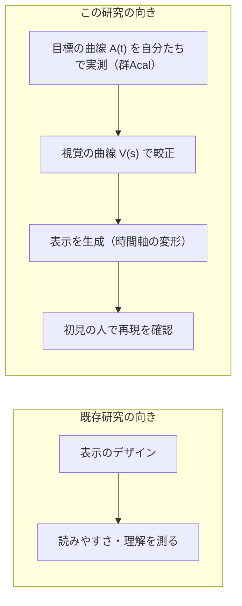
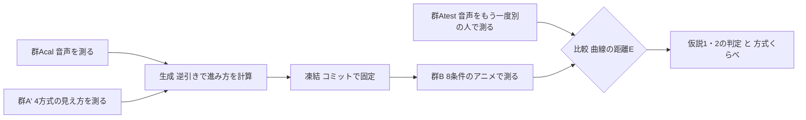
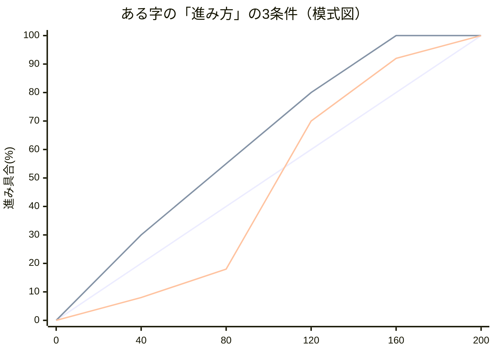
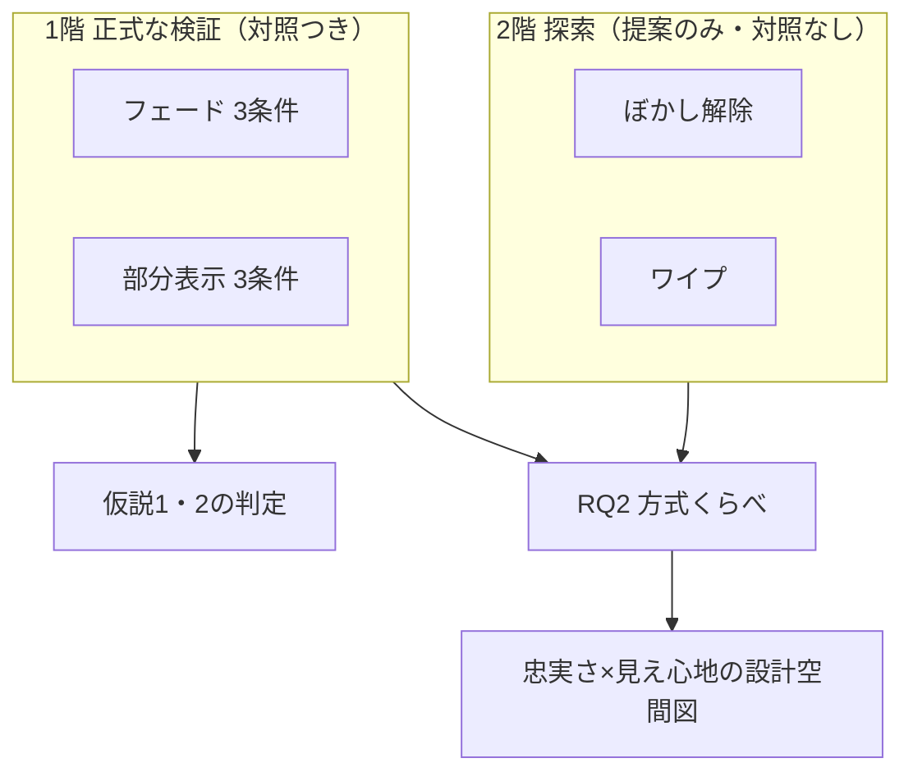

# 実験計画書：音声の「分かっていく過程」を文字アニメーションで作り直す手法の検証（iFont 転写検証実験）

- 作成: 2026-08-19 丸山（AI補助により起草）。**第2稿**（栗原先生のレビュー待ち）。
- 第2稿は、4系統の模擬査読（研究レビュー12点・EC24型・VR学会25型・ICEC23型）を受けて
  第1稿を大きく直したもの。**どれも実験を始めてからでは直せない指摘**だった。
  変更の一覧は**巻末の付録B**にまとめた。
- 位置づけ: 実験1（68かな・目標220人）の計画書は温存し、その**前に行う小さな検証実験**。
  経緯: project/提案_方針転換_小さく確かめてから広げる.md／設計: project/設計案_生成アルゴリズム.md
- 実験ページは experiment/audio1char.html（v3.41）を土台に改修する（変更点は9章)。
  データ収集直前のコミットで実装を固定し、そのコミット番号を論文に書く。
- 呼称は「実験協力者」。修正時は「>」「-」表記。設計判断の理由は付録のQ&Aにまとめた。
- **締切: WISS 2026 投稿 8/31（月）23:59。登壇論文6ページ。**

## 1. 背景とリサーチクエスチョン

### 1.1 経緯（要約）

iFontの狙いは、音声を聞くのと「同じ時点に同じだけ分かる」文字表示を作ること
（かるたの決まり字体験を、聴覚に頼れない人にも字幕で届けたい）。
音や表示を途中で打ち切って「どこまで届けば分かるか」を測る方法（ゲーティング法）は
1961年以来の標準的な方法で、聴覚と視覚の曲線を測って比べる研究まで既にある
（Sánchez-García ら 2018）。まだ誰もやっていないと言えるのは、
**測った音声の曲線をもとに文字アニメーションを作り、それが狙いどおりに働くかを
初見の参加者で確かめる**ことである（似た研究との区別 → Q11）。まず8文字でこれを検証する。

### 1.2 リサーチクエスチョン

**集団で測った音声の「分かっていく曲線」（提示時間→正答率）を、文字アニメーションの
進み方を変形することで、初見の集団に再現できるか。**

（図の補足: A(t)もV(s)も既存研究のデータではなく、**この実験の較正グループで実測する**。
既存研究から借りるのは測り方＝ゲーティング法と、表示方式の分類の根拠だけ。）

**この研究の向き（最重要）**: 本研究は表示の「読みやすさ」を良くする研究ではない。
目的は分かりやすさの**制御**——音声側で測った曲線を目標（target）として与え、
それと同じ分かり方をする表示を較正で作る。目標が「この時点では55%の人にしか
分からない」なら、わざと55%しか分からない表示が「正しい」。
既存のアニメーション文字研究（Livefonts、文字を動的に描画する学習研究、kinetic typography）は
「表示を変えると読みやすさや理解がどう変わるか」を調べる向きで、本研究はその逆——
「目標の曲線→較正→表示を作る」の向きである。だから各表示方式は優劣を競わせる対象ではなく、
**分かり方を時間軸の上で操るための「乗り物」**として扱う。

**言葉のルール**: この実験で作り直す（転写する）のは「識別率の軌跡」＝正答率の時間曲線であり、
「分かっていく過程」の中身すべてではない。正答率が同じでも、間違え方の分布
（60%が「た」・30%が「だ」なのか、60%が「た」で残りがばらばらなのか）は違い得る。
論文では測ったものを直接表す言葉（識別率軌跡の転写）を使い、間違え方の分布（混同行列）が
一致するかは追加の分析として調べる。Perceptual Score などの構想上の言葉は論文では前提にしない
（→ Q13）。

**表示方式は4種類・2階建て**: 方式は思いつきで並べず、既存のdynamic text研究が示す
「文字の見えやすさを時間的に操作する代表的なやり方」から4種類を選ぶ——

| 方式 | 何が徐々に変わるか | 性質 |
|---|---|---|
| フェード | 透明→不透明 | 文字全体は最初からあり、信号の強さが上がる |
| 部分表示 | 文字の画素が固定乱数順で増える | 散らばった部分情報が増える（既存資産を流用） |
| ぼかし解除 | 強いぼかし→鮮明 | 形は最初からあり、細部が後から入る |
| ワイプ | 端から順に領域を見せる | つながった部分情報が増える |

- **1階（正式な検証）**: フェードと部分表示の2方式。それぞれに対照条件を揃え、仮説1・2を検証する。
- **2階（探索）**: ぼかし解除とワイプは**提案手法の表示だけ**を作り（対照条件は作らない）、
  「同じ較正のやり方が他の方式でも通るか」「4方式のうちどれが目標の曲線に近づけやすいか」を
  傾向として見る（→ RQ2）。対照がないので、この2方式について「転写できた」とは言わない。

**評価の軸は2つ**: 忠実さ（目標の曲線にどれだけ近いか）と、見え心地（その表示を続けて
見ていられるか）。「忠実なら快適」とは仮定しない。最後に横軸=忠実さ・縦軸=見え心地の
図に4方式を置き、設計の全体像として示す。

### 1.3 iFontの構想との対応

| 構想の言葉 | この実験での姿 |
|---|---|
| Perceptual Score（分かっていく過程の中間表現） | まぐれ当たりと押し間違いの分を除いて0〜1に直した識別の進み具合 q(t)（→ 6.1） |
| 変換g（聴覚と視覚を同じ認識率で対応づける較正） | 時間軸の変形 s_i(t) = q̂V_i⁻¹(q̂A_i(t))。gを時間に沿って使ったもの |
| frac課題（gの実測） | 較正グループの打ち切り課題 |
| 文字合成 | 生成アルゴリズム（3.1） |
| iFont | 生成されたアニメーション（提案手法の条件） |

（「対象＝かなそのもの」の意味 → Q2）

## 2. 検証したい仮説

検証は「初見の人が音声を聞いたときの曲線（群Atest）」と「初見の人がアニメーションを
見たときの曲線（群B）」の比較で行う。「近さ」は曲線どうしの距離E（6.2）で測る。
**仮説1・2はフェードと部分表示のそれぞれで別々に判定**し、方式どうしの優劣は主な仮説にしない。

- **仮説1（転写は効く）**: 提案手法で作ったアニメーションは、何も工夫しない等速の表示よりも、
  音声の曲線に近い。
- **仮説2（速さ合わせでは足りない）**: 提案手法は、「開始時刻と速さだけを最適に合わせた表示」
  （＝1次の時間変換。数式では s=at+b）よりも音声の曲線に近い。
  - 前提: この仮説が意味を持つのは「1次の変換ではどうしても合わせきれない字」がある場合に
    限る。その「合わせきれなさ」（D_i と呼ぶ）は**8字を選ぶ基準には使わない**
    （「効きそうな字だけ選んだ」という批判を招くため）。8字は音の種類とQCだけで先に固定し、
    D_i は「D_iが大きい字ほど提案手法の優位が大きいはず」という**事前に宣言した予測**として
    本番データで確かめる。
  - 不支持なら「1次の時間変換で足りる」が結論。それも表示設計の知見として報告する。
- 補助指標: 中点（曲線の中間の時刻。→ 6.1の注意）の差は補助に格下げ。
- **RQ2（方式くらべ・探索）**: 同じ較正のやり方を4方式に使ったとき、
  **外から与えた目標の曲線にどれだけ近づけられるか**は方式によってどう違うか。
  「どの表示が一番読みやすいか」を問うのではない。探索の2方式は対照がないので、
  順位と傾向の報告にとどめる。
- **RQ3（見え心地・記述）**: 各方式の生成表示は、続けて見ていられるか。
  「継続して閲覧する際の主観的な見やすさ・負担」と定義し、群Bの識別課題が**全部終わった後**に
  4方式について聞く（→ 3.5）。忠実さと一致するとは仮定しない。

やっていることが壊れていないかの確認（操作チェック）:
確認A＝全部見せ・全部聞かせの問題の正答率が十分高い。確認B＝提示が長いほど正答率が上がる。
確認C＝ほとんど情報のない問題の正答率が、実験の後半になっても上がっていない
（出てくる字を覚えてしまう「学習」の兆候検出。→ Q7）。

## 3. 実験の構成

### 3.1 全体の流れ（5つの独立な参加者集団、「測る→作る→別の人で確かめる」）

| 段階 | 集団 | 課題 | 得るもの |
|---|---|---|---|
| 較正（聴覚） | 群Acal | 音声を先頭からt msで打ち切り→かな表から回答 | 生成に使う音声の曲線 Â_i(t) |
| 較正（視覚） | 群A′ | 基準アニメを進み具合s%で打ち切り→回答（4方式ぶん） | 方式ごとの視覚の曲線 V̂_m,i(s) |
| 生成 | — | 曲線の逆引きでアニメの進み方を一発生成し**凍結** | 各字の進み方 s_i(t)（人手調整なし） |
| 検証（聴覚） | 群Atest | 群Acalと同じ音声課題 | 検証の基準になる目標曲線 |
| 検証（視覚） | 群B | 1階6条件＋2階2条件のアニメを打ち切り→回答（終了後に見え心地の質問） | 各方式・各条件の曲線＋見え心地 |

- **検証の比較は「群B vs 群Atest」**（初見の人の視覚 vs 初見の人の聴覚）。
  こうすると「較正に使った人たちに合わせ込んだだけ」という疑いが基準から切り離せる（→ Q1）。
- どの集団も互いに独立（同じ人は1回だけ）。較正の聴覚と視覚まで分けるのは、同じ人が両方やると
  先の課題で「出てくる字」や刺激の癖を覚えてしまい、後の課題の曲線が汚れるため（→ Q1）。
- **凍結**: 生成のコード・設定・全8字の進み方を、検証データを取る**前に**コミットで固定し、
  番号を記録する。検証の結果を見てから作り直すことはしない（→ Q3）。
- **この手法が置いている仮定**: 基準アニメで測った「進み具合→正答率」の関係が、進み方を
  変形した後でも（同じ濃さでも、そこに来るまでの見え方の履歴が違っても）だいたい保たれること。
  この仮定は正しいと決めつけず、**この実験の検証対象に含める**
  （崩れたら「単純な時間変形では移植できない」という結果として報告。→ Q12）。
- 基準アニメの長さ・進み方のカーブは、較正の前に少人数の下見で決める設計項目（→ Q4）。
- **視覚較正のまとめ方（検討中の案）**: 方式ごとに別の集団を作らず、1つの集団の中で
  「どの字をどの方式で見るか」を偏りなく割り振る（同じ人は同じ字を1方式でしか見ない。
  人によって組合せを入れ替える）。集団全体では全方式×全字の曲線が得られる。
  これは**集団の数を減らす工夫で、必要な回答数は減らない**（曲線は方式ごとに必要なため、
  較正の総回答数は方式の数に比例する）。成立するかと必要人数はA2（10章）で確定する。

### 3.2 群Bの条件

**1階（正式な検証）**: フェードと部分表示のそれぞれに、同じ3条件を用意する（計6条件）:

| 条件 | 内容 | 何に答えるか |
|---|---|---|
| 対照1 | その方式の等速の進み方 | 何も工夫しない場合の基準 |
| 対照2 | **開始時刻と速さだけ最適に合わせた進み方**（s=at+b。a,bは較正データだけから、曲線の距離が最小になるように決める） | 「速さを合わせるだけで十分では？」への直接の答え（→ Q5） |
| 提案 | 曲線の形まで写す非線形な時間変形（＝iFont） | 「分かっていく形」まで写す必要があるか |

> 比較はすべて**方式の中だけ**（提案 vs その方式の対照）。方式どうしの優劣は主な仮説にしない。
> 論文には代表の字について、3条件の進み方の違いを1枚の図に重ねて示す。

3条件の違いの模式図（数値は説明用の作り物。横軸=時間ms、縦軸=表示の進み具合%）:

（提案だけが「ゆっくり→急に→ゆっくり」のような**非直線の進み方**になり得る。
3本がほぼ重なる字＝1次で足りる字、離れる字＝形まで写す意味がある字）

**2階（探索・対照なし）**: ぼかし解除とワイプは提案手法の表示だけ作って群Bに混ぜる
（合計8条件）。目的はRQ2とRQ3で、仮説1・2には使わない。この2方式も較正と凍結の対象。
**言い方のルール**: 1階は「対照に勝つか検証した」、2階は「同じ較正のやり方で作れるか、
どのくらい近いかを傾向として調べた」——2階について「転写できた」とは言わない。

### 3.3 課題の詳細

- **文字**: ターゲット8字（暫定）。選び方は**外から決まる基準だけ**——音の種類の多様さ
  （母音だけの字／にごらない破裂音／にごる破裂音／こすれる音／鼻に抜ける音／清濁のペア）と、
  刺激の品質チェック合格。前述のとおり D_i（合わせきれなさ）は選定に使わない。
  8字はねらって選ぶので、結論は「この8字について、参加者の母集団へ広げられる」まで
  （かな全体への一般化は68字実験の役割）。
- **まぎれ字（フィラー）**: ターゲット以外のかなも問題に混ぜ、「8字しか出ない」と
  気づかれないようにする（このため録音は全68かな行う。混ぜる量と繰り返し回数はA2で確定）。
- **提示の刻み**: 字ごとに7時点（暫定）。聴覚は音の実体の開始点（acoustic onset）からの
  実時間ms、視覚は進み具合%で打ち切る。分かり方が急に変わる**早い時間帯を細かく**、
  全長付近まで覆う（時間帯の根拠 → Q6）。具体的な配置はA2で確定。
- **1回だけ提示**: 聞き直し・見直しはなし。刺激に触れる回数を聴覚・視覚とも1回に揃える
  （回答時間は無制限のまま）。
- **回答**: 五十音表と同じ並びの全かな表から選ぶ（1問1答・選び直し確認つき）。
  **回答に使う表は聴覚・視覚で同じにする**。ただし「表が68択だから当て推量は1/68」とは
  主張しない（同じ字が繰り返し出ると、参加者の頭の中の候補は68個ではなくなり得る。→ Q7）。
- **割り振りの原則**: 群Bでは「字×時点×条件」の各組合せの回答数がほぼ等しくなるように
  実験協力者の間で分担し、1人は3条件すべてを経験、順番はランダムにする。具体はA2で確定。
- **募集**: Yahoo!クラウドソーシング。日本語母語・18歳以上・各集団1人1回・集団間の重複なし。
  再生機器は自由（合図音→0.6秒→刺激、の方式で無線イヤホンの頭欠けを防ぐ）。
- **人数**: A2の通しシミュレーション（10章）で確定。以前の目安25人/集団は下限とみなす
  （まぎれ字を入れると1つの組合せあたりの回答が薄まるため、増える見込み）。

### 3.4 刺激（音源）

> 決定（8/19・丸山）: **自然音声**。録音は全68かな（ターゲット候補12字を優先して丁寧に）。

1. **録音**: 日本語を母語とする話者1名（研究室の学生・知人などでよい）が、かなを1字ずつ
   単独で自然に発話。各3〜5回・WAV（手順書: project/録音手順_自然音声12字.md 第3版）
2. **テイクの選び方（録音前に固定）**: 読み間違い・雑音・音割れのある回を除き、
   残りから**長さが真ん中に最も近い回**を機械的に採用（→ Q8）
3. **音量合わせ**: 1音まるごとに一定の倍率を掛けるだけ（音の中身の強弱の配分は変えない。→ Q8）
4. **時間の基準**: 音の実体が始まる点（acoustic onset）を測って記録し、**実験の0msとする**。
   検出は自動（短い窓のエネルギーが背景雑音を十分超えた最初の点）＋全数を目視確認。
   音の種類ごとの基準（破裂音は破裂の開始、こすれる音は摩擦音の開始、母音・鼻音は
   周期的な波形の開始）を文書化し、スクリプトと全字の値を公開する（→ Q9）
5. **打ち切りの処理**: 波形を突然ゼロにせず、**打ち切り時刻tで終わる5msのなめらかな
   フェードアウト**で切る（フェード区間はtの直前5ms。tより後の音は一切含まれない）。
   全字・全時点で共通、論文に明記
6. **配信**: WAVのまま（音の頭の立ち上がりを守るため圧縮しない）。再生時の頭フェードもなし
7. **品質チェック（QC）**: 耳での全長試聴に加え、開始点・VOT・全長・音量・音割れの
   機械測定一覧を作る。さらに少人数の下見で、全長ならほぼ正答できることを確認

- 各字1テイクなので、得られる曲線は「そのかな一般」ではなく**この話者のこの発話**のもの。
  論文でもそう限定する（複数話者・複数テイクは今後の課題）。
- 従来の刺激作り（合成音声への加工）は「ぽ」が濁って聞こえる問題を起こしたため凍結し、
  この実験では使わない（診断: project/清濁診断_音響測定.md）。
  標準データベースは将来の追試用（project/音源調査_標準DB.md）。

## 4. 何を測定して分析するか

- 主要指標: 正誤（1問ごと。採点の仕組みは実験1と同じ）。
- 補助指標: 反応時間・実際の提示時間（視覚は描画の実時刻を記録し、狙った時間とのずれを検出）・
  所要時間・途中再開の回数・何問目か（学習の検出用）・端末環境。
- 仮説1・2の判定はすべて正誤から行う。主観の質問は3.5の見え心地だけに限り、
  それ以外の使い勝手の評価（かるたの実戦など）は次の段階の実験で扱う。

## 5. 実験協力者への事前説明

実験1（v3.41）の画面をそのまま使う: 同意画面（6項目）・音量の確認・見え方の確認・
図解つき説明と練習・「聞こえなくても（見えなくても）、もっとも近いと思う文字を選んでください。」
（聞き直しボタンはこの実験では表示しない）

## 6. データの分析方法

### 6.1 曲線の推定（生成用と分析用を分ける）

**生成用**: まぐれ当たり（床）と押し間違い（天井の欠け）の分を除いて0〜1に直した
「識別の進み具合」q を、**形を決めつけない単調な曲線**（単調性の制約つきの回帰）で推定する。
アニメの進み方は s_i(t) = q̂V_i⁻¹(q̂A_i(t))。範囲の外に出る部分は端に丸め、丸めが起きた範囲を
記録・報告する。
> 第2稿の理由: 聴覚・視覚の両方をS字関数（logistic）に当てはめてから逆引きすると、
> 数学的にほぼ「開始時刻をずらして速さを変えるだけ」の変換に退化してしまい、
> 提案手法が対照2と区別できなくなるため。S字への当てはめは分析の要約にだけ使う。

**分析用（要約）**: S字関数 P(t) = γ + (1−γ−λ)·logistic((t−μ)/s) を当てはめ、
μ（中点）・急峻さ・λ（押し間違い率）を要約として報告する。γ（まぐれ当たり率）は
名目値（選択肢数の逆数）を初期値にするが固定せず、変えても結論が変わらないか確かめる（→ Q7）。
**μは「下限と上限のちょうど中間の時刻」であって「正答率50%の時刻」ではない**
（必要なら正答率50%は別に逆算する）。

**統計モデル**: 正誤を、実験協力者（人によるばらつき）・文字・条件・時間・文字×時間を
含む混合モデルで扱う（同じ人の回答どうしは似ることを考慮。文字はねらって選んだので
「かな一般」への一般化には使わない）。

### 6.2 成功の判定（「近さ」の定義）

- **主判定: 曲線の距離E**＝2つの曲線の、評価時点での差の平均（正答率ポイント）。
  仮説1は E(提案) vs E(対照1)、仮説2は E(提案) vs E(対照2)。同じ字どうしのペアで比べ、
  字ごとの難しさの差を打ち消す。
- 補助: 中点の差・急峻さ・混同行列・字ごとの誤差・丸めの発生範囲。
- 報告: 差とその信頼区間。「±何msなら実質同じか」という基準は今回は決めず、次の段階で扱う。
- 参考の目安（シミュレーションより）: 測定の揺らぎだけでも距離Eは約3.7ポイント残る。
  形が合っていない場合は8〜10ポイントに現れる。

### 6.3 除外基準

実験1の6.3を踏襲（確認問題の誤答数・無応答・所要時間の異常・重複参加）。
数値の線引きはA2と同時に固定。加えて確認C（学習の兆候）を集団レベルで報告する。

## 7. モデルケース（群Bのある実験協力者）

1. Yahoo!クラウドソーシングで「文字の見え方の実験（約10分）」を開く。
2. 同意画面→見え方の確認→図解つき説明→練習1問以上。
3. 本番: いろいろなかなが、さまざまな速さ・見え方（フェード／部分表示／ぼかし解除／ワイプ）で
   現れては消える。条件の区別は知らされない。各問1回だけ提示され、全かな表から選んで確定。
   分からなくても最も近い字を選ぶ。
4. 識別課題が全部終わったら、代表の字のアニメーションを普通に眺めて、
   見え心地の質問（3項目×数本＋どれを使いたいか）に答える。
5. 完了コードをコピーして投稿し、報酬を受け取る。

（聴覚の集団は音声版、較正の視覚集団は各方式の基準アニメ版で同じ流れ。）

## 8. 予想される結果・結論（希望的展望）

- 仮説1が支持: 「音声の識別率軌跡は、較正した時間変形で文字アニメーションとして作り直せる」
  ——WISSの中核の主張。
- 仮説2も支持: 「速さ合わせでは足りず、曲線の形まで写す意味がある」。
- 仮説2が不支持: 「1次の時間変換で近似できる」という設計知見として報告
  （どの字も1次で合わせきれてしまうかどうかは、下見の段階で分かる）。
- 進み具合と正答率の関係が変形後に崩れた場合: 「同じ濃さでも見え方の履歴で正答率が変わる」
  という発見として報告（→ Q12）。
- 方式くらべ（RQ2・RQ3）: 例えば「部分表示は忠実だが目障り、フェードは快適だが忠実さは中くらい」
  のような結果になれば、**忠実さと見え心地は別物でトレードオフがあり得る**という
  HCIらしい知見になる。
- どの場合も、主張は「較正済みの8字・この話者の発話・調べた表示方式・集団レベル」の範囲に
  限定する（言ってよいこと・いけないことの一覧: 設計案§6と本書§11）。

## 9. 実験のための実装（差分）

1. 聴覚: 割合指定（frac%）→ 開始点からの実時間ms・字ごと7時点の設定化＋5msの終端フェード
2. 視覚較正: フェードは既存の打ち切り課題（刻みの設定のみ）。部分表示は既存のマスク方式
   （字ごと固定乱数順の画素表示。必要な刻みは生成スクリプトで再生成）の再生器を追加。
   探索の2方式: ぼかし解除＝ぼかし半径を単調に減らす、ワイプ＝見せる領域を単調に広げる
3. 群B: 進み方 s_i(t)（60Hzの数値列）で再生する変形モード（フェード=濃さ、部分表示=画素率、
   ぼかし=半径、ワイプ=領域率）＋8条件とまぎれ字の割り振り・記録（方式列・条件列）＋
   終了後の見え心地画面
4. 聞き直し・見直しボタンの無効化（1回だけ提示）
5. 刺激: 自然音声WAV＋各ファイルの開始点（ms）の一覧。まぎれ字の音声・表示も同じ手順で用意
6. 記録: 集団・方式・条件・時点・実提示時間・何問目かを1問1行で保存

## 10. 未確定事項と決定の記録

シミュレーションは二段階。A1/A1.5（実施済み）は仮の曲線での設計感度の確認。
**A2（これから）**は、実際の刺激の下見データを使い、
録音標本→曲線推定→生成→検証標本→距離Eの判定、までの**全工程を通した誤判定率**で
次を確定する: ①各字の「1次で合わせきれない度合い」D_iの分布（選定には使わない）
②時点の配置 ③まぎれ字の量 ④ターゲットの繰り返し回数 ⑤必要人数
⑥4方式ぶんの割り振りで精度が確保できるか。
**撤退の順序（8/22のA2完了時点で判定）**: 間に合わなければ
①まず探索の2方式（ぼかし解除・ワイプ）を落とす → ②次に部分表示を落としてフェード単独へ。
どの段階でも仮説1・2は成立する。

| 事項 | 状態 | 決め方 |
|---|---|---|
| 音源 | **確定**（8/19・丸山）: 自然音声・全68かな録音 | 3.4 |
| 検証用の聴覚集団（Atest）追加・5集団構成 | **確定**（8/19・丸山） | 3.1 |
| 対照2=最適な1次変換・生成=形を決めつけない単調推定・主判定=距離E | **確定**（8/19・レビュー反映） | 3.2・6章 |
| 表示方式の2階建て（1階2方式×3条件＋2階2方式は提案のみ）・見え心地評価・撤退順序 | **確定**（8/19・丸山） | 1.2・3.2・3.5相当・10章 |
| まぎれ字方式（量・繰り返しは未定） | **確定**（8/19・丸山） | A2③④ |
| 録音話者 | 未確定 | 母語話者1名を研究室周辺から依頼 |
| 8字の選定 | 未確定 | **音の種類＋QCのみ**で選定（D_iは使わない。方針は先生に確認） |
| 基準アニメの長さ・進み方 | 未確定 | 下見で曲線の広がりを確認して固定（Q4） |
| 人数・時点・割り振り・除外の線引き | 未確定 | A2⑤⑥ |
| 報酬・予算 | 未確定 | 下見の実所要時間から時給1,000円目安で設定 |
| この順序とWISS 8/31目標の承認 | 先生の復帰待ち | 提案メモ第4版とともにレビュー依頼 |

## 11. WISS執筆方針（模擬査読への対応の要点）

- **Contribution（序論の最後に明示する3点・案)**:
  1. 音声と文字アニメーションの識別率軌跡を同じ手続き（ゲーティング）で較正する方法
  2. 較正に基づく非線形な時間変形による文字アニメーション生成（一発生成・凍結つき）
  3. 初見の参加者による、「速さ合わせ」対照との比較検証と、4方式にわたる適用の探索
- **使わない言葉**: 「Perceptual Score」（実体は正規化した識別率。構想名は展望でのみ）／
  「equivalent experience・同じ知覚体験」（合わせたのは識別率の軌跡であって感覚体験ではない）／
  「識別過程を再構成」（保存対象を定義しない限り使わない）／
  「4方式で成立した＝一般に適用可能」（調べた4方式を超える一般性は示していない）
- **しないRQ**: 「どのアニメーションが最も理解しやすい・読みやすいか」（既存のanimated
  typography研究の土俵）。本研究の位置づけは「既存研究は表示→理解の向き。私たちは
  代表的な表示機構を『制御可能な乗り物』として使い、外から与えた識別率の軌跡を
  再現できるかを問う」（英文: Prior work has investigated how animated typography affects
  legibility and reading. We instead use representative animation mechanisms as controllable
  visual carriers and ask whether each can be calibrated to reproduce an externally specified
  recognition trajectory.）
- 初めにproof-of-concept（原理確認）だと明言（1話者・8字・4方式・集団レベル。
  かるた実戦・ゲームプレイは評価していない）
- **必須図**: 代表1字の「聴覚の目標曲線・視覚の較正曲線・3条件の進み方・時刻→進み具合の
  対応表」を1枚に。結果は全体平均だけでなく音の種類別・字別にも示す
  （「母音は1次で足り、破裂は非線形が要る」型の発見を狙う）
- **報告する実装情報**: フォント名・文字サイズ・想定視距離・画面のリフレッシュレート・
  実測フレーム時刻・音の開始点の定義とスクリプト・打ち切りフェード仕様・かな表UIの詳細
- 次の研究（温存）: 探索で有望だった方式の正式検証・線の太さ変化などの追加方式・
  本格的な見え心地評価・かるた文脈での評価

## 付録: 設計の理由（Q&A）

**Q1. 「別の人で確かめる」って、追試（再現性研究）のこと？ なぜ集団を全部分ける？**
追試ではない。検証集団を分けるのは「結果を見ながら調整した」可能性の排除。さらに聴覚の
再測定（Atest）を置くのは、生成の目標に使った曲線（Acal）を検証の採点基準にも使うと
「較正標本に合わせただけ」と区別できないため——比較を「初見の視覚 vs 初見の聴覚」にする。
較正の聴覚と視覚を分けるのは、同じ人が両方やると先の課題で出題の字や刺激の癖を覚えて
後の課題の曲線が汚れるため（曲線は集団単位で扱うので、同じ人で対にする利点は小さい）。

**Q2. 「対象＝かなそのもの」とは？**
構想では、スコアは「対象（かるたなら歌）がいつ分かるか」を書き、それを「どの文字をいつ
見せるか」へ翻訳する橋渡し（決まり字の組合せ論）を挟む。この実験は分かる対象がかな1文字
そのものなので、翻訳の工程が不要（何もしない翻訳＝恒等写像）。構想の特別な場合にあたる。

**Q3. なぜ凍結するのか？**
時間変形は自由度が高いので「結果を見て調整を繰り返せばいつかは合う」という批判が成り立つ。
検証データを取る前にコミットで固定し、一発生成であることを履歴で証明する。

**Q4. 基準アニメの200msをなぜ見直す？**
200msは旧製品（かるたの0.2秒/モーラ）の名残で、測定のために選んだ値ではない。大事なのは
「進み具合→正答率」の曲線が全域でなだらかに立ち上がること。進みが速すぎると「薄くても
すぐ読める」ため曲線が狭い範囲で跳び、逆引きが不安定になる。下見で決めてから較正する。

**Q5. 対照2はなぜ「最適な1次変換」なのか？**
「中点だけ合わせた表示」を対照にすると「傾きも合わせれば十分では」という反論が残る。
較正データだけから最良の「開始時刻＋速さ」変換を作って対照にすれば、これに勝つことが
「非線形な変形が必要だった」ことの直接の証拠になる。負ければ「1次で足りる」という明快な知見。

**Q6. 打ち切りが40msとか、急すぎない？**
先行研究では、日本語の音節の識別率は切る位置に対して急に変わり、スペクトルが大きく動く
付近の短い区間が識別に大きく効くと報告されている（Furui 1986）。清濁の主な手がかりの一つ
VOT（破裂から声帯振動までの時間）は日本語でおおむね数十ms（音・話者で変動）。だから時点は
等間隔でなく、変化が予想される早い時間帯を細かく取る。具体は下見の結果から決める。
「もっと遅く分かるはず」という体感は反応時間（数百ms）が乗っているためで、この方法は
回答時間を無制限にして「情報がいつ届いたか」と「反応の速さ」を切り分けて測る。

**Q7. 当て推量の率は1/68でいいの？**
固定しない（第2稿で撤回）。回答の表に68字あっても、同じ8字が繰り返し出れば参加者は
出題の範囲を学習し、実質の選択肢は68個でなくなる。対策は（1）全68かなを録音してまぎれ字を
混ぜる（2）ターゲットの繰り返しを抑える（量はA2で）（3）当て推量率は固定せず、変えても
結論が変わらないか確かめる（4）学習の兆候を確認Cとして明示的に調べる。なお「同じ音声を
何度も聞くこと」自体は、先行研究（Cotton & Grosjean）で提示形式による大差が出ておらず、
より危ないのは出題範囲の学習の方。

**Q8. テイク選びと音量合わせは、なぜ機械的に？**
「都合の良い録音を選んだ」「音を整えて結果を作った」という批判の余地を消すため、選ぶ基準
（除外→長さが真ん中）を録音前に固定する。音量も、音の頭のノイズの強さ自体が清濁の
手がかりになり得るので、中身の配分を変えない一定倍率だけにする。

**Q9. 音の開始点は誰がどう決める？**
自動検出を初期値に、波形とスペクトログラムで全数を目視確認。音の種類ごとの基準を文書化し、
スクリプトと全字の値を公開して、第三者が同じ値を出せるようにする。時間の位置そのものが
この実験の独立変数なので、5msのずれでも無視できない。

**Q10. なぜ曲線の急峻さ（傾き）を判定に使わない？**
二段階の推定（曲線を推定→逆引きに使用）では傾きが系統的に浅く出る偏りがあることを
シミュレーションで確認済み。判定は曲線の距離Eで行い、傾きは要約・図示にとどめる。

**Q11. 「まだ誰もやっていない」って本当？**
部品はすべて既存: ゲーティング測定（竹内1961・Furui 1986・Grosjean 1980）、聴覚と視覚の
曲線の測定・比較（Sánchez-García 2018）、文字の段階提示（Petersen & Andersen、dynamic text）、
モダリティ間の対応づけ（古典的な感覚間マッチング）、音声に同期した文字表示（カラオケ。
較正も検証もない）。見つかっていないのは「測った識別率軌跡から較正済みの逆引きで表示を作り、
初見の参加者で確かめる」という組み合わせの全体（8/19時点の調査）。論文では「私たちの知る
限り」と限定し、近い研究を自分から挙げて区別する。価値は「世界初」でなく検証結果に置く。

**Q12. 「進み具合が同じなら正答率も同じ」と言える？（見え方の履歴の問題）**
保証はない。同じ濃さ50%でも、ゆっくり到達した場合と直前に急に到達した場合で正答率は
違い得る。本手法はこの関係が変形後も保たれることを仮定しており、**仮定ごと検証対象に
含める**。崩れれば「単純な時間変形では移植できない（履歴まで考えたモデルが必要）」という
結果として報告する。

**Q13. 正答率が同じなら「分かっていく過程を作り直した」と言える？**
言えない。正答率60%でも間違え方の中身が違えば、持っている情報は違う。この実験で保存を
確かめるのは「識別率の軌跡」であり、論文の言葉もそれに合わせる。間違え方の分布（混同行列）の
一致は追加の分析として調べ、一致すればより強い主張の材料、しなければ「正答率軌跡のみの転写」
と限定する。

**Q14. なぜフェードイン？そもそも徐々に表示する必要ある？**
手法が必要とするのは「進み具合という1つの量で書ける、単調に情報が増える表示」であれば
よく、フェードはその一例。第2稿からは部分表示も正式検証に含め、ぼかし解除・ワイプも探索層で
調べることで「フェード固有の現象ではないか」に直接答える。「徐々に」の根拠は、目的が
分かる時刻だけでなく途中の「半分だけ分かる」状態まで揃えることにあるから。時刻だけなら
一気に全表示するステップ表示でも足りる可能性があり、それは仮説2の延長として考察で扱う。

## 付録B: 第2稿の主な変更（第1稿からの差分・すべて実験前に直さないと後から直せない指摘）

1. 生成をS字関数（logistic）の逆写像から**形を決めつけない単調推定**へ（S字同士の逆写像は
   ほぼ「開始時刻と速さの調整」に退化し、提案が対照2と区別できなくなるため）
2. 対照2を「中点合わせ」から**最適な1次の時間変換**（s=at+b）へ強化
3. 仮説2の主判定を中点の差から**曲線の距離E**へ（中点を合わせた対照を中点で測る矛盾の解消）
4. **検証用の聴覚集団（Atest）を追加**。検証は「初見の視覚 vs 初見の聴覚」の比較に
5. 「当て推量率=1/68」の固定を撤回（出題範囲の学習で実質の選択肢が変わり得る）。
   **全68かな録音＋まぎれ字混入**方式へ
6. 聞き直し・見直しの廃止（**1回だけ提示**）、音の開始点の決め方の明文化、
   打ち切り終端の5msフェード仕様、較正集団を分ける理由、主張の「集団レベル」明確化
7. 言葉を「識別率軌跡の転写」に統一（「識別過程の再構成」は言い過ぎ）。混同行列の一致を
   追加分析に。8字の選定は音の種類＋QCのみ（「合わせきれなさD_i」は事前予測として使う）
8. **表示方式を2階建てで4種類に拡張**: 1階=フェード・部分表示（各3条件で正式検証）、
   2階=ぼかし解除・ワイプ（提案のみで探索）。方式どうしの優劣は主仮説にしない
9. **見え心地の評価（RQ3）**を群Bの最後に追加（識別課題の後に限定・3項目＋choice・数分）
10. 研究の向きを「読みやすさの最大化」でなく**「分かりやすさの制御」**と明確化。
    方式は「制御の乗り物」であり、既存のanimated typography研究とはこの向きで区別する
11. **撤退の順序**を事前に固定: 8/22のA2時点で間に合わなければ 探索2方式→部分表示→
    フェード単独 の順に縮める
