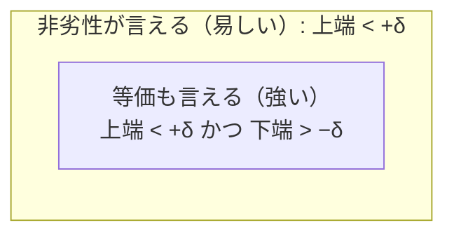
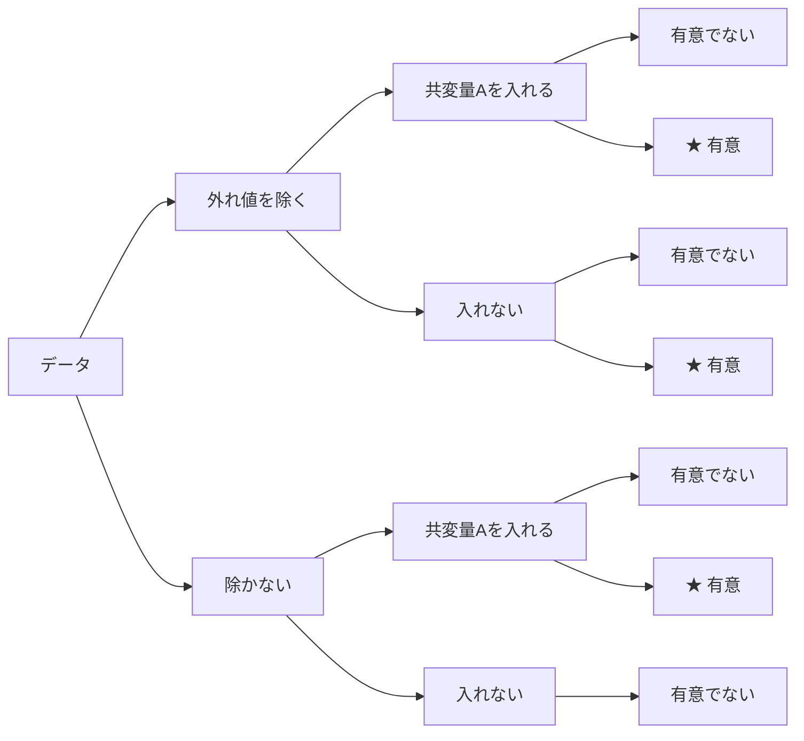
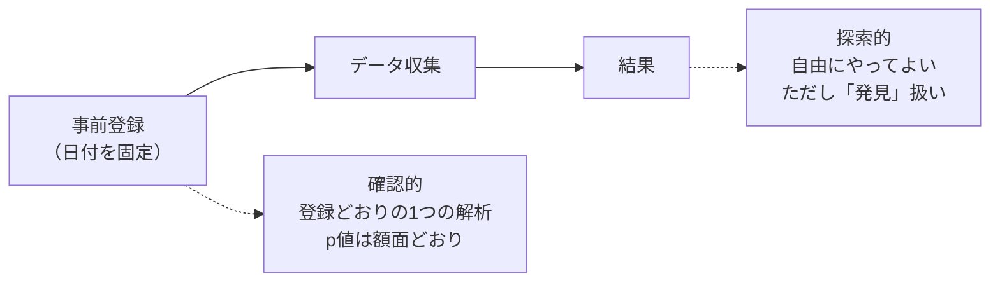

# 「差がない」を示す・事前に決める・情報を借りる

**iFont論文の統計 — 学習ノート**

HCI/ECの研究者が t検定・分散分析は実務で使うが、その背後の数理モデルまでは踏み込んでいない——という前提から出発して、iFont論文に出てくる3つの概念を、図と対応表で腑に落とすためのノートです。

| | |
|---|---|
| 所要 | 約60分（第1部24分・第2部18分・第3部31分） |
| 前提 | t検定・分散分析の実務利用 |
| 数式 | 最小限・図で補う |

> このファイルはHTML版（`統計3概念の学習ノート.html`）のMarkdown版です。HTML版のSVG図は、Mermaid図・表・図解テキストとして内容を保ったまま再構成しています。

---

この3つは、統計の道具箱の中では毛色が違って見えますが、**どれも「線形モデル」という同じ土台の上に立っています**。第3部でその土台をていねいに作るので、第1部・第2部で「なぜそんな回りくどいことを」と思っても、最後まで読むと一本の線でつながります。まず、なぜこの3つがiFont論文に必要になったのかを一言ずつ。

- **非劣性マージン** — iFontは「0.2秒間隔で連続提示しても、1文字ずつの認識と*変わらない*」ことを示したい。「変わらない」は普通の検定では示せないので、専用の枠組みが要ります。
- **事前登録** — 「変わらない」という結論は、データを見てから基準を決めると簡単に捏造できてしまう。それを封じるために、実験前に判断基準を届け出ます。
- **階層モデル・部分プーリング** — 認識率を「かな1文字ごと」に推定したいが、1文字あたりの試行は少ない。全体の傾向と各文字の個性を同時にモデル化して、少ないデータを救います。

**この教材の道筋**

1. [非劣性検定と非劣性マージン δ](#part-1-非劣性検定と非劣性マージン-δ) — 「差がない」を積極的に示す。医学では標準、HCIでも広まりつつある考え方。
2. [事前登録（preregistration）](#part-2-事前登録preregistration) — 研究者の自由度を縛る。なぜ「事前に決めた」ことが統計的な正しさを支えるのか。
3. [線形モデル → 混合モデル → 階層モデルと部分プーリング](#part-3-線形モデル--混合モデル--階層モデルと部分プーリング) — t検定もANOVAも線形モデル。そこに「項を足す」と何が起きるか。

---

# PART 1: 非劣性検定と非劣性マージン δ

*約24分 — 「差がない」ことを、有意差の不在ではなく、積極的な検定で示す。*

## 1.1 なぜ普通の検定では「差がない」を示せないのか

まず、いつもの有意差検定（帰無仮説検定）が何を言っているかを思い出します。帰無仮説 *H₀*「差はゼロ」を立て、データがそれと矛盾するほど極端なら *H₀* を棄却して「差がある」と言う。ここで大事なのは、**棄却できなかったとき、それは「差がない証拠」ではない**という点です。

棄却できない理由は2つあり、検定はそれを区別しません。ひとつは本当に差が小さいから。もうひとつは、単に**データが足りなくて差を見つけられなかった**から。つまり「有意差なし」は、雑な実験ほど出やすい。手を抜くほど「差がない」ように見える、という倒錯が起きます。

**図1.1　「有意差なし」が意味しうる2つの状況**（横棒＝差の95%信頼区間）

```
                          差 = 0
                            |
A. 差は小さいと言い切れる    |
                     |------●------|          ← 狭い区間が0の近くに収まる
                            |
B. 何も分からない（データ不足）
        |-------------------●-------------------|   ← 広い区間。大きな差も否定できていない
                            |
```

どちらも「0を含む＝有意差なし」。だが意味は正反対。

> 有意差検定は A と B を区別しない。両方とも「区間が0を含む＝有意差なし」だが、A は「差は小さい」と言える一方、B は「まだ何も言えない」だけ。**「差がない」を主張したいなら、区間が0を含むかではなく、区間が*十分狭い範囲に収まっているか*を見る必要がある**——これが非劣性・等価性検定の出発点。

## 1.2 発想の転換 — 「無視できる差の幅」δ を先に決める

そこで問いを変えます。「差はゼロか？」ではなく、**「差は、実務上どうでもいいと言えるくらい小さいか？」**を問う。この「どうでもいい」の境界を、実験の前に一つの数値として決めます。これが**非劣性マージン δ**（デルタ）です。「劣化が δ 未満なら、無いのと同じとみなす」という約束です。

判定は信頼区間で行います。差の信頼区間を作り、その**上限が δ より小さければ**「劣化は δ 未満だと自信を持って言える＝非劣性（干渉なし）」と結論します。検定の向きが逆さになっていることに注目してください。普通の検定は「0からどれだけ離れているか」を問い、非劣性検定は「δ の内側にどれだけ確実に収まっているか」を問います。

**図1.2　信頼区間の上限とマージン δ の位置で決まる3つの結論**

```
   ← S=200が良い          差=0                    δ           劣化が大きい →
                            |                      |
  干渉なし   |--------●--------|                   |     上限が δ より左
                            |                      |
  保留            |----------●----------|          |     δ をまたぐ
                            |                      |
  干渉あり                  |          |-----●-----|---|  下限も 0 より右
                            |                      |
```

| 判定 | 条件 | 意味 |
|---|---|---|
| **干渉なし** | 上限 < δ | 劣化は δ 未満だと言える |
| **干渉あり** | 上限 ≥ δ かつ 下限 > 0 | 本当に劣化がある |
| **保留** | それ以外（δ をまたぐ） | データ不足で結論できない |

> iFontの乙課題はこの3区分をそのまま使っている。

> **【核心】** 非劣性検定は「区間の**上限**とマージン δ を比べる」だけ。難しい新しい統計量は出てこない。使うのは、いつもの t検定と信頼区間である。変わるのは**「何と何を比べるか」という向き**だけ。

## 1.3 等価性検定（TOST）— 両側にしたいとき

iFontは「劣化していないか（片側）」だけを気にするので、上限だけを見ます（**非劣性**）。もし「良くも悪くもなっていない（両側）」を示したいなら、上側と下側の両方に δ を置き、区間全体が (−δ, +δ) の内側に収まるかを見ます。これが心理学で普及した**等価性検定 TOST**（Two One-Sided Tests、2つの片側検定）です。名前のとおり、片側検定を2回やっているだけ。非劣性はその片側版だと思えば同じ枠組みです。

**図1.3　等価性検定（TOST）**

```
        −δ                  差=0                  +δ
         |===================|===================|      ← 等価とみなす帯
         |     |-------------●-------------|     |
         |                                       |
                        区間全体が帯の内側 → 「実質的に等価」
```

上側の片側だけを見るのが非劣性検定。

## 1.4 マージン δ はどう決めるのか

ここが非劣性検定の一番のクセです。**δ に「5%」のような分野横断の既定値はありません**。むしろ「既定値に頼らず、研究の中身から正当化して事前に決めよ」というのが規範です（医学の規制指針 ICH E10 が明記）。とはいえ相場はあり、割合（正答率など）を扱う医学試験では **10ポイント**前後がよく使われます（重大な結果なら1〜2ポイントまで絞る）。

iFontでは、δ を測定の解像度から導いています。「後段で1文字ごとの認識率を測るときの誤差（標準誤差 約5〜6.5ポイント）より小さい差は、変換 g の出力を変えない」——だから δ=5〜8ポイント。医学の相場よりむしろ厳しい側で、しかも数値の根拠が研究内在的なので、査読で守りやすい位置取りです。

**表1.1　普通の有意差検定と非劣性検定の対比**

| | 普通の有意差検定 | 非劣性検定 |
|---|---|---|
| 示したいこと | 差が**ある** | 差が**無視できるほど小さい** |
| 帰無仮説 *H₀* | 差 = 0 | 差 ≥ δ（劣化が許容外） |
| 見るもの | 区間が 0 を含むか | 区間の**上限**が δ より小さいか |
| データ不足だと | 「有意差なし」に見えて**得** | 区間が広がり**結論できない**（保留） |
| 使う道具 | 同じ（t検定・信頼区間）。向きが違うだけ | 同左 |

## 1.5 片側でよいのか — 非劣性と等価性（TOST）の使い分け

> 「非劣性＝片側検定、TOST＝両側検定」という対応は本質を突いている。そして「改善のつもりのシステムでも悪化しうるから、既定は両側」という指導もまっとうだ。では、なぜここで片側の非劣性を使うのか。TOSTが誠実なところを、非劣性で楽をしていないか。

結論から言うと、**「向きが正しいから片側」なのであって「緩いから片側」ではありません**。両側検定が既定とされるのは、多くの場面で**どちらの向きの差が問題になるか、事前に分からない**からです。改善策が裏目に出るかもしれないし、予想外に効きすぎるかもしれない。向きを決め打ちできないので、両側で守る。これは正しい既定です。

ところがiFontの干渉判定では事情が違います。ここで**測定の妥当性を脅かすのは片側だけ**だからです。「0.2秒間隔だと1文字目が**悪くなる**（干渉）」なら、単音で測った認識曲線を連続提示に当てはめる根拠が崩れます。しかし逆に「0.2秒間隔のほうが**良くなる**」場合は脅威になりません。単音（＝十分長い間隔）の値を当てはめると、実際の連続提示を**控えめに見積もる**ことになり、安全側の誤差だからです。

**図1.4　2つの向きは、結果の重大さが非対称**

| | ← 改善（S=200 が良い） | 悪化（干渉）→ |
|---|---|---|
| 重大さ | **脅威ではない** | **妥当性への脅威** |
| 理由 | 当てはめが控えめになるだけ＝安全側 | 単音の測定が当てはめられなくなる |
| 起こりやすさ | 後方マスキング上ほぼ起こらない | 起こりうる |
| 検定の扱い | 見張らない | **非劣性検定はこの側を全力で見張る** |

> 「悪化」と「改善」は結果の重大さが対称ではない。両側で守る必要があるのは「害の向きが未知」のときで、ここでは既知。

つまり**非劣性検定は、悪化の向きを無視するどころか、そこに検定を丸ごと向けています**。心配される「悪化を見逃す」危険こそ、この検定が全力で見張っている当のものです。落としているのは「良くなる」向きだけで、そこは脅威になりません。加えて仕組み上、S=200が頭打ちより良くなることはほぼ起こりません。S=200では1文字目を鳴らし切った直後に次の音（マスカー）が来るので、後続音は1文字目を**邪魔することはあっても助けることはない**（後方マスキング）。実際パイロットでも差は0付近で振れているだけでした。

では「緩さ＝ずる」はどこに潜むのか。**それは片側かどうかではなく、(1) マージン δ を大きく取ること、(2) 有意水準 α を甘くすること**の2つです。iFontはどちらも保守側に倒しています。δ は測定精度から導き、医学の相場（10ポイント）より厳しい5〜8ポイント。α は**片側2.5%**——これは**両側95%信頼区間の上側とちょうど同じ厳しさ**で、「片側だから半分に緩めた」わけではありません（片側5%にすれば緩くなりますが、そうしていない）。

**表1.2　非劣性と等価性（TOST）はどちらを使うか**

| 状況 | 使う検定 | 例 |
|---|---|---|
| 片側だけが脅威（悪化だけ困る。良くなるのは歓迎か無害） | **非劣性**（片側） | iFontの干渉判定。新薬が既存薬に劣らない |
| 両側が脅威（良すぎても困る） | **等価性 TOST**（両側） | 測定器どうしの一致・製造公差・「効きすぎ」が別の前提を壊す場合 |

> **【先回りできる報告】** 査読で「両側で示すべきだ」と言われても困らない。信頼区間は両端とも計算済みなので、**そのまま等価性（TOST）としても報告できる**。S=200は頭打ちより良くもなっていない（下側の限界も −δ の内側）ので、等価性でも合格する。**非劣性を主・等価性を副として併記すれば、この懸念は先回りで潰せる**——コストはほぼゼロ。

### コラム：等価性の併記は「基準の二重化」ではないか

「非劣性で通った、等価性でも通った」と併記するのは、普通の検定でいえば「片側でも両側でも有意だった」と書くようなもの——**基準を二重にして甘い方に逃げているのでは？** という疑問はもっともだ。だが構造が違う。二重化の批判が刺さるのは**同じ仮説を、易しい基準と難しい基準の両方で試して、通ったほうを採る**ときで、批判の核は「後出しで甘い方へ乗り換える」点にある。非劣性と等価性はそうではなく、**片方がもう片方を含む入れ子**の関係にある。

**図1.5　非劣性と等価性は「同じ信頼区間の、どこを見るか」の違い**

```
        −δ              差=0              +δ
         |               |                 |
         |    |----------●----------|      |     ← 1つの信頼区間
         |                                 |
  非劣性 :  上端 < +δ　だけを見る（悪化していない）
  等価性 :  上端 < +δ　かつ　下端 > −δ（両端を見る）
```

どちらも同じ区間を見ている。等価性は条件が1つ多いだけ（新しい検定は増えていない）。



**等価性 ⟹ 非劣性**（等価は非劣性を含む・入れ子）。使うのは同じ1つの区間で、新しい検定統計量もデータも増えない。

この入れ子から、二重化批判が当たらない理由が3つ出てくる。

- **結論への「抜け道」が増えていない。** 多重検定で偽陽性が増える（第2部の 1−0.95^k）のは、**どれか1つでも当たれば同じ結論を言える**とき。iFontは事前登録した非劣性**1本だけ**で「干渉なし」を結論し、等価性はその結論への別ルートではない（＝抜け道は1本のまま）。だから偽陽性率は上がらない。
- **追加のαを使っていない。** そもそも等価性（TOST＝2つの片側検定）は、各側をαで検定しても全体の第一種の過誤がαを超えない（真の値はマージンの片側にしか居られないため、両方を誤って棄却できない）。非劣性はそのTOSTの片腕にすぎず、「非劣性＋もう片側＝TOST」は追加のαを1円も使わない単一の正当な手続き。
- **動く向きが逆。** 二重化のずるは「難しい基準が落ちたとき、易しい基準へ後出しで乗り換える」こと。iFontは易しい方（非劣性）を主に**事前固定**し、難しい方（等価性）を副として報告する。**弱い主張から強い主張へ動くのはずるになりようがない**——結果を見て甘い方へ逃げていないからだ。

> **【封じ方（2案）】**
> **案A（推奨）**：非劣性を確認的な主解析として事前登録し、等価性は同じ区間からの**副次・記述**として一文添える。登録文で「主＝非劣性（確認的）／副＝等価性（記述的）」と役割を明記すれば、査読者はこれを「完全な区間報告」と読み、二重基準とは受け取らない。
> **案B**：いっそ等価性を**唯一の主解析**として登録する。基準が1本になり批判は原理的に消えるが、検定力がわずかに下がり、iFontには関心の薄い「良すぎる側」まで見張ることになる。

## 1.6 どのくらい一般的な方法なのか

- **医学・臨床試験では完全に標準**。新薬が既存薬に「劣らない」ことを示す試験は日常的で、規制当局のガイドライン（ICH E9/E10、FDA/EMA）や報告基準（CONSORT の非劣性拡張）が整備されている。
- **心理学・HCIでは「等価性検定（TOST）」として近年普及中**。火付け役は Lakens (2017) の実務向け解説で、再現性運動と結びついて広まった。ただしまだ「知っている人は使う」段階で、分野の常識というほどではない。
- だからiFontで使うと、**HCI/EC読者には馴染みが薄い**。論文では「差の不在は有意差の不在では示せない」という一文で導入し、δの根拠を明記し、引用（Lakens、CONSORT非劣性）を添える——という丁寧な扱いをしている。

> **【iFontでの使い方】** 乙課題（連続提示の干渉検証）で、**「0.2秒間隔での正答率」が「十分長い間隔での正答率（頭打ち）」を δ 以上は下回らない**ことを非劣性検定で確かめる。参加者ごとに差得点（頭打ち − S=200ms）を作り、その平均の信頼上限が δ を下回れば「干渉なし」。第一段は δ=8ポイント、保留なら増員して δ=5ポイントで再判定する二段階にしている。

---

# PART 2: 事前登録（preregistration）

*約18分 — 実験の前に、仮説・手続き・判断基準・停止規則を届け出て固定する。*

> 「事前に行うべき実験と判断基準を決めて届け出て、事後的に都合よく仮説を立てることを防ぐ方式」——という理解は正確です。ここでは、なぜそれが**統計的な正しさそのもの**を支えるのかを見ます。

## 2.1 問題 — 「研究者の自由度」が偽陽性を作る

データ解析には無数の小さな分かれ道があります。外れ値をどこで切るか、どの共変量を入れるか、いつ実験をやめるか、どの指標を主要評価にするか。ひとつひとつは正当に見えます。しかし**結果を見てから道を選べる**と、無意識にでも「有意になる道」を選んでしまう。これを**研究者の自由度**（researcher degrees of freedom）と呼びます。

関連する2つの悪癖があります。**p-hacking**（有意になるまで解析を少しずつ変える）と、**HARKing**（Hypothesizing After the Results are Known＝結果を見てから、それに合う仮説を「最初からそう思っていた」ように書く）。どちらも意図的な不正とは限らず、善意の研究者でも陥ります。

**図2.1　解析の分かれ道（garden of forking paths）**



分岐が3段階あるだけで経路は8通りに増える。真に効果がなくても、どこかの経路（★）は偶然「有意」になる。**結果を見てから道を選ぶ自由**が、偽陽性を生む温床になる。

## 2.2 なぜ「事前に決めた」ことが正しさを支えるのか

ここが理論の核心です。**p値や有意水準5%という保証は、「検定を1回だけ、事前に決めた形で行う」ことを前提に計算されている**。同じデータに何通りもの解析を試して一番よいものを選ぶと、実際の偽陽性率は5%をはるかに超えます。

**図2.2　検定を重ねると「偽陽性が1回以上出る確率」はこう上がる**

各検定の偽陽性率が5%でも、独立に *k* 回試すと「少なくとも1回は偽陽性」の確率は **1 − 0.95^k** で上がります。

| 試した検定の数 k | 1 | 5 | 10 | 20 |
|---|---|---|---|---|
| 偽陽性が出る確率 | 5% | **23%** | 40% | **64%** |

事前登録は、この「試す回数」と「試し方」を実験前に1つに固定することで、5%の保証を取り戻す装置である。

だから事前登録は、単なる誠実さのポーズではなく**統計的な必要条件**です。「事前に決めた1つの解析」だからこそ、その p値や信頼区間は額面どおりの意味を持ちます。iFontの二段階判定で「各段 片側2.5%」とわざわざ配分しているのも同じ理屈で、判定のチャンスが2回あるぶん、全体で5%を超えないように事前に割り振っています（Bonferroni）。

## 2.3 何を届け出るのか — 確認と探索を分ける

事前登録では、少なくとも次を実験**前**に書いて日付つきで固定します。仮説／デザインと条件／サンプルサイズと停止規則／主要評価項目／解析モデル／除外基準。ポイントは、これによって研究が**確認的（confirmatory）**な部分と**探索的（exploratory）**な部分にはっきり分かれることです。

**図2.3　事前登録が引く境界線**



事前登録は**探索を禁止しない**。登録した1つの解析は「確認的」として強い証拠になり、それ以外の後から思いついた解析は「探索的（＝仮説生成）」として正直に報告すればよい。両者を混ぜて「探索の結果を確認のように書く」ことだけを防ぐ。

> **【よくある誤解】** 事前登録は「計画から一歩も外れてはいけない」ではない。予定外の解析をしてよいし、逸脱してもよい。求められるのは**区別して正直に書く**ことだけ——「これは登録どおりの確認的解析」「これは後から気づいた探索的解析」と。

## 2.4 どのくらい一般的なのか

- **臨床試験では法的・規範的に必須**。ClinicalTrials.gov などへの登録が、資金・倫理・出版の条件になっている（米FDAAA、医学雑誌編集者組織ICMJEの方針）。医学で「馴染みがある」と感じるのはこのため。
- **心理学では2011年以降の「再現性の危機」を機に急速に普及**。Open Science Framework の事前登録、さらに**Registered Reports**（結果を出す前に方法だけで査読し採否を決める仕組み）が広がった。Nosek ら (2018) が理論と実務をまとめている。
- **HCI/ECではまだ少数派だが増加中**。CHI などで研究者の自由度・透明性の議論が起き（Cockburn, Gutwin, Dix 2018「HARK No More」など）、事前登録した論文も現れ始めている。iFontで採り入れるのは、この流れの先取りにあたる。

> **【iFontでの使い方】** 乙課題の判定を `docs/prereg_interference.md` として事前登録する。仮説（劣化が δ 未満）、二段階のN（60/40 → 保留時130/80）、判定ルール（差得点の信頼上限 vs δ）、除外基準、そして**停止規則**（第一段で決着 or 保留なら増員）まで固定する。特にこの「二段階の停止規則」は、事前に決めておかないと偽陽性率が保証できない典型例で、事前登録が効く場面そのもの。

---

# PART 3: 線形モデル → 混合モデル → 階層モデルと部分プーリング

*約31分 — t検定もANOVAも線形モデル。そこに「項を足す」と、少ないデータが救える。*

> 「分散分析などは線形モデルで、結局 反応 = 何かの影響 + 何かの影響 + 定数、と何らかのモデル化をしている。その項がちょっと増えただけと捉えてよいか」——ほぼ正解です。半分だけ補足が要る、というのがこの部の結論です。

## 3.1 出発点 — あらゆる検定は線形モデルの特殊例

t検定も分散分析も回帰も、根っこは同じ**線形モデル**です。観測値を「いくつかの効果の足し算＋ばらつき」として書きます。

```
y = β₀ + β₁x₁ + β₂x₂ + ⋯ + ε
（観測 ＝ 定数 ＋ 効果 ＋ 効果 ＋ … ＋ 誤差）
```

ここで少し立ち止まります。回帰の *x* は身長や時間のような**数値**ですが、「群A／群B」のような**カテゴリ**は数値ではありません。これを足し算の式に入れるための仕掛けが**ダミー変数**（0か1だけを取る変数）です。ここが分かると、t検定も分散分析も同じ式で書けることが腑に落ちます。

### ダミー変数 — カテゴリを 0/1 の列に置き換える

「群Aの平均 vs 群Bの平均」を比べたいとき、**「Bなら1・Aなら0」という列を1本足す**だけで回帰の形になります。実際のデータ表で見ます。

**図3.1　2群のとき：ダミー1本（β₁ が「BとAの平均差」そのものになる）**

元データ → 置換後：

| 参加者 | 所属する群 | 値 y | | 参加者 | **x（Bなら1）** | 値 y |
|---|---|---|---|---|---|---|
| P1 | A | 62 | → | P1 | **0** | 62 |
| P2 | A | 58 | → | P2 | **0** | 58 |
| P3 | B | 71 | → | P3 | **1** | 71 |
| P4 | B | 69 | → | P4 | **1** | 69 |

`y = β₀ + β₁·x` に当てはめると：

- 群A（x=0）: y ≈ β₀ → **β₀ は「群Aの平均」**
- 群B（x=1）: y ≈ β₀ + β₁ → **β₁ は「BとAの平均差」**

だから **β₁=0 の検定 ＝ 2標本t検定**。

### 3群以上のとき — ダミーは「束」になる

群が3つ（A・B・C）に増えたらどうするか。数値として1,2,3と入れてはいけません（AとBの差＝BとCの差、という不当な仮定が入るため）。代わりに**ダミーを複数本たてます**。基準をAにするなら、「Bなら1」の列と「Cなら1」の列の**2本**。これが**「ダミーの束」**の正体です。一般に **水準がk個なら、ダミーは k−1 本**（基準の1つは全部0で表す）。

**図3.2　3群のとき：ダミー2本＝「束」**

| 所属する群 | **x₁（Bなら1）** | **x₂（Cなら1）** |
|---|---|---|
| A（基準） | 0 | 0 |
| B | **1** | 0 |
| C | 0 | **1** |

`y = β₀ + β₁·x₁ + β₂·x₂ + ε` において：

- β₀ = Aの平均
- β₁ = B と A の差
- β₂ = C と A の差

この **β₁ と β₂ を「束」としてまとめて「両方ともゼロか？」と問うのが F検定 ＝ 一元配置分散分析の主効果**。（1本ずつ t検定すると検定を2回することになる。束でまとめて1回で問うので、要因全体の効果を1つの帰無仮説で扱える）

つまり**t検定は「ダミー1本の回帰」、分散分析は「ダミーの束の回帰」**。みな「効果の足し算」のモデル化で、違うのはダミーの本数と、それを1本ずつ見るか束で見るかだけです。

**表3.1　おなじみの検定は、みな線形モデルの特殊例**

| おなじみの手法 | 線形モデルとしての姿 |
|---|---|
| 1標本t検定 | `y = β₀ + ε`（定数が0かを検定） |
| 2標本t検定 | `y = β₀ + β₁x + ε`（x＝Bなら1・Aなら0のダミー1本。β₁＝2群の平均差） |
| 一元配置分散分析 | `y = β₀ + β₁x₁ + ⋯ + β_{k−1}x_{k−1} + ε`（k群ならダミー k−1 本＝「束」。束がそろってゼロかをF検定） |
| 重回帰 | `y = β₀ + β₁x₁ + ⋯ + ε` |
| ロジスティック回帰 | 上と同じ右辺で、**正答/誤答**のような0/1を予測（後述） |

### 正答/誤答を扱う — ロジスティック回帰

iFontの反応は連続値ではなく「正答か誤答か（0/1）」です。この場合、確率を直接足し算すると0〜1をはみ出すので、**ロジット変換**（確率をオッズの対数に直す）を挟んで、その上で線形モデルを立てます。中身は「効果の足し算」で同じ。右辺は線形のまま、左辺だけ確率→ロジットに替えた、と思えば十分です。

```
logit( P(正答) ) = β₀ + β₁·(条件) + ⋯
```

### 線形モデルは、実際には何を検定しているのか — 係数がゼロか

右辺の各項には係数 β が付いています。β は「その項の効果の大きさ」で、データからは推定値 β̂ が出ます。そして**検定が問うことはいつも一つ——その係数はゼロと区別できるか（H₀: β = 0）**です。ゼロなら「その項に効果はない」。

- **係数1つ → t検定。** ダミー1本のときの「β₁ はゼロか」＝2群の平均差の検定そのもの（図3.1）。
- **係数の束をまとめて → F検定。** ダミーの束（k群ならk−1本）の係数が**そろってゼロか**＝その要因の主効果の検定（図3.2）。

だから「分散分析で要因Aの主効果が有意」は、モデルの言葉では**「Aの水準を表すダミーの係数が全部ゼロ、という帰無仮説を棄却した」**ということ。分散分析表で見ているF値は、この「係数の束がゼロか」を測っています。**推定値 β̂ が効果量、検定はそれが雑音と区別できるか**、という二役だと思えば十分です。

### 正規分布を仮定するのはどれか — 誤差（残差）であって、データそのものではない

ここは最も誤解が多い所です。線形モデルが正規分布を仮定するのは**誤差項 ε**（観測値からモデルの予測を引いた残差）であって、生データ *y* ではありません。

```
y = （モデルの予測） + ε,　　ε 〜 正規分布(0, σ²)
```

だから「2群で平均が違うので *y* 全体はふた山」でも、**各群の中の残差が正規**なら前提は満たされます。t検定・分散分析の前提は正確には「**残差の正規性 ＋ 等分散 ＋ 独立**」の3点で、生データのヒストグラムが正規かどうかではありません。

**図3.3　正規を仮定するのは「各群内の残差」**

```
  観測値 y
    ↑
    |         群B: ● ● ●        ←—— 各点と平均線のずれ（残差）が
    |        ------●------●--        この群の中で正規分布
    |             ● ●
    |
    |    群A: ● ●
    |   ------●----●------          ←—— 群Aの中でも残差が正規
    |        ●  ●
    +----------------------------→ 群A          群B
```

生データ全体（両群をまとめたヒストグラム）は「ふた山」になりうるが、それは前提と無関係。

2つ補足します。

1. **ロジスティック回帰には正規分布の仮定がありません**。反応が0/1でベルヌーイ分布に従うので、ε〜正規 の項がそもそも無い（iFontが正答率にロジスティックを使う理由の一つ）。
2. **混合モデルでは、変量効果にも正規を仮定します**（aᵢ, b_c 〜 正規分布）。§3.4で足す「文字ごとのずれ」も正規分布から出てきたと見なす——正規性の仮定が1段増えます。

### 主効果・交互作用・単純主効果を、モデルで読む

2要因（A・B）のモデルはこう書けます。積の項 A×B が交互作用です。

```
y = β₀ + β₁·A + β₂·B + β₃·(A×B) + ε
```

- **主効果** ＝ 単独の項。Aの主効果は β₁（Bを平均してならしたときのAの効果）。検定は H₀: β₁ = 0。
- **交互作用** ＝ 積の項 β₃。**β₃ ≠ 0 ⟺ Aの効果がBの水準によって変わる**。図で言えば線が平行でない。
- **単純主効果** ＝ Bをある水準に固定したときのAの効果。モデルでは β₁ + β₃·(そのBの値)。交互作用があるとき（β₃≠0）、主効果だけでは足りず、Bで切って単純主効果を見るのはこのため。

**図3.4　交互作用は「線が平行かどうか」、単純主効果は「1本の線の傾き」**

```
 交互作用なし（平行）              交互作用あり（非平行）
   値                                 値
    |          ●B=b2                   |            ● B=b2
    |        ／                        |          ／
    |      ●                           |        ／        ← この傾き＝B=b2での
    |     ／   ●B=b1                   |      ●             Aの単純主効果
    |   ●    ／                        |   ●———————● B=b1  （ほぼ平ら）
    |      ●                           |
    +---------------→ A                +----------------→ A
      a1      a2                         a1       a2
   傾きが同じ → β₃ = 0                傾きが違う → β₃ ≠ 0
```

2本の線はBの各水準でのAの効果（＝単純主効果＝その線の傾き）。**2本が平行なら交互作用なし（β₃=0）、非平行なら交互作用あり（β₃≠0）**。主効果は2本をならした平均的な傾き。交互作用があると、ならした主効果だけでは各線の違いを表せないので、線ごとの単純主効果を見る。

つまり、分散分析で使い分けている主効果・交互作用・単純主効果は、すべて**同じモデルの係数の組み合わせ**として読めます。

## 3.2 新しいのは「変量効果」— 項の種類が2つになる

ここが「項がちょっと増えただけ」に対する**唯一の補足**です。線形モデルの項には2種類あります。

- **固定効果（fixed effect）**：それ自体に興味がある、数の決まった効果。例：「S=200ms か 頭打ちか」という条件。水準を選び直すことはない。
- **変量効果（random effect）**：**母集団からのサンプル**とみなす効果。例：実験に使った「かな68字」や「参加者130名」。これらは、ありうる文字・人の集まりからたまたま選ばれた一部であり、個々の値そのものより**そのばらつき具合**に関心がある。

「項が増えただけ」が半分正しく、半分足りないのはここです。**変量効果の項は、ただの係数ではなく「分布に従う」と仮定する**——ここが線形モデルからの本当の一歩です。文字ごとの効果 b_c を「平均0・分散 σ²_字 の正規分布から出てきた」と見なす。この一手が、次の部分プーリングを可能にします。

### 式のどこが固定効果で、どこが変量効果か

§3.1までに出てきた式は、実は**全部が固定効果**でした。そこに変量効果の項を足すと、こう変わります。

**図3.5　同じ式の中での固定効果と変量効果の見分け方**

これまでの式（2要因の分散分析。**すべて固定効果**）：

```
y  =  β₀  +  β₁·A  +  β₂·B  +  β₃·(A×B)  +  ε
      └────────── 固定効果 ──────────┘     └誤差┘
      定数として推定される（ただ1つの値が決まる）
```

変量効果を足した式（混合モデル。iFontが使う形）：

```
y  =  β₀ + β₁·A  +  aᵢ  +  b_c  +  ε
      └─ 固定効果 ─┘   └─ 変量効果 ─┘  └誤差┘
                         ↓        ↓
        aᵢ 〜 正規分布(0, σ²_参加者)   ← 参加者ごとのずれ
        b_c 〜 正規分布(0, σ²_文字)    ← 文字ごとのずれ
```

見分け方は**記号ではなく「何を推定するか」**です。

**表3.2　固定効果と変量効果の違い（式の読み方）**

| | 固定効果（β） | 変量効果（aᵢ, b_c） |
|---|---|---|
| 式での見え方 | 係数 β が1個 | 個体ごとのずれの**集まり** |
| 推定するもの | **その値そのもの**（β₁＝2.3、など） | **ばらつきの大きさ σ**（個々の値は副産物） |
| 個数 | 条件の数だけ（少数） | 参加者数・文字数だけ（多数） |
| 分布の仮定 | なし | **あり**（平均0の正規分布） |
| 増えたら | パラメータが1個増える | パラメータは実質**1個（σ）**しか増えない |

最後の行が要点です。参加者130人分のずれ aᵢ を入れても、**推定するパラメータは実質「σ_参加者」1個だけ**。130個の値は「その分布から出てきたもの」として自動的に決まります。だからデータが少なくてもモデルが破綻しません。これが次節の部分プーリングの仕掛けです。

**図3.6　固定効果と変量効果 — 何を「母集団からのサンプル」とみなすか**

| | 固定効果 | 変量効果 |
|---|---|---|
| 例 | 条件（S=200 / 頭打ち） | かな（68字）、参加者 |
| 見方 | この水準に用がある。選び直さない | ありうる文字の母集団から引いた標本 |
| 関心 | その効果の大きさそのもの | 個々の値より**ばらつきの大きさ** |
| モデルでの扱い | 係数 β | 分布に従うずれ（b_c 〜 正規分布） |

## 3.3 3つのプーリング — no / complete / partial

「文字ごとの認識率を知りたいが、1文字あたりの試行が少ない」問題に、3つの態度がありえます。「文字全体の値＋文字独特の値」という理解は、まさに3つ目です。

- **no pooling（プーリングしない）**：文字ごとに完全に独立して推定する。各文字のデータしか使わないので、試行の少ない文字は推定が**暴れる**（過学習）。
- **complete pooling（完全にプールする）**：文字の違いを無視して全部まとめる。安定するが、文字の個性を**消してしまう**（過度な単純化）。
- **partial pooling（部分プーリング）**：その中間。各文字の推定を**全体平均のほうへ引き寄せる**。データが少ない文字ほど強く引き寄せ、多い文字はあまり動かさない。これが階層モデルが自動でやること。

**図3.7　3つのプーリング — 文字ごとの推定（●）と全体平均（──）**

```
 no pooling            complete pooling        partial pooling
 （文字ごと独立）        （全部まとめる）         （全体へ引き寄せる）

   ●                                              ●↓
        ●                                            ↓●
   ●          ●         ──●──●──●──●──●──        ●↑  ↓ ──────（全体平均）
      ●   ●                                        ↑●   ●
          ●                                       ●↑
 ばらつき大（暴れる）      個性が消える           データが少ない文字ほど強く引き寄せ
```

部分プーリング（右）は、文字ごとの生の推定を全体平均のほうへ引き寄せて最終推定にする。**データの少ない文字ほど強く引き寄せ、多い文字はほとんど動かさない**。no pooling の暴れと complete pooling の個性つぶしの、いいとこ取り。この「引き寄せ（shrinkage、収縮）」が部分プーリングの本体。

> **【核心】** 部分プーリングの正体は**収縮（shrinkage）**。各文字の推定を、その文字だけの生データと全体平均の**あいだ**に置く。混ぜる比率は、その文字のデータ量が自動的に決める——データが少ないほど全体平均を信じ、多いほど自分のデータを信じる。

## 3.4 モデルの式で見る — 「情報を借りる」

iFontの「文字全体の値＋文字独特の値」を式にするとこうです。正答のロジットを、全体の切片・条件の効果・**参加者ごとのずれ**・**文字ごとのずれ**の足し算で書きます。

```
logit( P(正答 [参加者 i, 文字 c]) ) = α + β·(条件) + aᵢ + b_c

  aᵢ  〜 正規分布(0, σ²_参加者)
  b_c 〜 正規分布(0, σ²_文字)
```

この aᵢ・b_c が変量効果です。それぞれ「平均0の正規分布から出てきた」と仮定するのがミソ。この仮定があるおかげで、ある文字の推定に**他の文字のデータも間接的に効いてきます**。全体の分布 σ²_文字 は全文字から推定され、それが個々の文字の推定を「その分布らしい値」へ引き戻すからです。これを**情報を借りる（borrowing strength）**と言います。データの少ない文字が、仲間の文字から強さを借りている、というイメージです。

**図3.8　収縮の強さは「その文字の観測数」で決まる**

| その文字の観測数 | 全体平均へ引き寄せる割合 | 結果 |
|---|---|---|
| 少ない | 大きい | ほぼ全体平均を採用 |
| 中くらい | 中くらい | 生の推定と全体平均の中間 |
| 多い | 小さい | ほぼ自分の値を採用 |

しきい値でカクッと切り替わるのではなく、観測数に応じて連続的に混ざります。

## 3.5 名前の整理 — 混合モデル・階層モデル・マルチレベルは同じ仲間

用語が乱立していますが、実質は近いものです。**混合モデル（mixed model）**は「固定効果と変量効果が混ざったモデル」という意味。**階層モデル（hierarchical model）／マルチレベルモデル**は「効果に階層（全体の分布→個々の値）がある」という視点を強調した呼び名。**部分プーリング**はそれが生む振る舞い（収縮）を指します。Kikiwake論文の「混合モデル」も、iFontの「階層モデル・部分プーリング」も、この同じ家族です。

ベイズ統計との関係も一言。変量効果の分布仮定 b_c〜正規分布 は、ベイズでいう**事前分布**そのものです。部分プーリング＝ゆるい正則化＝弱い事前分布、という三つ組は同じことを別の言葉で言っています。だからiFontの本解析はベイズの階層ロジスティック回帰で書けます。

**表3.3　3つのプーリングの比較**

| | no pooling | complete pooling | partial pooling（階層モデル） |
|---|---|---|---|
| 文字の扱い | 完全に別々 | 全部同じ | 全体分布から引いた標本 |
| 少数データの文字 | 暴れる | 個性が消える | 全体平均を借りて安定 |
| 過学習/過単純化 | 過学習ぎみ | 過単純化 | データ量で自動調整 |
| ひとことで | 信じすぎ | まとめすぎ | **ちょうどよく混ぜる** |

### 実務ではどう扱うか

統計ソフトの上でやることは、**分散分析でモデル式に項を書くのと同じ感覚**です。違いは一点だけ。

> **項を足すときに、それを「定数として推定する項（固定効果）」にするか、「正規分布に従う量として推定する項（変量効果）」にするかを、書き方で選べる。**

主要な統計ソフト（R、Python、SPSS、JASP など）はどれも混合モデルに対応していて、「この項は変量効果にする」と指定する記法が用意されています。指定を1つ足した瞬間、その項は係数ではなく**正規分布に従うずれの集まり**として推定され、部分プーリング（収縮）が自動的に働きます。

つまり実務上の学習コストは、**「どの項を変量効果にするか」を決めることだけ**です。iFontなら「参加者」と「文字」の2つ——それが §3.4 の式の aᵢ と b_c にあたります。推定のアルゴリズムはソフトが引き受けます。

## 3.6 どのくらい一般的な方法なのか（分野別）

非劣性や事前登録と違い、混合モデル（＝階層モデル＝マルチレベルモデル）は**すでに多くの分野で標準的な道具**です。ただし「いつから・どれだけ当たり前か」は分野でかなり差があります。

**図3.9　混合モデル・階層モデルの分野ごとの浸透度**

| 分野 | 浸透度 | 状況 |
|---|---|---|
| 教育学・社会学 | **標準** | 発祥（1980s）・中核手法 |
| 医学・生物統計・疫学 | **標準** | 反復測定・メタ分析・クラスター試験で標準 |
| 生態学・生物学 | **標準** | GLMM が標準 |
| 心理学・心理言語学 | **普及** | 2008〜13で標準化（交差変量効果） |
| HCI・EC | **増加中** | 推奨は増加。まだ分散分析が多い |

発祥した教育学から、医学・生態学へ広がり、心理言語学で「参加者×項目」の標準手法に。HCIは移行の途中。

- **教育学・社会学（発祥地）** — マルチレベルモデルはここで生まれた。「生徒 ⊂ 学級 ⊂ 学校」のような入れ子データを扱うのが元来の動機。Raudenbush & Bryk の階層線形モデル（HLM）が古典で、いまも中核手法。
- **医学・生物統計・疫学** — 経時測定（患者ごとの変量効果）、クラスターランダム化試験、メタ分析の変量効果モデルなどで**日常的に標準**。混合モデル（mixed-effects model）という呼び名はこの界隈で定着している。
- **生態学・生物学** — 一般化線形混合モデル（GLMM）が標準の道具。Bolker ら (2009) の解説が広く読まれた。
- **心理学・心理言語学** — **2008〜2013年ごろに急速に標準化**。決め手は「**参加者と項目（items）を同時に変量効果にする**」交差変量効果で、これが反復測定分散分析を置き換えた（Baayen 2008、Barr ら 2013「keep it maximal」）。Kikiwake論文の混合モデルもこの系譜。
- **HCI・EC** — 反復測定デザインで混合モデルを推奨する声が増え、方法論の論文でも取り上げられるが、実際にはまだ反復測定分散分析が多い。**移行の途中**で、iFontで使うのは先取りに近い。

> **【iFontとの直結点】** iFontの「**参加者ごとのずれ ＋ 文字ごとのずれ**」は、心理言語学で標準化した「参加者×項目の交差変量効果」とまったく同じ構造。つまりiFontの階層モデルは、HCIでは新しく見えても、隣接分野ではすでに**確立した定石**を輸入しているだけ、と位置づけられる。

> **【iFontでの使い方】** 本計測（1文字課題）で、かな1文字ごとの認識率を推定するのに階層ロジスティック回帰を使う。`correct ~ 1 + (1|参加者) + (1|文字)` の形。1文字あたりの試行は限られるが、部分プーリングで全体傾向から情報を借り、暴れずに文字ごとの曲線を出す。乙課題の補助解析でも `correct1 ~ 条件 + (1|参加者) + (1|文字)` を使い、主要解析（差得点のt検定）を裏づける。Kikiwake論文の混合モデルと地続きの手法。

---

# 3つを1枚で

**表4　この教材のまとめ**

| 概念 | ひとことで | 効く場面 | 普及度 |
|---|---|---|---|
| 非劣性マージン δ | 「差がδ未満」を積極的に示す。信頼区間の上限とδを比べる | 「変わらない」を主張したいとき | 医学=標準／HCI=普及中（TOST） |
| 事前登録 | 判断基準を実験前に固定し、研究者の自由度を封じる | 確認的な結論の信用を担保したいとき | 臨床=必須／心理=急増／HCI=少数派 |
| 階層モデル・部分プーリング | 全体の値＋個体のずれ、とモデル化し情報を借りる | 群ごと（文字ごと）に少ないデータを推定するとき | 多分野で標準化しつつある |

共通の土台は**線形モデル**でした。非劣性は「その差の信頼区間をどう読むか」の話、事前登録は「その検定を1回に固定する」話、階層モデルは「その線形モデルに分布を仮定した項を足す」話。道具は増えても、**足し算のモデルと信頼区間という骨格は変わっていません**。

# もっと深く学ぶなら

- **非劣性・等価性** — Lakens, D. (2017) "Equivalence Tests: A Practical Primer for t Tests, Correlations, and Meta-Analyses." *Social Psychological and Personality Science* 8(4), 355–362.（HCI/心理向けの実務入門。まずこれ）／ Piaggio et al. (2012) CONSORT非劣性拡張, *JAMA* 308(24).
- **事前登録** — Nosek, Ebersole, DeHaven, Mellor (2018) "The preregistration revolution." *PNAS* 115(11), 2600–2606.／ Cockburn, Gutwin, Dix (2018) "HARK No More: …preregistration in HCI." *CHI*.（HCIでの議論）
- **階層モデル・混合モデル** — Gelman & Hill (2007) *Data Analysis Using Regression and Multilevel/Hierarchical Models*.（部分プーリングの定番）／ McElreath (2020) *Statistical Rethinking*.（ベイズから直観的に）／ Barr, Levy, Scheepers, Tily (2013) "Keep it maximal." *JML*.（変量効果構造の実務指針）

---

*このノートはiFont論文の統計を学ぶための教材です。数値や設計はiFontプロジェクトの事前登録ドラフト・セッション設計に基づきます。*
